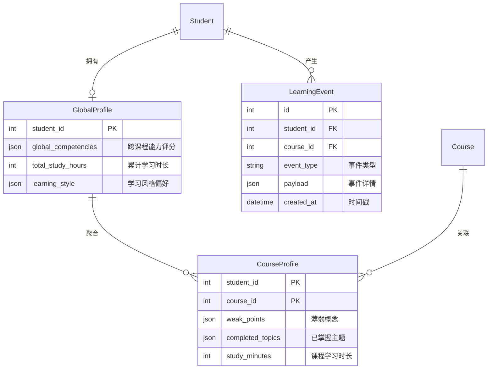
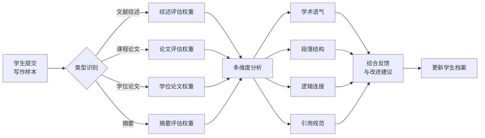
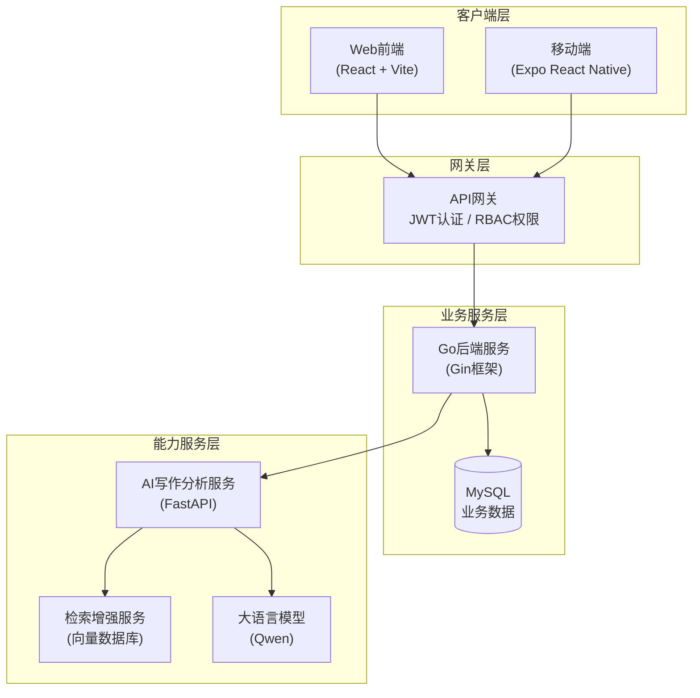

# 毕业设计（论文）开题报告
## 一、课题名称
基于大模型的以学生为中心的智能教学平台设计与实现——以研究生专业英文写作课程为例

## 二、课题背景与研究意义
### （一）课题背景
随着高等教育规模的持续扩大与教学质量要求的不断提升，传统的以课程内容为核心的教学模式正面临深刻变革。在这种模式下，教学活动围绕知识点的系统传授展开，学生被动接受统一进度与标准化内容，个体差异难以得到充分关注。然而，现代教育理论与实践表明，学习效果的提升更多依赖于对学生个体学习状态的精准把握与针对性干预，而非单纯的内容覆盖。因此，构建"以学生为中心"的智能教学平台，已成为教育技术领域的重要研究方向。

在此背景下，研究生阶段的专业英文写作课程提供了一个理想的试点场景。该课程具有以下特点：首先，学术写作能力的培养是一个渐进式、个性化的过程，不同学生在语言基础、逻辑表达、学术规范等方面存在显著差异，需要针对性的指导；其次，写作任务形式多样，包括文献综述、课程论文、学位论文摘要等，每种类型对结构、语言风格、引用规范等均有不同要求；再者，写作过程产生丰富的文本数据，为基于自然语言处理技术的学习状态分析提供了天然素材。

与此同时，大语言模型（Large Language Model, LLM）技术的快速发展为智能教学提供了新的技术支撑。以Qwen、GPT系列为代表的大模型在自然语言理解、文本生成、逻辑推理等方面展现出强大能力，能够为学生提供即时的写作反馈、风格分析与改进建议。结合企业微信等移动办公平台的广泛应用，构建触达便捷、交互自然的智能辅导系统成为可能。

### （二）研究意义
本课题的研究意义可从以下三个层面加以阐述。

在教学实践层面，以学生为中心的智能教学平台能够突破传统课堂的时空限制，为每位学生建立持久的学习档案，追踪其在多门课程中的学习轨迹与能力发展。通过对学生写作风格、常见错误、薄弱环节的持续分析，系统可自动生成个性化的学习建议与专项练习，使教学资源的配置更加精准高效。对于专业英文写作课程而言，这意味着学生能够获得针对其特定写作类型（如综述、课程论文、学位论文）的差异化指导，从而有效提升学术写作能力。

在技术应用层面，本研究探索将大语言模型以"可控、可追溯"的方式引入教育场景，构建"学生状态感知—智能分析—个性化辅导"的闭环系统。通过设计多维度的写作能力评估框架，结合检索增强生成（RAG）与知识图谱技术，实现对学生写作能力的精准画像与动态追踪。这一技术路径对于将人工智能技术规范、有效地应用于教育领域具有示范意义。

在学术与工程价值层面，本研究综合运用前后端分离架构、微服务设计、事件溯源数据模型、跨端适配等现代软件工程方法，形成可复用、可扩展的智能教学平台架构。研究成果不仅适用于专业英文写作课程，也可推广至其他需要个性化辅导的课程类型，为高校教学信息化建设提供技术参考与实践经验。

## 三、国内外研究现状与发展趋势

智能教学系统的研究可追溯至上世纪七十年代的智能导师系统（Intelligent Tutoring Systems, ITS），经过数十年发展，已形成较为完整的理论框架与技术体系。近年来，随着深度学习与自然语言处理技术的突破，该领域呈现出若干新的发展态势。

在学习分析与学生建模方面，国内外研究者普遍采用学习管理系统（Learning Management System, LMS）采集学生的行为数据，并运用统计分析与机器学习方法构建学习者模型。然而，现有系统多侧重于对学习行为的事后统计，如登录频次、资源访问时长等表层指标，对学生认知状态与能力发展的深层建模仍显不足。特别是在写作能力评估领域，尽管自动作文评分（Automated Essay Scoring, AES）技术已较为成熟，但多数系统仅给出整体评分，缺乏对学生写作风格演变、能力增长轨迹的纵向追踪。

在教育大模型与对话式辅导方面，以ChatGPT、Qwen为代表的大语言模型在知识问答、文本生成等任务中表现优异，已在编程教学、语言学习等领域得到初步应用。然而，将大模型应用于学术写作辅导仍面临若干挑战：一是模型可能产生不准确或不恰当的建议，需要可靠的质量控制机制；二是写作指导的个性化程度有待提升，需结合学生历史表现进行差异化反馈；三是不同写作类型具有不同的评估标准，需要类型感知的提示策略。

在检索增强生成（Retrieval-Augmented Generation, RAG）与知识图谱技术方面，研究者通过引入外部知识库来提升大模型输出的准确性与可追溯性。GraphRAG等方法进一步将知识组织为图结构，支持多跳推理与关联检索。这些技术为构建可解释、可验证的智能写作辅导系统提供了技术基础。

从发展趋势来看，智能教学平台正经历从"资源导向"向"过程导向"的范式转变，从关注内容分发转向关注学习过程中的状态感知与动态干预。同时，跨设备、跨平台的学习体验一致性受到重视，要求系统在桌面端与移动端提供功能对等的服务。此外，强调AI辅助的可控性、可追溯性与可评估性，避免模型输出对学生产生误导。

## 四、研究目标与主要内容

### （一）研究目标

本课题旨在设计并实现一套以学生为中心的智能教学平台原型系统，以华中科技大学研究生专业英文写作课程为试点应用场景。研究目标可从以下四个层面予以阐述。

首先，在学生状态追踪层面，系统需构建跨课程、长期化的学生学习档案体系，实现对学生学习轨迹的持续记录与分析。每位学生在系统中拥有全局档案与课程档案两级结构：全局档案汇聚学生在多门课程中的综合能力发展情况，课程档案则记录特定课程内的薄弱点、已完成主题与学习时长等细粒度数据。通过事件溯源机制，系统保留每次学习行为的时序日志，为能力发展的纵向分析与教学干预的效果评估提供数据支撑。

其次，在写作能力分析层面，系统需针对学术写作的特点设计多维度评估框架，涵盖学术语气、段落结构、逻辑连接、引用规范、词汇丰富度等维度。更为重要的是，系统需具备写作类型感知能力，能够识别并区分文献综述、课程论文、学位论文、摘要等不同类型的写作任务，并据此调整评估权重与反馈策略。例如，对于文献综述，系统应侧重评估文献覆盖度与批判性分析能力；对于学位论文，则应关注研究问题的明确性与学术贡献的原创性。

再次，在智能辅导层面，系统需借助大语言模型提供即时、个性化的写作反馈与改进建议。通过检索增强生成技术，系统可将学生历史写作样本、课程资料、标准范文纳入检索范围，使AI反馈具有针对性与可追溯性。系统还需支持渐进式辅导模式，根据学生当前能力水平提供分层次的指导，避免过度依赖或一步到位的答案式输出。

最后，在平台工程层面，系统需实现跨终端的一致性用户体验，确保学生无论通过桌面浏览器还是移动设备访问，均能获得功能对等、交互流畅的服务。这要求在技术架构设计中充分考虑响应式布局、共享API层与统一的设计语言。

### （二）主要研究内容

#### 1. 多层级学生档案与事件溯源数据模型

本研究首先需要设计支撑长期学习追踪的数据模型。核心设计思路是建立"全局档案—课程档案—学习事件"的三层结构。全局学生档案记录学生在整个学习生涯中的综合能力画像，包括跨课程的写作能力评分、学习风格偏好、累计学习时长等。课程学习档案则聚焦于单门课程内的学习状态，记录该课程中的薄弱概念、已掌握主题、推荐学习内容等。学习事件日志采用追加写入模式，记录每次AI对话、作业提交、测验作答等行为的时间戳与详细载荷，既支持实时查询，也为后续的学习分析与模型训练提供原始素材。

**图1：多层级学生档案数据模型**

#### 2. 写作类型感知的智能分析服务

针对专业英文写作课程的特殊需求，本研究将开发类型感知的写作分析服务。该服务首先对学生提交的写作样本进行类型识别，判断其属于文献综述、课程论文、学位论文章节还是摘要等类型。随后，根据不同类型的评估标准，从学术语气、段落结构、逻辑连接、引用规范、学术词汇使用等维度进行多角度分析。分析结果不仅给出整体评分，还提供各维度的详细反馈与改进建议。系统将持续追踪学生在各维度上的表现变化，识别进步趋势与持续薄弱环节。

**图3：写作类型感知分析流程**

#### 3. 基于大模型的个性化辅导引擎

辅导引擎的核心在于将大语言模型的生成能力与学生个性化档案相结合。系统为每种写作类型设计专门的提示策略，引导模型关注该类型的关键评估维度。通过检索增强机制，模型在生成反馈时可参考学生的历史写作样本与课程材料，使建议更具针对性。辅导引擎还支持多种交互模式：对于初学者，提供详细的分步指导；对于进阶学生，则给出简洁的要点提示，培养其自主修改能力。

#### 4. 跨端一致的前端应用开发

为满足学生在不同场景下的学习需求，本研究将同步开发Web端与移动端应用。两端共享统一的后端API与TypeScript类型定义，确保数据模型与业务逻辑的一致性。在用户界面层面，Web端采用React技术栈，针对大屏幕优化布局与交互；移动端采用Expo React Native框架，适配企业微信等移动办公环境。两端均支持AI对话、写作提交、学习档案查看等核心功能，并保持视觉风格与交互模式的统一。

## 五、技术路线与实现方案

### （一）总体技术架构

本系统采用前后端分离、服务化的技术架构，各组件通过标准化的REST API进行通信。整体架构可分为四个层次：客户端层、网关层、业务服务层与能力服务层。

客户端层包括Web前端与移动端应用，分别采用React与Expo React Native技术栈实现，通过共享的TypeScript类型定义确保接口一致性。Web前端可在桌面浏览器与企业微信内置WebView中运行，移动端应用则针对智能手机的交互特点进行优化。

网关层负责请求路由、身份认证与访问控制，采用JWT令牌机制实现无状态认证，基于角色的访问控制（RBAC）确保教师、助教、学生各角色仅能访问其权限范围内的资源与功能。

业务服务层采用Go语言Gin框架实现，遵循分层架构模式（Handler-Service-Repository），提供课程管理、作业提交、学习档案、学习事件记录等核心业务功能。数据持久化采用MySQL关系型数据库，通过数据库迁移工具管理表结构演进。

能力服务层包括AI写作分析服务与检索增强服务，采用Python FastAPI框架实现。AI服务对接Qwen等大语言模型，通过精心设计的提示策略实现写作类型感知的智能反馈；检索增强服务基于向量数据库与知识图谱，为模型提供可追溯的参考素材。

**图2：系统总体技术架构**

### （二）关键技术说明

在写作分析技术方面，系统采用多维度评估框架对学生写作样本进行分析。首先通过文本特征提取计算客观指标，包括平均句长、词汇丰富度（类符/形符比）、被动语态使用比例、学术词汇占比等。随后，借助大语言模型进行语义层面的评估，判断论点清晰度、逻辑连贯性、论据充分性等主观维度。针对不同写作类型，系统配置差异化的评估权重矩阵，使反馈更具针对性。

在检索增强技术方面，系统构建学术写作知识库，涵盖写作规范、范文片段、常见错误案例等资源。采用向量检索与关键词检索的混合策略，通过倒数排名融合（Reciprocal Rank Fusion）整合检索结果，提升召回的相关性。大模型在生成反馈时引用检索到的片段编号，使建议具有可追溯性。

在学习追踪技术方面，系统采用事件溯源模式记录学生的每次学习行为，包括AI对话、写作提交、修改记录等。后台聚合任务定期将课程级数据汇总至全局学生档案，计算跨课程的能力发展指标。前端通过心跳机制上报学习时长，页面隐藏时自动暂停计时，确保数据准确性。

### （三）关键问题与拟解决方案

针对大模型输出的可靠性问题，系统采取多重保障措施：通过检索增强将模型输出锚定于已知素材，降低幻觉风险；要求模型输出遵循结构化模板，便于验证与追溯；保留完整的对话历史与引用来源，支持教师事后审核与纠正。

针对写作评估的主观性问题，系统将客观文本指标与模型语义判断相结合，提供多维度的评分依据。同时，允许教师对AI生成的反馈进行确认或修正，逐步积累高质量的评估样本，用于后续的模型微调与提示优化。

针对跨端一致性问题，系统通过抽取共享的API类型定义与设计令牌（Design Tokens）确保两端的数据模型与视觉风格统一。在功能层面，核心模块在两端对等实现，差异仅体现于针对不同屏幕尺寸的布局优化。

## 六、创新点与特色

本研究的创新性可从以下几个方面予以概括。

在教学理念层面，本研究构建真正"以学生为中心"的智能教学平台，将关注焦点从课程内容转向学生个体。通过建立跨课程、长期化的学生学习档案，系统能够追踪每位学生在学术写作能力各维度上的发展轨迹，识别持续薄弱环节与进步趋势，为针对性干预提供数据支撑。这一设计理念突破了现有平台多聚焦于单次作业评分的局限，实现了对学习过程的纵向追踪与动态画像。

在技术方法层面，本研究提出写作类型感知的智能分析框架，区分文献综述、课程论文、学位论文等不同写作任务的评估标准。通过为每种类型配置差异化的评估权重与提示策略，系统能够提供更具针对性的写作反馈与改进建议。这一设计突破了现有写作辅助工具"一刀切"的评估模式，使智能反馈更加贴合学术写作的实际需求。

在系统工程层面，本研究采用事件溯源数据模型记录学习行为，支持学习轨迹的完整回溯与多维度聚合分析。同时，通过共享API层与设计令牌实现Web端与移动端的功能对等与体验一致，满足学生在不同场景下的学习需求。这些工程实践形成可复用的技术方案，具有推广应用价值。

### 验证方式

为评估系统在写作辅导任务上的有效性，本研究将构建包含多种写作类型的测试样本集，涵盖文献综述、课程论文、摘要等类型各20至30篇。评估维度包括：写作反馈的准确性（与专家评分的一致性）、建议的可操作性（学生采纳率）、类型识别的正确率，以及学生写作能力的纵向提升程度。同时，将通过消融实验对比不同组件（类型感知、检索增强、个性化档案）的贡献。

## 七、可行性分析

本课题的可行性可从技术、时间、应用三个维度加以分析。

在技术可行性方面，本研究所采用的技术栈均已成熟并拥有丰富的社区资源。后端采用的Go语言Gin框架与前端采用的React技术栈均为业界主流选择，具备完善的文档与生态支持。大语言模型服务可通过Qwen等模型的云端API获取，也可在配备GPU的服务器上进行本地部署。自然语言处理相关的文本分析任务可借助成熟的Python库实现。数据库采用MySQL，其稳定性与可靠性已在大规模应用中得到验证。上述技术的选型均经过充分调研，风险可控。

在时间可行性方面，本研究采用模块化与迭代式开发策略，将整体目标分解为若干可独立交付的阶段性成果。首先完成核心的学生档案与学习事件记录功能，确保数据收集链路畅通；随后开发写作类型感知的分析服务，实现智能反馈能力；最后进行跨端适配与系统联调。这一开发计划与研究周期相匹配,各阶段成果可独立验证，降低了整体风险。

在应用可行性方面，本研究以华中科技大学研究生专业英文写作课程为试点场景,该课程学生规模适中、写作任务类型丰富、教师对智能辅助工具持开放态度，具备良好的试点条件。系统设计遵循通用化原则，核心的学生追踪与智能分析框架可迁移至其他需要个性化辅导的课程类型，具有推广价值。

### 风险与对策

针对大模型可能产生不准确或不恰当建议的风险，系统采取检索增强、结构化输出、教师审核等多重保障措施，并持续积累高质量评估样本用于模型优化。针对学生写作数据的隐私保护，系统遵循最小化采集原则，实施严格的访问控制与数据脱敏策略。针对企业微信环境的接入限制，原型阶段采用平台独立账号体系，预留OAuth接口待条件成熟后对接。

## 八、研究进度安排

本研究计划分为六个阶段，总计十五周完成。

第一阶段（第1至2周）为需求分析与架构设计阶段。主要任务包括深入调研专业英文写作课程的教学需求与痛点，明确写作类型分类与评估维度；完成系统总体架构设计与数据库模型设计；绘制核心页面原型并与指导教师确认。

第二阶段（第3至6周）为基础功能开发阶段。主要任务包括实现后端核心业务模块（用户管理、课程管理、作业提交、学习档案、学习事件记录）；开发Web前端核心页面（登录、课程列表、AI对话、学习档案）；完成数据库迁移与基础API联调。

第三阶段（第7至9周）为智能分析服务开发阶段。主要任务包括开发写作类型识别与多维度评估服务；实现基于大模型的个性化辅导引擎；构建学术写作知识库并集成检索增强功能；完成AI服务与后端的接口对接。

第四阶段（第10至11周）为跨端适配与集成阶段。主要任务包括开发移动端应用，实现与Web端功能对等；抽取共享API类型定义与设计令牌；完成全链路联调与功能验证。

第五阶段（第12至13周）为测试与优化阶段。主要任务包括构建多类型写作测试样本集；执行功能测试、性能测试与安全检查；根据测试结果进行优化迭代；准备系统演示脚本。

第六阶段（第14至15周）为论文撰写与答辩准备阶段。主要任务包括撰写毕业论文各章节；整理系统文档与用户手册；完善项目演示材料；准备答辩PPT与现场演示。

## 九、预期成果与验收指标

本研究预期产出以下成果：

在系统实现层面，预期交付可运行的智能教学平台原型系统，包括Web前端、移动端应用、后端业务服务与AI写作分析服务四个组件。系统部署于服务器或本地开发环境，支持完整的学习流程演示。

在功能验证层面，预期实现并演示以下核心功能：学生学习档案的创建、更新与跨课程聚合；不同写作类型（文献综述、课程论文、学位论文、摘要）的识别与差异化评估；基于学生历史表现的个性化写作反馈生成；Web端与移动端的功能对等体验。

在评估验证层面，预期构建包含60至100篇写作样本的测试集，覆盖四种主要写作类型。评估指标包括：写作类型识别准确率、AI反馈与专家评分的一致性、系统响应时间等。

在文档交付层面，预期产出完整的系统设计文档、API接口文档、部署说明、用户使用手册以及毕业论文与答辩材料。

## 十、参考文献

1. Swales, J. M., & Feak, C. B. *Academic Writing for Graduate Students*. University of Michigan Press, 2012.
2. Flower, L., & Hayes, J. R. "A Cognitive Process Theory of Writing." *College Composition and Communication*, 1981.
3. Devlin, J., Chang, M.-W., Lee, K., & Toutanova, K. "BERT: Pre-training of Deep Bidirectional Transformers for Language Understanding." *NAACL*, 2019.
4. Lewis, P., et al. "Retrieval-Augmented Generation for Knowledge-Intensive NLP Tasks." *NeurIPS*, 2020.
5. Shermis, M. D., & Burstein, J. *Handbook of Automated Essay Evaluation*. Routledge, 2013.
6. Vaswani, A., et al. "Attention Is All You Need." *NeurIPS*, 2017.
7. 阿里云. Qwen（通义千问）技术白皮书与开发文档.
8. VanLehn, K. "The Relative Effectiveness of Human Tutoring, Intelligent Tutoring Systems, and Other Tutoring Systems." *Educational Psychologist*, 2011.
9. Hyland, K. *Teaching and Researching Writing*. Routledge, 2015.
10. OpenAI. GPT 系列技术报告与 API 文档.

