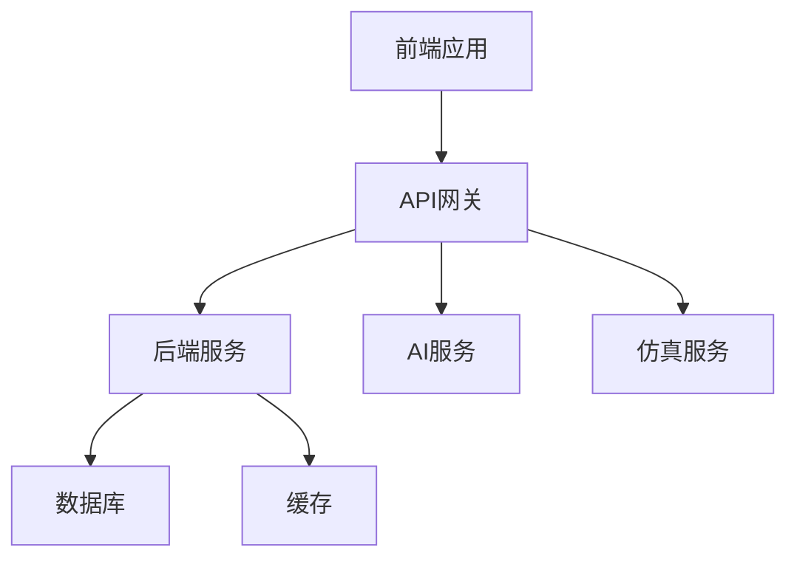
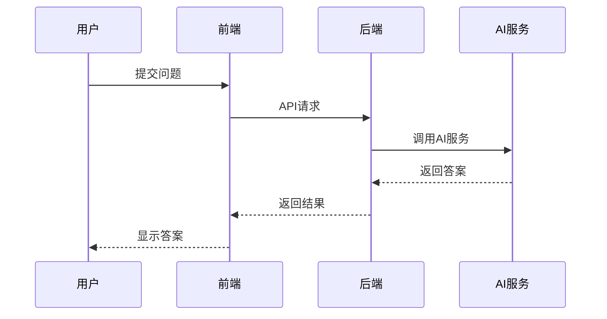
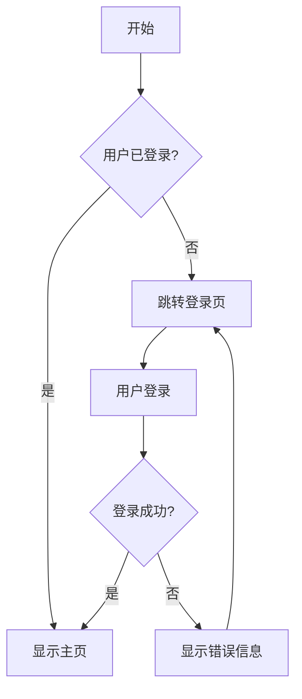

# 架构图和流程图 (Diagrams)

本目录包含项目的各种架构图、流程图和技术图表。

## 图表类型

### 系统架构图
- 整体系统架构
- 微服务架构图
- 部署架构图
- 网络拓扑图

### 数据流图
- 数据处理流程
- API调用关系
- 消息传递流程
- 状态转换图

### UML图
- 类图 (Class Diagram)
- 时序图 (Sequence Diagram)
- 用例图 (Use Case Diagram)
- 活动图 (Activity Diagram)

### 业务流程图
- 用户操作流程
- 业务处理流程
- 决策流程图
- 异常处理流程

## 文件格式

### 源文件格式
- **Mermaid (.mmd)**: 推荐格式，便于版本控制和协作
- **Draw.io (.drawio)**: 复杂图表的可视化编辑
- **PlantUML (.puml)**: 代码化的UML图表
- **Graphviz (.dot)**: 自动布局的图形描述

### 导出格式
- **SVG**: 矢量格式，支持缩放，推荐用于文档
- **PNG**: 位图格式，兼容性好，适合演示
- **PDF**: 高质量打印，适合正式文档
- **HTML**: 交互式图表，适合在线展示

## Mermaid 图表示例

### 系统架构图


### 时序图


### 流程图


## 创建和编辑

### 使用 Mermaid
```bash
# 安装 Mermaid CLI
npm install -g @mermaid-js/mermaid-cli

# 生成 SVG
mmdc -i diagram.mmd -o diagram.svg

# 生成 PNG
mmdc -i diagram.mmd -o diagram.png
```

### 在线编辑器
- [Mermaid Live Editor](https://mermaid.live/)
- [Draw.io](https://app.diagrams.net/)
- [PlantUML Online](http://www.plantuml.com/plantuml/)

### 本地工具
- Visual Studio Code + Mermaid 插件
- Draw.io Desktop
- Lucidchart
- OmniGraffle (Mac)

## 命名规范

### 文件命名
- 使用描述性英文名称
- 包含图表类型前缀
- 使用连字符分隔
- 示例：
  - `system-architecture.mmd`
  - `user-flow-diagram.mmd`
  - `api-sequence-diagram.mmd`

### 目录组织
```
diagrams/
├── architecture/          # 架构图
├── flows/                # 流程图
├── uml/                  # UML图
├── network/              # 网络图
└── exports/              # 导出的图片文件
```

## 使用指南

### 在文档中引用
```markdown
<!-- 示例：当系统架构图可用时 -->
![系统架构图] (./exports/system-architecture.svg)
```

### 在代码注释中引用
```javascript
/**
 * 用户登录流程
 * 详见: ../assets/diagrams/user-login-flow.mmd
 */
```

### 在演示文稿中使用
- 导出为高分辨率PNG或SVG
- 确保字体大小适合投影
- 使用对比鲜明的颜色

## 维护指南

### 版本控制
- 源文件纳入版本控制
- 重要版本的导出文件也要保留
- 记录重大变更的原因
- 使用分支管理不同版本

### 同步更新
- 代码变更时及时更新相关图表
- 定期检查图表的准确性
- 保持文档和图表的一致性
- 建立图表更新的检查清单

### 协作规范
- 统一的绘图风格和颜色
- 清晰的图例和标注
- 合适的抽象层次
- 避免过于复杂的图表

## 最佳实践

### 设计原则
- 简洁明了，突出重点
- 层次分明，逻辑清晰
- 颜色搭配合理
- 字体大小适中

### 技术建议
- 优先使用代码化的图表格式
- 保持源文件和导出文件同步
- 建立自动化的图表生成流程
- 定期备份重要图表文件
