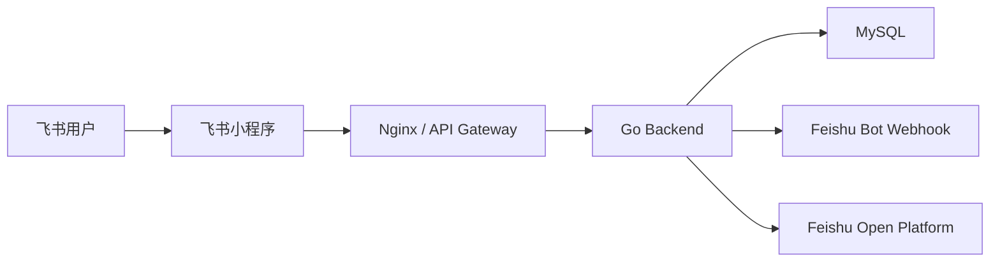

# 飞书集成使用与部署指南

本文档面向需要启用飞书 OAuth 登录、群机器人通知和飞书小程序入口的部署者，覆盖开放平台配置、服务器部署、联调顺序和常见故障。

## 1. 适用范围

当前飞书集成包含两部分：

- 后端能力：
  - `POST /api/v1/auth/feishu`：使用飞书授权码登录
  - `POST /api/v1/feishu/notify`：向飞书自定义机器人发送文本通知
- 飞书小程序前端：
  - 使用 `tt.login`
  - 调用现有后端 `/api/v1` 接口完成登录、作业、写作反馈和学习档案查询

推荐部署顺序是：

1. 先部署后端飞书能力
2. 再完成飞书开放平台配置
3. 最后联调飞书小程序

不要先做小程序联调。没有可公网访问的后端，开放平台配置和小程序调试都无法闭环。

## 2. 开放平台需要准备什么

在飞书开放平台创建一个自建应用，并记录以下信息：

- `App ID`
- `App Secret`

如果需要群消息通知，还需要在目标群里创建一个自定义机器人并获取：

- `Webhook URL`

此外还需要准备：

- 一个可以公网访问的后端地址，例如 `https://api.example.com`
- 一个用于飞书小程序请求后端的 HTTPS 域名
- 一个固定的服务器出口 IP（如果机器人启用 IP 白名单）

## 3. 服务器先部署什么

### 3.1 最小可运行后端

飞书接入的第一步不是配置小程序，而是把支持飞书的后端版本部署到测试或生产服务器。

后端至少要满足：

- 能正常启动
- 已加载飞书环境变量
- `POST /api/v1/auth/feishu` 可访问
- `POST /api/v1/feishu/notify` 可访问

如果这两个接口还没有部署到服务器，后续所有开放平台配置都只能停留在“已填写但无法验证”的状态。

### 3.2 必填环境变量

在服务器环境中加入以下变量：

```env
FEISHU_APP_ID=cli_xxxxxxxxxxxxx


FEISHU_APP_SECRET=xxxxxxxxxxxxxxxx
FEISHU_BOT_WEBHOOK=https://open.feishu.cn/open-apis/bot/v2/hook/xxxxxxxx-xxxx-xxxx-xxxx-xxxxxxxxxxxx
```

同时确保已有基础变量也已正确配置：

```env
BACKEND_JWT_SECRET=replace_with_strong_secret
BACKEND_CORS_ORIGINS=https://your-frontend-domain.example.com
PUBLIC_WEB_BASE_URL=https://your-frontend-domain.example.com
BACKEND_DB_DSN=user:pass@tcp(db:3306)/teaching_platform?charset=utf8mb4&parseTime=True&loc=Local
```

### 3.3 Docker / Compose 部署建议

如果使用本项目的容器化部署，建议在 `code/.env` 或部署系统的环境注入中补齐飞书变量，再重启后端服务。

典型流程：

```bash
cd code
docker compose up -d --build backend
```

或者如果你使用项目脚本：

```bash
cd code
./scripts/prod-up.sh
```

部署后首先验证健康检查和认证端点都可访问，再继续开放平台配置。

## 4. 飞书开放平台如何配置

### 4.1 应用能力

在飞书开放平台中：

1. 创建自建应用
2. 开启小程序能力
3. 为应用分配可见范围
4. 在权限管理中勾选获取用户身份和用户信息所需权限
5. 发布权限变更并完成管理员授权

你的后端登录逻辑以 `FeishuOpenID` 绑定用户，因此最关键的是：

- 能获得 `open_id`
- 能拿到用于展示和建档的用户基本信息，例如姓名、邮箱、头像、user_id

### 4.2 机器人 Webhook

在飞书群中添加自定义机器人后，把生成的 `Webhook URL` 配置到 `FEISHU_BOT_WEBHOOK`。

推荐的安全策略是：

- 开启关键词校验
- 暂时不要开启签名校验，除非后端已实现签名逻辑
- 如果启用 IP 白名单，把后端服务器出口 IP 加入白名单

如果机器人开启了签名而服务端没有签名逻辑，`/api/v1/feishu/notify` 会稳定失败。

### 4.3 小程序域名

飞书小程序需要把后端域名加入合法请求域名。

请至少加入：

- 后端 API 域名，例如 `https://api.example.com`

如果前后端分域部署，还要确保：

- CORS 允许小程序实际来源
- 后端证书有效
- 不使用自签名证书

## 5. 推荐联调顺序

按下面的顺序做，排障成本最低。

### 第一步：验证服务器已加载飞书配置

重启后端后，先通过服务日志或部署平台确认：

- `FEISHU_APP_ID` 已生效
- `FEISHU_APP_SECRET` 已生效
- `FEISHU_BOT_WEBHOOK` 已生效

### 第二步：验证群机器人 Webhook

先直接用 curl 测试飞书机器人是否可用：

```bash
curl -X POST "$FEISHU_BOT_WEBHOOK" \
  -H "Content-Type: application/json" \
  -d '{"msg_type":"text","content":{"text":"你的关键词 + classPlatform webhook 测试"}}'
```

如果群里能收到消息，说明机器人配置无误。

### 第三步：验证你自己的通知接口

用平台登录获取一个 JWT 后，测试你自己的通知端点：

```bash
curl -X POST "https://api.example.com/api/v1/feishu/notify" \
  -H "Authorization: Bearer <your_jwt>" \
  -H "Content-Type: application/json" \
  -d '{"content":"你的关键词 + classPlatform /feishu/notify 测试"}'
```

预期结果：

- HTTP 200
- 返回 `sent: true`
- 飞书群收到消息

### 第四步：验证飞书登录接口

在飞书小程序或飞书容器中拿到 `code` 后，请求：

```bash
curl -X POST "https://api.example.com/api/v1/auth/feishu" \
  -H "Content-Type: application/json" \
  -d '{"code":"<feishu_login_code>"}'
```

预期结果：

- HTTP 200
- 返回 `access_token`、`refresh_token`、`user_id`、`role`

### 第五步：联调飞书小程序

在开发者工具中配置后端地址后，再测试：

- 飞书登录
- 作业列表
- 作业提交
- AI 写作反馈
- 学习 Dashboard

推荐先用测试课程和测试账号完成全链路验证，不要直接在生产群和生产租户中试错。

## 6. 小程序部署建议

### 6.1 本地开发

如果你已经在代码分支中加入了飞书小程序目录，建议把后端地址写成测试环境 API 地址，例如：

```text
https://api.example.com/api/v1
```

不要在真机或体验版里继续使用 `http://localhost:8080/api/v1`。

### 6.2 体验版联调

小程序体验版联调时建议满足以下条件：

- 后端已部署到公网 HTTPS 域名
- 数据库使用测试库
- 飞书机器人使用测试群
- 飞书应用可见范围只给测试人员

### 6.3 生产方案

推荐的生产拓扑如下：



部署要点：

- API 网关统一暴露 `https://api.example.com`
- 后端只对 API 网关开放
- `FEISHU_APP_SECRET` 存放在服务器环境或密钥管理系统中
- `FEISHU_BOT_WEBHOOK` 不写入前端
- 机器人发送必须经由后端，不让小程序直接调用飞书机器人地址

## 7. 常见问题

### 7.1 `/api/v1/auth/feishu` 返回鉴权失败

优先检查：

- `FEISHU_APP_ID` / `FEISHU_APP_SECRET` 是否正确
- 应用权限是否已发布并获管理员授权
- `code` 是否来自飞书环境

### 7.2 `/api/v1/feishu/notify` 返回成功但群里没消息

优先检查：

- 机器人是否启用了关键词校验
- 发送内容是否包含关键词
- 是否误开了签名校验
- IP 白名单是否拦截

### 7.3 小程序里能打开页面，但请求全失败

优先检查：

- 后端域名是否加入合法请求域名
- 是否为 HTTPS
- 证书是否有效
- CORS 是否允许当前来源

### 7.4 本地能通，服务器不通

优先检查：

- 服务器环境变量是否真正加载
- 部署平台是否需要重新发布
- 容器是否重建而不是仅重启
- 反向代理是否正确透传 `/api/v1`

## 8. 推荐阅读

- [生产部署](./production-deployment.md)
- [配置说明](./configuration.md)
- [Docker 部署](./docker-deployment.md)
- [故障排查](./troubleshooting.md)
- [认证接口](../../04-reference/api/auth.md)
