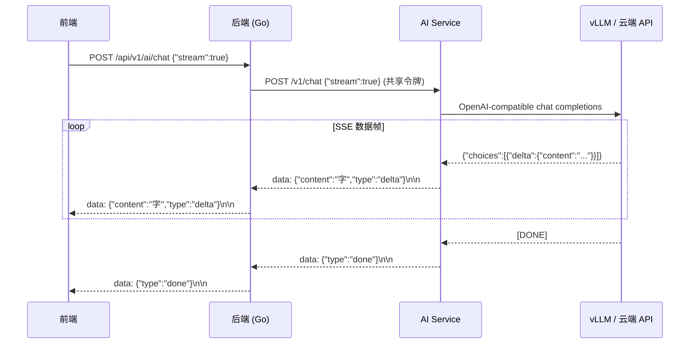

# AI 服务接口

> 本页文档化后端对外暴露的所有 AI 接口（`/api/v1/ai/*`）。这些接口由 Go 后端完成 JWT 鉴权后，通过 `AI_GATEWAY_SHARED_TOKEN` 转发至 AI Service（`code/ai_service`）内部路由 `/v1/*`。

::: info 写作模块接口
写作提交、评分、反馈等属于**写作模块**接口（`/api/v1/courses/{courseId}/writing/*`），见 `docs/04-reference/api/openapi.yaml`。
:::

## 权限要求

所有 AI 接口要求：
- 有效 JWT Token（`Authorization: Bearer <token>`）
- 用户权限 `ai:use`（所有角色均具备）
- AI 接口受独立速率限制器保护（`aiLimiter`：每 3 秒 10 次）

---

## 对话模式（`mode` 字段）

`mode` 字段透传至 AI Service，决定系统 Prompt 的选择与后处理逻辑。支持追加 `_rag` 后缀启用 GraphRAG（如 `tutor_rag`）。

| mode | 说明 | 输出特点 | 典型用途 |
|------|------|---------|---------|
| `tutor` | 通用答疑/概念解释 | 自然语言 | 写作规范、概念澄清 |
| `grader` | 作文批改/结构化反馈 | Markdown 结构 | 按 rubric 评分，不直接代写 |
| `polish` | 学术英文润色 | 结构化 JSON（含修改对比） | 段落语言优化 |
| `tutor_rag` | 带知识库的答疑 | 含引用来源编号 | 基于课程资料的精准问答 |
| `formula_verify` | 公式验证（仿真课程） | 结构化结果 | 电磁场公式检查 |
| `sim_tutor` | 仿真场景辅导 | 混合文本 + 工具调用 | 电磁仿真参数解释 |

---

## 1. `POST /api/v1/ai/chat` — 文本对话

最核心的 AI 接口，支持同步与流式（SSE）两种响应模式。

### 请求

```typescript
// code/shared/src/types/ai.ts — ChatRequest
type ChatRequest = {
  mode?: string;          // 对话模式，默认 "tutor"
  messages: ChatMessage[];
  stream?: boolean;       // true = SSE 流式，false = 同步（默认）
  course_id?: number | string;  // 可选，用于上下文注入
  privacy?: 'private' | 'public';  // 数据隐私级别
  route?: 'local' | 'cloud' | 'auto';  // 显式路由覆盖
};

type ChatMessage = {
  role: 'system' | 'user' | 'assistant';
  content: string;
};
```

**示例请求：**

```bash
curl -X POST http://localhost:8080/api/v1/ai/chat \
  -H "Authorization: Bearer $TOKEN" \
  -H "Content-Type: application/json" \
  -d '{
    "mode": "tutor",
    "messages": [
      {"role": "user", "content": "如何写出清晰的 thesis statement？"}
    ],
    "stream": false
  }'
```

### 同步响应（`stream: false`）

```typescript
// ChatResponse
type ChatResponse = {
  reply: string;
  model?: string | null;   // 实际使用的模型名
  message?: ChatMessage;
  usage?: {
    prompt_tokens: number;
    completion_tokens: number;
    total_tokens: number;
  };
};
```

```json
{
  "success": true,
  "data": {
    "reply": "一个清晰的 thesis statement 需要满足三个条件：……",
    "model": "qwen3-7b",
    "usage": {
      "prompt_tokens": 45,
      "completion_tokens": 180,
      "total_tokens": 225
    }
  }
}
```

### 流式响应（`stream: true`） — SSE



**SSE 事件格式：**

```
data: {"content":"一个","type":"delta"}\n\n
data: {"content":"清晰的","type":"delta"}\n\n
data: {"content":" thesis","type":"delta"}\n\n
data: {"type":"done"}\n\n
```

::: tip 前端接入方式
前端 SDK 通过 `fetch` + 手动 SSE 解析实现流式读取，返回 `AsyncGenerator<string>`。推荐使用 `code/frontend/src/lib/ai-stream.ts` 中封装的 `aiStreamClient`，通过 `for await...of` 消费 token，并将 `AbortController.signal` 传入以支持中断：

```typescript
const controller = new AbortController();
await aiStreamClient.streamChat(messages, {
  mode: 'tutor',
  onStart: (model) => { /* 开始回调 */ },
  onMessage: (token) => { /* 逐 token 回调 */ },
  onFinish: () => { /* 完成回调 */ },
  onError: (err) => { /* 错误回调 */ },
  signal: controller.signal,   // 调用 controller.abort() 即可中断
});
```
:::

---

## 2. `POST /api/v1/ai/chat/multimodal` — 多模态对话

::: warning 功能开关
该端点默认关闭（`AI_MULTIMODAL_ENABLED=false`）。未启用时返回 `403 FEATURE_DISABLED`。
:::

支持图文混合输入，后端路由至 Qwen3-VL 视觉语言模型。

### 请求

```typescript
// ChatMultimodalRequest
type ChatMultimodalRequest = {
  mode?: string;
  messages: MultimodalChatMessage[];
  stream?: boolean;
  privacy?: string;
  route?: string;
  model_family?: 'auto' | 'qwen3' | 'qwen3_vl';  // 默认 'auto'
};

type MultimodalChatMessage = {
  role: 'system' | 'user' | 'assistant';
  content?: string;
  parts?: Array<{
    type: string;        // 'text' | 'image_url' | 'video_url'
    text?: string;
    url?: string;
  }>;
};
```

**示例：**

```json
{
  "mode": "tutor",
  "model_family": "auto",
  "messages": [
    {
      "role": "user",
      "content": "请分析图中的电场分布",
      "parts": [
        { "type": "image_url", "url": "https://example.com/field.png" }
      ]
    }
  ],
  "stream": false
}
```

**路由规则：**

| `model_family` | `needs_vision` | 路由结果 |
|----------------|----------------|---------|
| `auto` | false | Qwen3 文本模型 |
| `auto` | true（含图片） | Qwen3-VL 视觉模型 |
| `qwen3` | true | ❌ `MODEL_NOT_SUPPORT_VISION` |
| `qwen3_vl` | any | Qwen3-VL 视觉模型 |

**错误码：**

| HTTP | `error.code` | 说明 |
|------|--------------|------|
| 403 | `FEATURE_DISABLED` | `AI_MULTIMODAL_ENABLED=false` |
| 400 | `MODEL_NOT_SUPPORT_VISION` | 文本模型收到视觉请求 |
| 503 | `UPSTREAM_UNAVAILABLE` | 推理服务不可达 |

---

## 3. `POST /api/v1/ai/chat_with_tools` — 带工具调用对话

AI 可在对话过程中调用预定义工具（仿真计算、表达式求值等）。

### 请求

```typescript
// ChatWithToolsRequest
type ChatWithToolsRequest = {
  mode?: string;
  messages: ChatMessage[];
  enable_tools?: boolean;    // 默认 true
  max_tool_calls?: number;   // 最大工具调用次数，默认 3
  context?: Record<string, unknown>;  // 附加上下文（如课程信息）
  privacy?: string;
  route?: string;
};
```

**示例：**

```json
{
  "mode": "sim_tutor",
  "messages": [
    {"role": "user", "content": "计算平行板电容器在 d=0.01m, A=1m² 时的电容值"}
  ],
  "enable_tools": true,
  "max_tool_calls": 3
}
```

### 响应

```typescript
// ChatWithToolsResponse
type ChatWithToolsResponse = {
  reply: string;
  model?: string | null;
  tool_calls?: Array<{
    name: string;
    arguments: Record<string, unknown>;
  }>;
  tool_results?: Array<{
    name: string;
    success: boolean;
    result?: unknown;
    error?: string;
  }>;
};
```

```json
{
  "success": true,
  "data": {
    "reply": "根据计算结果，电容值为 884.2 pF。……",
    "model": "qwen3-7b",
    "tool_calls": [
      {
        "name": "evaluate_expression",
        "arguments": { "expression": "8.85e-12 * 1 / 0.01" }
      }
    ],
    "tool_results": [
      {
        "name": "evaluate_expression",
        "success": true,
        "result": { "value": 8.85e-10 }
      }
    ]
  }
}
```

::: details 可用工具列表
工具集定义见 `code/ai_service/app/tools.py`。当前支持：
- `evaluate_expression` — 数学表达式求值
- `run_simulation` — 触发仿真服务计算
- `search_knowledge_base` — GraphRAG 知识库检索
:::

---

## 4. `POST /api/v1/ai/chat/guided` — 引导式学习

结构化引导式学习会话，AI 根据学习路径逐步引导学生，并实时更新薄弱点记录。

::: info 用户身份注入
后端从 JWT 中提取 `user_id`，自动注入到对 AI Service 的请求中。客户端**无需**传递 `user_id`。
:::

### 请求

```typescript
// GuidedChatRequest
type GuidedChatRequest = {
  session_id?: string;   // 空字符串或省略 = 创建新会话
  topic?: string;        // 学习主题描述
  messages: ChatMessage[];
  course_id?: string;
  privacy?: string;
  route?: string;
};
```

**示例：**

```json
{
  "session_id": "",
  "topic": "如何写好文献综述的段落结构",
  "course_id": "1",
  "messages": [
    {"role": "user", "content": "我写综述总像在罗列文献，应该怎么改？"}
  ]
}
```

### 响应

```typescript
// GuidedChatResponse
type GuidedChatResponse = {
  reply: string;
  session_id: string;           // 后续请求传入此值延续会话
  current_step: number;
  total_steps: number;
  progress_percentage: number;  // 0-100
  weak_points: string[];        // 检测到的薄弱点标签
  citations: Record<string, unknown>[];  // GraphRAG 引用（启用时）
  tool_results: ToolResult[];
  model?: string | null;
  learning_path: Array<{
    step: number;
    title: string;
    description: string;
    completed: boolean;
  }>;
};
```

**示例响应：**

```json
{
  "success": true,
  "data": {
    "reply": "好的，文献综述的核心是综合，而不是罗列……",
    "session_id": "7c3e6f8e-4a2b-4c1d-9e5f-abc123def456",
    "current_step": 0,
    "total_steps": 4,
    "progress_percentage": 0,
    "weak_points": ["逻辑连接", "文献综合"],
    "citations": [],
    "tool_results": [],
    "model": "qwen3-7b",
    "learning_path": [
      {
        "step": 1,
        "title": "理解综合 vs 罗列",
        "description": "学习如何将多篇文献的观点整合成一个论证",
        "completed": false
      }
    ]
  }
}
```

::: tip 会话持续
将 `session_id` 放入下一次请求，AI Service 将从 `session.py` 中恢复会话上下文，延续学习进度。
:::

---

## 通用错误码

| HTTP | `error.code` | 场景 |
|------|--------------|------|
| 401 | `TOKEN_INVALID` / `TOKEN_EXPIRED` | 未鉴权或 Token 过期 |
| 429 | `RATE_LIMIT_EXCEEDED` | AI 接口频率超限 |
| 503 | `UPSTREAM_UNAVAILABLE` | 本地 vLLM 和云端 API 均不可达 |
| 400 | `INVALID_MODE` | 未知的 `mode` 值 |
| 400 | `MESSAGES_EMPTY` | `messages` 数组为空 |

---

## 共享 SDK 调用示例

```typescript
import { api } from '@/lib/api-client';  // Web 端

// 同步对话
const res = await api.ai.chat({
  mode: 'tutor',
  messages: [{ role: 'user', content: '什么是被动语态？' }],
  stream: false,
});
console.log(res.reply);

// 引导式学习
const guided = await api.ai.guidedChat({
  topic: '学术写作段落结构',
  messages: [{ role: 'user', content: '我的段落总是太短怎么办？' }],
  course_id: '1',
});
console.log(guided.weak_points);  // ['段落展开', '例证支撑']
```

---

## 5. `POST /api/v1/writing/analyze` — 写作分析

> 本端点由 Go 后端转发至 AI Service 内部路由 `/v1/writing/analyze`，需携带有效 JWT Token。

根据**写作类型专属评分维度**（rubric）对学生写作样本进行结构化分析，返回各维度得分、优点、改进建议与总体评价。

### 请求

```typescript
// WritingAnalysisRequest
type WritingAnalysisRequest = {
  content: string;           // 必填，写作正文，最少 50 字
  writing_type?: string;     // 写作类型（见下表），默认 "course_paper"
  title?: string;            // 可选，作文标题
  student_profile?: Record<string, unknown>;  // 可选，学生画像（用于个性化反馈）
  privacy?: 'private' | 'public';
  route?: 'local' | 'cloud' | 'auto';
};
```

**`writing_type` 枚举：**

| 值 | 名称 | 适用场景 |
|----|------|---------|
| `course_paper` | 课程论文 | 本科/研究生课程作业（默认） |
| `literature_review` | 文献综述 | 系统性文献梳理与综合 |
| `thesis` | 学位论文 | 研究生毕业论文章节 |
| `abstract` | 摘要 | 期刊/会议论文摘要 |

::: info 类型自动校正
若传入未知的 `writing_type`，服务端自动降级为 `course_paper`，不返回错误。
:::

**示例请求：**

```bash
curl -X POST http://localhost:8080/api/v1/writing/analyze \
  -H "Authorization: Bearer $TOKEN" \
  -H "Content-Type: application/json" \
  -d '{
    "content": "This paper investigates the electromagnetic field distribution...",
    "writing_type": "course_paper",
    "title": "Electromagnetic Field Analysis in Waveguides"
  }'
```

### 响应（200）

```typescript
// WritingAnalysisResponse
type DimensionScore = {
  name: string;       // 维度名称（如"论点清晰度"）
  score: number;      // 0-10 分
  weight: number;     // 该维度权重（0-1，各维度权重之和为 1）
  comment: string;    // 针对该维度的具体反馈
};

type WritingAnalysisResponse = {
  overall_score: number;       // 总体评分（0-10）
  dimensions: DimensionScore[];
  strengths: string[];         // 写作优点列表
  improvements: string[];      // 改进建议列表
  summary: string;             // 一句话总结（含分数）
  raw_feedback: string;        // AI 完整原始反馈（用于展示详细内容）
  word_count: number;          // 按空格分词的词数统计
  writing_type: string;        // 实际使用的写作类型
  model: string | null;        // 使用的模型名称
};
```

**示例响应：**

```json
{
  "overall_score": 7.2,
  "dimensions": [
    {
      "name": "论点清晰度",
      "score": 8.0,
      "weight": 0.25,
      "comment": "主论点明确，但部分段落的支撑论据需要加强。"
    },
    {
      "name": "结构组织",
      "score": 7.5,
      "weight": 0.25,
      "comment": "整体结构清晰，引言和结论衔接流畅。"
    }
  ],
  "strengths": ["论点集中，主题突出", "学术词汇运用准确"],
  "improvements": ["文献引用格式需统一", "段落间过渡句较弱"],
  "summary": "您的课程论文总体评分为 7.2/10。主要需要改进的方面：文献引用格式需统一",
  "raw_feedback": "...",
  "word_count": 342,
  "writing_type": "course_paper",
  "model": "qwen3-7b"
}
```

### 错误码

| HTTP | `detail` | 场景 |
|------|----------|------|
| 400 | `content 字段最少需要 50 个字符` | `content` 过短 |
| 401 | `TOKEN_INVALID` / `TOKEN_EXPIRED` | 未鉴权或 Token 过期 |
| 503 | `UPSTREAM_UNAVAILABLE` | 本地与云端推理均不可达 |

---

## 前端流式接入契约（ai-stream.ts）

`code/frontend/src/lib/ai-stream.ts` 封装了流式对话的完整生命周期，基于 `AsyncGenerator<string>` 驱动：

```typescript
interface StreamOptions {
  mode?: string;                      // 对话模式，默认 'tutor'
  onStart?: (model: string) => void;  // 流开始时触发（model 当前为空字符串）
  onMessage: (content: string) => void; // 每收到一个 token 触发
  onFinish: () => void;               // 流正常结束触发
  onError: (error: Error) => void;    // 流异常触发（abort 不触发此回调）
  signal?: AbortSignal;               // 中断信号，调用 abort() 后静默退出
}
```

**回调行为语义：**

| 回调 | 触发条件 | 注意事项 |
|------|---------|---------|
| `onStart` | 首个 token 前 | `model` 参数当前固定为空字符串 |
| `onMessage` | 每个流式 token | 累积拼接即为完整回复 |
| `onFinish` | 流正常结束 | `onError` 不会同时触发 |
| `onError` | 网络异常 / 服务报错 | `AbortSignal` 中断**不触发**，直接静默退出 |

::: warning 中断行为
调用 `controller.abort()` 后，流会立即停止，但**不会触发 `onError` 回调**。这是设计行为，避免将用户主动中断误判为错误。如需在中断时执行清理逻辑，请在调用 `abort()` 的代码中直接处理。

**实现细节（参考 `code/frontend/src/lib/ai-stream.ts`）：**

```typescript
try {
  for await (const token of api.ai.streamChat(..., signal)) {
    options.onMessage(token);
  }
  options.onFinish();
} catch (error) {
  if (options.signal?.aborted) return;  // 静默退出，不触发 onError
  options.onError(error instanceof Error ? error : new Error('Unknown error'));
}
```
:::

**完整用法示例：**

```typescript
import { aiStreamClient } from '@/lib/ai-stream';

const controller = new AbortController();

// 开始流式对话
await aiStreamClient.streamChat(
  [{ role: 'user', content: '什么是 thesis statement？' }],
  {
    mode: 'tutor',
    onStart: (_model) => setStatus('streaming'),
    onMessage: (token) => setReply(prev => prev + token),
    onFinish: () => setStatus('done'),
    onError: (err) => setError(err.message),
    signal: controller.signal,
  }
);

// 中断示例
controller.abort();  // onError 不触发，流静默退出
```

---

## 本地大模型 SDK 调用契约（@jadesnow7/edge-ai-sdk）

::: info 适用场景
本节内容仅适用于**桌面端（Tauri）**。Web 端和移动端通过后端网关调用 AI 服务，使用上述 HTTP 接口。
:::

### 架构概览

桌面端通过 **@jadesnow7/edge-ai-sdk** 直接调用本地 NPU/GPU 推理引擎，无需经过后端网关。SDK 采用三层架构：

- **TypeScript Binding** — 前端统一入口（`EduEdgeAI` 单例类）
- **Tauri Plugin** — Rust IPC 命令处理与事件发射
  - 命令：`plugin:eduedge-ai|init_local_model`、`plugin:eduedge-ai|stream_chat`
  - 事件：`llm-token:${streamId}`、`llm-finish:${streamId}`
- **Rust Core** — 硬件探测与推理引擎适配

**IPC 通信机制：**
- TypeScript 通过 `@tauri-apps/api/core` 的 `invoke()` 调用 Rust 命令
- Rust 通过 `emit()` 发射事件，TypeScript 通过 `listen()` 订阅
- 所有事件名动态拼接 `streamId` 后缀，确保并发流隔离

### StreamId 隔离协议

为解决桌面端多会话并发时的 Token 串流问题，SDK 引入 **StreamId 隔离协议**：

- 每次调用 `streamChat` 时，SDK 自动生成唯一的 `streamId`（UUID）
- 底层事件名动态拼接为 `llm-token:${streamId}`，确保不同会话的 Token 互不干扰
- **SDK 自动管理事件监听器的挂载与解绑**，完全杜绝内存泄漏：
  - 在 `invoke` 前通过 `listen()` 注册事件监听器（`llm-token:${streamId}` 和 `llm-finish:${streamId}`）
  - 在流结束（`llm-finish` 事件）或异常时，自动调用 `unlisten()` 解绑
  - 使用 `settled` 标志位防止重复 resolve/reject
  - 事件回调中通过 `payload.streamId !== streamId` 过滤其他流的事件

**前端开发者无需手动管理 StreamId 和事件解绑**，调用接口即可。

**实现细节（参考 `eduedge-ai-sdk/packages/eduedge-js/src/index.ts`）：**

```typescript
// 自动生成 streamId
const streamId = createStreamId();
const tokenEvent = `llm-token:${streamId}`;
const finishEvent = `llm-finish:${streamId}`;

// 自动清理函数
const cleanup = (): void => {
  if (unlistenToken) unlistenToken();  // 解绑 token 事件
  if (unlistenFinish) unlistenFinish(); // 解绑 finish 事件
};

// 在 Promise 的 resolve/reject 中自动调用 cleanup
const resolveOnce = (): void => {
  if (settled) return;
  settled = true;
  cleanup();
  resolve();
};
```

### API 参考

#### `LocalAI.init()`

初始化本地推理引擎，应在应用启动时调用一次。

```typescript
import { LocalAI } from '@jadesnow7/edge-ai-sdk';

await LocalAI.init();
```

**返回值**：`Promise<void>`

**异常**：
- `HARDWARE_NOT_SUPPORTED` — 当前设备不支持本地推理（无 NPU/GPU）
- `ENGINE_INIT_FAILED` — 推理引擎初始化失败

---

#### `LocalAI.streamChat(messages, options)`

流式对话接口，逐 Token 返回 AI 回复。

**参数：**

```typescript
type StreamChatOptions = {
  onMessage: (token: string) => void;   // 每收到一个 Token 触发
  onFinish: () => void;                 // 流正常结束触发
  onError: (error: Error) => void;      // 流异常触发（abort 不触发）
  mode?: string;                        // 对话模式，默认 'tutor'
  signal?: AbortSignal;                 // 中断信号，调用 abort() 后静默退出
};

await LocalAI.streamChat(
  messages: ChatMessage[],
  options: StreamChatOptions
): Promise<void>;
```

**示例：**

```typescript
import { LocalAI } from '@jadesnow7/edge-ai-sdk';
import { useState } from 'react';

function ChatComponent() {
  const [reply, setReply] = useState('');
  const [status, setStatus] = useState<'idle' | 'streaming' | 'done'>('idle');
  const controllerRef = useRef<AbortController>();

  const handleChat = async () => {
    controllerRef.current = new AbortController();
    setStatus('streaming');
    setReply('');

    await LocalAI.streamChat(
      [{ role: 'user', content: '解释电磁感应定律' }],
      {
        mode: 'tutor',
        onMessage: (token) => setReply(prev => prev + token),
        onFinish: () => setStatus('done'),
        onError: (err) => {
          console.error('推理失败:', err);
          setStatus('idle');
        },
        signal: controllerRef.current.signal,
      }
    );
  };

  const handleStop = () => {
    controllerRef.current?.abort();  // 中断推理，onError 不触发
    setStatus('idle');
  };

  return (
    <div>
      <button onClick={handleChat} disabled={status === 'streaming'}>
        开始对话
      </button>
      <button onClick={handleStop} disabled={status !== 'streaming'}>
        停止
      </button>
      <pre>{reply}</pre>
    </div>
  );
}
```

**回调行为语义：**

| 回调 | 触发条件 | 注意事项 |
|------|---------|---------|
| `onMessage` | 每个流式 Token | 累积拼接即为完整回复 |
| `onFinish` | 流正常结束 | `onError` 不会同时触发 |
| `onError` | 网络异常 / 推理失败 | `AbortSignal` 中断**不触发**，直接静默退出 |

---

#### `LocalAI.getHardwareInfo()`

获取当前设备的硬件信息（NPU/GPU 型号、可用显存等）。

```typescript
const info = await LocalAI.getHardwareInfo();
console.log(info);
// {
//   hasNPU: true,
//   npuModel: 'Ascend 310P',
//   hasGPU: true,
//   gpuModel: 'NVIDIA RTX 4060',
//   availableVRAM: 8192,  // MB
// }
```

**返回值**：`Promise<HardwareInfo>`

---

### 错误处理

SDK 内部错误通过 `onError` 回调传递，常见错误码：

| 错误码 | 说明 | 处理建议 |
|--------|------|---------|
| `HARDWARE_NOT_SUPPORTED` | 设备不支持本地推理 | 提示用户切换至云端模式 |
| `ENGINE_INIT_FAILED` | 推理引擎初始化失败 | 检查模型文件是否完整 |
| `INFERENCE_TIMEOUT` | 推理超时（默认 30s） | 重试或切换至云端 |
| `OUT_OF_MEMORY` | 显存不足 | 降低 batch size 或切换至云端 |

---

### 与服务端 SSE 接口的对比

| 特性 | 服务端 SSE (`/api/v1/ai/chat`) | 本地 SDK (`@jadesnow7/edge-ai-sdk`) |
|------|-------------------------------|---------------------------|
| **适用端** | Web / Mobile | Desktop (Tauri) |
| **数据隐私** | 需经过后端网关 | 完全本地，不出设备 |
| **延迟** | 取决于网络 + 服务端负载 | 仅本地推理延迟（≤300ms p95） |
| **并发隔离** | HTTP 请求天然隔离 | StreamId 协议隔离 |
| **中断机制** | `AbortController` | `AbortController` |
| **事件管理** | 手动 `EventSource.close()` | SDK 自动 `unlisten` |

---

## 相关文档

- [@jadesnow7/edge-ai-sdk 架构与 StreamId 协议](/05-explanation/architecture/local-ai-runtime) — SDK 分层设计与并发流隔离机制
- [模型路由策略](/05-explanation/ai/model-routing-policy) — `local_first` 路由规则与 fallback 边界
- [引导式学习机制](/05-explanation/ai/guided-learning) — 会话状态机与薄弱点检测
- [GraphRAG 说明](/05-explanation/ai/graph-rag) — 知识库检索增强
- [工具调用机制](/05-explanation/ai/tool-calling) — 工具集与执行器
- [工作台接口](/04-reference/api/workspace) — 仿真异步任务调度
- [NPU 分层部署](/03-how-to-guides/deployment/npu-tiered-deployment) — 端侧部署配置
