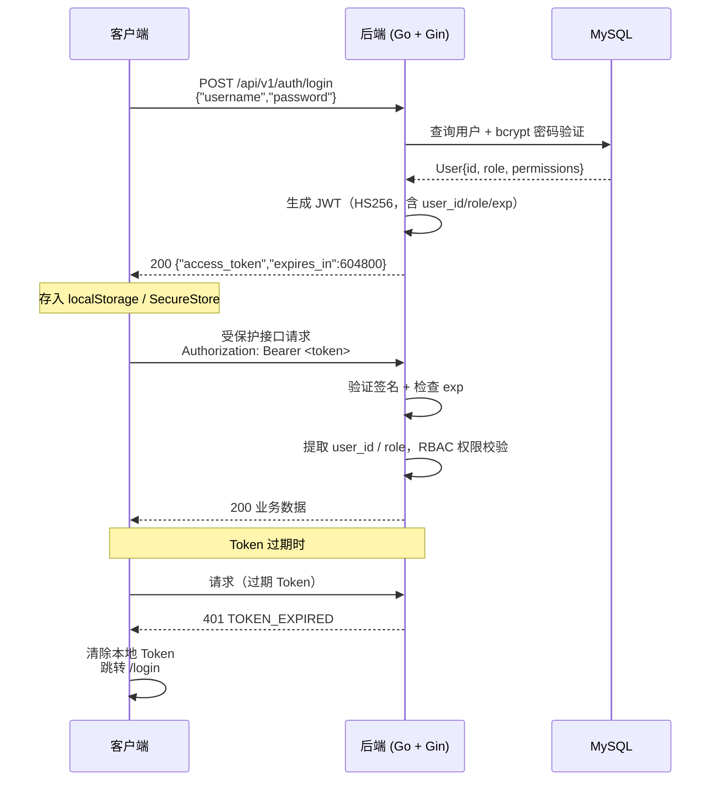
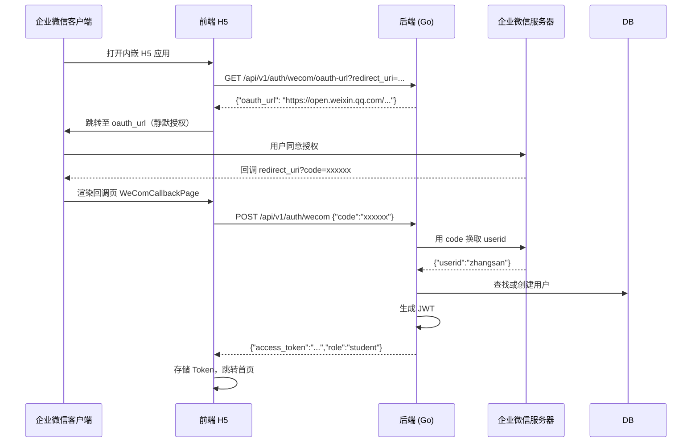

# 认证接口

> 所有 API 接口使用 `Bearer Token` 鉴权。本页文档化认证相关的全部端点、令牌生命周期与错误处理规范。

## 认证方式概览

平台支持两种登录方式，均返回相同结构的 JWT Token：

| 方式 | 端点 | 适用场景 |
|------|------|---------|
| 用户名 + 密码 | `POST /api/v1/auth/login` | Web / Desktop / Mobile 登录 |
| 企业微信 OAuth | `POST /api/v1/auth/wecom` | 企业微信客户端内嵌场景 |

---

## JWT Token 鉴权流程



---

## 端点详情

### `POST /api/v1/auth/login` — 用户名密码登录

**请求体：**

```json
{
  "username": "student",
  "password": "student123"
}
```

| 字段 | 类型 | 必填 | 说明 |
|------|------|------|------|
| `username` | string | ✅ | 用户名 |
| `password` | string | ✅ | 明文密码（传输层 HTTPS 加密） |

**响应（200）：**

```json
{
  "success": true,
  "data": {
    "access_token": "eyJhbGciOiJIUzI1NiIsInR5cCI6IkpXVCJ9...",
    "token_type": "Bearer",
    "expires_in": 604800,
    "user_id": 3,
    "username": "student",
    "role": "student"
  }
}
```

**错误响应：**

| HTTP 状态码 | `error.code` | 场景 |
|------------|--------------|------|
| 401 | `INVALID_CREDENTIALS` | 用户名或密码错误 |
| 429 | `RATE_LIMIT_EXCEEDED` | 登录频率超限（`authLimiter`：每 12s 5 次） |

---

### `GET /api/v1/auth/me` — 获取当前用户信息

前端在每次刷新页面时调用此接口恢复会话（详见 `code/frontend/src/domains/auth/useAuth.tsx`）。

**请求头：**

```http
Authorization: Bearer <jwt_token>
```

**响应（200）：**

```json
{
  "success": true,
  "data": {
    "id": 3,
    "username": "student",
    "name": "测试学生",
    "role": "student",
    "permissions": ["course:read", "ai:use", "sim:use"]
  }
}
```

TypeScript 类型（来自 `@classplatform/shared`）：

```typescript
// code/shared/src/types/auth.ts
export type MeResponse = {
  id: number;
  username: string;
  name?: string;
  role: string;
  permissions: string[];
};
```

---

## 企业微信 OAuth 登录流程



### `GET /api/v1/auth/wecom/oauth-url` — 获取授权 URL

**查询参数：**

| 参数 | 类型 | 必填 | 说明 |
|------|------|------|------|
| `redirect_uri` | string | ✅ | 授权后的回调地址（需已在企业微信后台注册） |

**响应（200）：**

```json
{
  "success": true,
  "data": {
    "oauth_url": "https://open.weixin.qq.com/connect/oauth2/authorize?appid=ww...&redirect_uri=...&response_type=code&scope=snsapi_base&state=..."
  }
}
```

---

### `POST /api/v1/auth/wecom` — 企业微信授权码登录

**请求体：**

```json
{
  "code": "xxxxxxxxxxxxxx"
}
```

**响应（200）：** 与密码登录结构相同，包含 `access_token`、`role` 等字段。

---

### `GET /api/v1/auth/wecom/jsconfig` — JS-SDK 配置

用于初始化企业微信 JS-SDK（网页内调用微信 API）。

**查询参数：**

| 参数 | 类型 | 必填 |
|------|------|------|
| `url` | string | ✅ 当前页面 URL（需 URL 编码） |

**响应（200）：**

```json
{
  "success": true,
  "data": {
    "appId": "ww1234567890abcdef",
    "timestamp": 1740000000,
    "nonceStr": "randomstring",
    "signature": "sha1_signature_string"
  }
}
```

---

## Token 规范

### JWT Payload 结构

```json
{
  "user_id": 3,
  "username": "student",
  "role": "student",
  "exp": 1740086400,
  "iat": 1740000000
}
```

| 字段 | 说明 |
|------|------|
| `user_id` | 数据库主键 ID（整型） |
| `role` | `admin` \| `teacher` \| `assistant` \| `student` |
| `exp` | Unix 时间戳，默认 7 天（604800 秒）后过期 |

::: info 前端 Token 管理
Token 在 Web 端存储于 `localStorage`（`code/frontend/src/lib/auth-store.ts`）。Mobile 端使用 Expo SecureStore。API Client 自动注入 `Authorization: Bearer <token>` 请求头，401 响应时自动清除 Token 并跳转登录页。
:::

### Token 使用

```typescript
// 所有受保护接口均通过 @classplatform/shared 的 API Client 自动处理
import { api } from '@/lib/api-client';  // Web 端

// 示例：获取课程列表（Token 自动附加）
const courses = await api.course.list();
```

---

## 错误码一览

| HTTP | `error.code` | 描述 |
|------|--------------|------|
| 400 | `VALIDATION_ERROR` | 请求参数格式错误 |
| 401 | `INVALID_CREDENTIALS` | 用户名/密码错误 |
| 401 | `TOKEN_EXPIRED` | JWT 已过期 |
| 401 | `TOKEN_INVALID` | JWT 签名无效或格式错误 |
| 403 | `INSUFFICIENT_PERMISSIONS` | 角色权限不足 |
| 429 | `RATE_LIMIT_EXCEEDED` | 登录接口频率超限 |

::: warning 安全注意事项
- 密码使用 `bcrypt` 哈希存储，不明文保存
- 登录接口受独立速率限制器保护（`authLimiter`：每用户每 12 秒最多 5 次）
- 生产环境必须通过 HTTPS 传输，`BACKEND_JWT_SECRET` 至少 32 字符随机字符串
- **生产环境建议**：当前 7 天 TTL 适用于开发/演示场景；生产部署时建议缩短至 1～8 小时，配合 Refresh Token 或重登录机制，降低 Token 泄露后的暴露窗口
:::

## 相关文档

- [RBAC 权限模型](/05-explanation/rbac-model)
- [系统设计](/05-explanation/system-design)
- [环境变量配置](/04-reference/config/)
