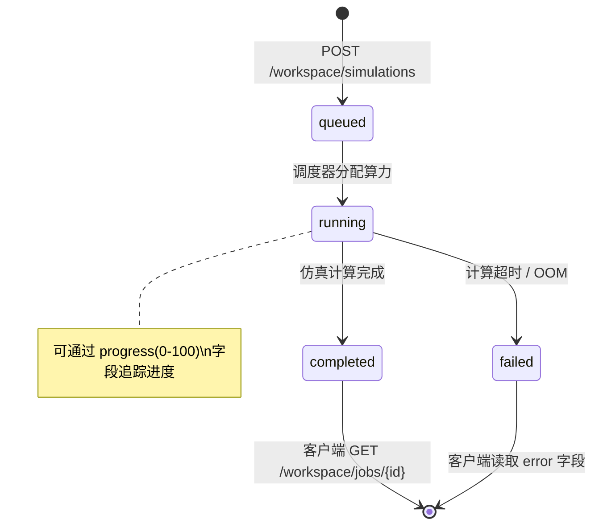

# 工作台与仿真接口

> 本页文档化电磁场仿真工作台的全部接口，包括异步任务调度（`/api/v1/workspace/*`）和直连仿真计算（`/api/v1/sim/*`、`/api/v1/calc/*`）。

::: warning 实现状态（WIP / Demo）
**`/api/v1/workspace/*` 异步路由当前尚未在后端注册**（见 `code/backend/internal/http/router.go`），前端工作台页面（`Workspace.tsx` / `WorkspaceHubPage.tsx`）使用 `setTimeout` Mock 模拟轮询，并非真实 API 链路。本页异步工作台接口契约为**设计规范**，实现状态为**计划中（Planned）**。

同步直连仿真（`/api/v1/sim/*`、`/api/v1/calc/*`）已正常可用。
:::

## 两种调用模式

| 模式 | 接口前缀 | 适用场景 | 响应方式 |
|------|---------|---------|---------|
| **同步直连** | `/api/v1/sim/*` `/api/v1/calc/*` | 轻量计算（< 5s） | 立即返回结果 |
| **异步工作台** | `/api/v1/workspace/*` | 重量仿真（> 5s，精细网格） | 提交任务 → 轮询状态 → 获取结果 |

---

## 异步工作台

### 任务生命周期



### `POST /api/v1/workspace/simulations` — 提交仿真任务

**权限：** `Bearer Token`（所有已登录角色）

**请求体：**

```typescript
// code/shared/src/types/workspace.ts
type WorkspaceSimulationParams = {
  type: 'laplace2d' | 'fdtd' | 'waveguide' | string;
  frequency_mhz?: number;
  grid_resolution: 'coarse' | 'medium' | 'fine';
  boundary_condition: 'pml' | 'pec' | 'periodic';
  duration_ns?: number;
  [key: string]: unknown;   // 各仿真类型特有参数
};
```

**示例（Laplace 2D 边值问题）：**

```json
{
  "type": "laplace2d",
  "grid_resolution": "medium",
  "boundary_condition": "pec",
  "nx": 50,
  "ny": 50,
  "v_top": 100,
  "v_bottom": 0,
  "v_left": 0,
  "v_right": 0
}
```

**示例（1D FDTD 波传播）：**

```json
{
  "type": "fdtd",
  "grid_resolution": "fine",
  "boundary_condition": "pml",
  "frequency_mhz": 2450,
  "duration_ns": 10
}
```

**响应（202 Accepted）：**

```typescript
type SubmitWorkspaceSimulationResponse = {
  id: string;
  status: 'queued' | 'running';
};
```

```json
{
  "success": true,
  "data": {
    "id": "job_a1b2c3d4-5e6f-7890",
    "status": "queued"
  }
}
```

---

### `GET /api/v1/workspace/jobs/{jobId}` — 查询任务状态

**路径参数：**

| 参数 | 类型 | 说明 |
|------|------|------|
| `jobId` | string | 提交时返回的任务 ID |

**响应（200）：**

```typescript
type WorkspaceJob = {
  id: string;
  name: string;
  status: 'queued' | 'running' | 'completed' | 'failed';
  progress: number;          // 0-100，仅 running 状态有效
  cpu_usage?: number;        // 百分比
  gpu_usage?: number;
  memory_used?: string;      // "1.2GB"
  estimated_seconds?: number;
  result?: WorkspaceSimulationResult | null;
  error?: string;            // 仅 failed 状态
  created_at: string;        // ISO 8601
  completed_at?: string;
};

type WorkspaceSimulationResult = {
  id?: string;
  png_base64?: string;       // Base64 编码的可视化图像
  metadata?: {
    computation_time?: number;   // 秒
    iterations?: number;
    grid_size?: number[];
    peak_field_value?: number;
    [key: string]: unknown;
  };
  created_at?: string;
};
```

**示例（运行中）：**

```json
{
  "success": true,
  "data": {
    "id": "job_a1b2c3d4-5e6f-7890",
    "name": "laplace2d_medium_pec",
    "status": "running",
    "progress": 65,
    "cpu_usage": 89,
    "gpu_usage": 0,
    "memory_used": "512MB",
    "estimated_seconds": 8,
    "result": null,
    "created_at": "2026-02-26T10:00:00Z"
  }
}
```

**示例（完成）：**

```json
{
  "success": true,
  "data": {
    "id": "job_a1b2c3d4-5e6f-7890",
    "status": "completed",
    "progress": 100,
    "result": {
      "png_base64": "iVBORw0KGgoAAAANSUhEUg...",
      "metadata": {
        "computation_time": 12.4,
        "iterations": 500,
        "grid_size": [50, 50],
        "peak_field_value": 98.7
      }
    },
    "created_at": "2026-02-26T10:00:00Z",
    "completed_at": "2026-02-26T10:00:12Z"
  }
}
```

---

### `GET /api/v1/workspace/jobs` — 获取任务列表

返回当前用户的历史任务列表。

**响应（200）：**

```json
{
  "success": true,
  "data": [
    {
      "id": "job_a1b2c3d4",
      "status": "completed",
      "progress": 100,
      "created_at": "2026-02-26T10:00:00Z"
    }
  ]
}
```

---

## 前端轮询最佳实践

::: warning Demo 代码
以下示例展示接口调通后的预期用法，当前前端实现为 Mock（`setTimeout` 模拟状态流转），不可直接在生产链路中使用。
:::

```typescript
import { api } from '@/lib/api-client';

async function runSimulation(params: WorkspaceSimulationParams) {
  // 1. 提交任务
  const { id } = await api.workspace.submitSimulation(params);

  // 2. 轮询直到完成（建议间隔 2s）
  while (true) {
    const job = await api.workspace.getJob(id);

    if (job.status === 'completed') {
      // 3. 显示 Base64 图像
      const img = `data:image/png;base64,${job.result!.png_base64}`;
      return { img, meta: job.result!.metadata };
    }

    if (job.status === 'failed') {
      throw new Error(job.error ?? '仿真失败');
    }

    // 更新进度条 job.progress
    await new Promise(r => setTimeout(r, 2000));
  }
}
```

---

## 同步直连仿真

适用于轻量、低延迟的仿真计算，直接返回结果（无需轮询）。

### `POST /api/v1/sim/laplace2d` — Laplace 2D 求解

**请求体：**

```json
{
  "nx": 20,
  "ny": 20,
  "v_top": 1,
  "v_bottom": 0,
  "v_left": 0,
  "v_right": 0
}
```

**响应（200）：**

```json
{
  "success": true,
  "data": {
    "png_base64": "iVBORw0KGgoAAAANSUhEUg...",
    "metadata": {
      "computation_time": 0.23,
      "grid_size": [20, 20],
      "peak_field_value": 1.0
    }
  }
}
```

### 其他同步仿真端点

| 端点 | 物理模型 | 说明 |
|------|---------|------|
| `POST /api/v1/sim/point_charge` | 点电荷电场 | 返回等势线 + 电场线图 |
| `POST /api/v1/sim/biot_savart` | Biot-Savart 磁场 | 有限长直导线磁场分布 |
| `POST /api/v1/sim/fdtd1d` | 1D FDTD 波传播 | 电磁波在有耗介质中的传播 |
| `POST /api/v1/sim/fresnel` | Fresnel 系数 | TE/TM 极化反射/透射系数 |
| `POST /api/v1/calc/integrate` | 数值积分 | 高斯积分 |
| `POST /api/v1/calc/differentiate` | 数值微分 | 中心差分 |

::: details 仿真服务完整路由
详细参数说明见各物理模型的 FastAPI 接口文档（运行 `uvicorn app.main:app --reload --port 8002` 后访问 `http://localhost:8002/docs`）。
:::

---

## 错误码

| HTTP | `error.code` | 场景 |
|------|--------------|------|
| 400 | `INVALID_PARAMS` | 仿真参数格式错误或超出范围 |
| 404 | `JOB_NOT_FOUND` | `jobId` 不存在或不属于当前用户 |
| 503 | `SIM_SERVICE_UNAVAILABLE` | 仿真服务不可达 |
| 429 | `RATE_LIMIT_EXCEEDED` | 提交频率超限 |

---

## 相关文档

- [系统设计](/05-explanation/system-design) — 仿真服务在整体架构中的位置
- [AI 工具调用](/05-explanation/ai/tool-calling) — AI 触发仿真的工具调用机制
- [AI 服务接口](/04-reference/api/ai) — `chat_with_tools` 触发仿真
