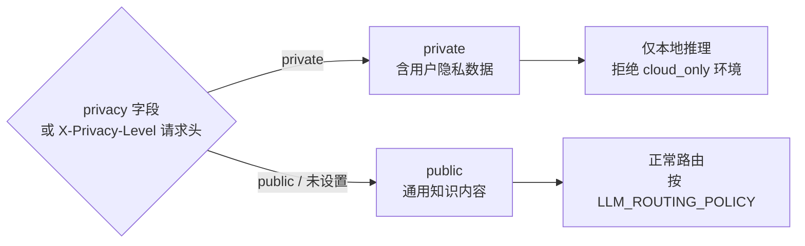

# 模型路由策略（权威说明）

> 本文档定义 AI Service 的模型路由规则、fallback 边界与 vLLM 定位，作为**唯一权威参考**。代码实现见 `code/ai_service/app/model_router.py`。

## 1. 核心路由决策树

```mermaid
flowchart TD
    REQ["AI 请求到达 AI Service"]
    POLICY{"`LLM_ROUTING_POLICY`<br/>环境变量"}

    CO["cloud_only\n绕过本地"]
    LF["local_first\n（默认生产策略）"]
    AUTO_P["auto\n（实验性）"]

    FAMILY{"model_family\n参数值"}
    VISION{"请求是否含\n图片/视频？\nneeds_vision"}

    QWEN3_LOCAL["✅ 本地 vLLM\nQwen3 Text\nNPU / CPU"]
    QWEN3_VL_LOCAL["✅ 本地 vLLM\nQwen3-VL\nGPU"]
    ERR["❌ 400 错误\nMODEL_NOT_SUPPORT_VISION"]

    QWEN3_CLOUD["☁️ 云端 Qwen3\nDashScope / OpenAI"]
    QWEN3_VL_CLOUD["☁️ 云端 Qwen3-VL\nDashScope / OpenAI"]

    REQ --> POLICY
    POLICY -->|cloud_only| CO
    POLICY -->|local_first| LF
    POLICY -->|auto| AUTO_P
    CO --> FAMILY
    LF --> FAMILY
    AUTO_P --> FAMILY

    FAMILY -->|"qwen3"| VISION
    FAMILY -->|"qwen3_vl"| QWEN3_VL_LOCAL
    FAMILY -->|"auto"| VISION

    VISION -->|"false\n纯文本"| QWEN3_LOCAL
    VISION -->|"true\n含图片"| QWEN3_VL_LOCAL
    FAMILY -- "qwen3 +\nneeds_vision=true" --> ERR

    QWEN3_LOCAL -->|"超时 / OOM / 5xx\n本地失败"| QWEN3_CLOUD
    QWEN3_VL_LOCAL -->|"超时 / OOM / 5xx\n本地失败"| QWEN3_VL_CLOUD

    style ERR fill:#ff6b6b,color:#fff
    style QWEN3_CLOUD fill:#74b9ff
    style QWEN3_VL_CLOUD fill:#74b9ff
```

---

## 2. 路由决策表（固定规则）

| `model_family` | `needs_vision` | `LLM_ROUTING_POLICY` | 路由结果 |
|---|---|---|---|
| `qwen3` | false | any | Qwen3 文本模型 |
| `qwen3_vl` | false | any | Qwen3-VL 视觉模型（也可处理纯文本） |
| `auto` | false | any | Qwen3 文本模型 |
| `qwen3` | true | any | **错误** `MODEL_NOT_SUPPORT_VISION` |
| `qwen3_vl` | true | any | Qwen3-VL 视觉模型 |
| `auto` | true | any | Qwen3-VL 视觉模型 |

**关键约束：**
- `needs_vision=true` 时**必须**路由到支持视觉的模型
- 多模态失败**不跨族降级**（不会降到纯文本模型返回错误答案）
- `model_family=auto` 时根据 `needs_vision` 自动选择**同族**模型

---

## 3. Fallback 策略（同族限定）

### 3.1 允许的 Fallback

仅支持**同模型族**内的 `local → cloud` 回退：

```
Qwen3 (local)    → 失败 → Qwen3 (cloud)    ✅
Qwen3-VL (local) → 失败 → Qwen3-VL (cloud) ✅
```

### 3.2 严格禁止的 Fallback

```
Qwen3-VL → Qwen3    ❌  跨能力降级（视觉 → 纯文本）
Qwen3 → Qwen3-VL    ❌  跨能力升级
Qwen3 → 任意其他族  ❌  不支持跨厂商降级
```

### 3.3 Fallback 触发条件

| 触发条件 | 说明 |
|----------|------|
| 连接超时（超过 `LLM_LOCAL_TIMEOUT_SEC`） | ✅ 触发 fallback |
| 推理服务返回 5xx | ✅ 触发 fallback |
| 模型加载失败（OOM、文件损坏） | ✅ 触发 fallback |
| 业务逻辑错误（4xx，如内容违规） | ❌ **不触发** fallback |
| 请求参数错误（400） | ❌ **不触发** fallback |

---

## 4. 隐私分级对路由的影响



| `privacy` | `LLM_ROUTING_POLICY` | 行为 |
|-----------|---------------------|------|
| `private` | `local_first` | 仅使用本地，fallback 拒绝 |
| `private` | `cloud_only` | 返回错误，保护隐私 |
| `public` | any | 按策略正常路由 |

---

## 5. 环境变量配置

### 5.1 路由策略变量

```bash
# 路由策略
LLM_ROUTING_POLICY=local_first       # local_first | cloud_only | auto

# 超时配置
LLM_LOCAL_TIMEOUT_SEC=30             # 本地推理超时（秒）
LLM_CLOUD_TIMEOUT_SEC=120            # 云端 API 超时（秒）

# 非生产环境 cloud fallback 开关
LLM_ENABLE_CLOUD_FALLBACK_NONPROD=true
```

### 5.2 双模型实例配置（推荐）

```bash
# ── 文本模型 ─────────────────────────────────
# 本地 vLLM（Qwen3-7B）
LLM_BASE_URL_LOCAL_TEXT=http://vllm-text:8000/v1
LLM_API_KEY_LOCAL_TEXT=token-local-text
LLM_MODEL_LOCAL_TEXT=qwen3

# 云端备份（DashScope）
LLM_BASE_URL_CLOUD_TEXT=https://dashscope.aliyuncs.com/compatible-mode/v1
LLM_API_KEY_CLOUD_TEXT=sk-xxxx
LLM_MODEL_CLOUD_TEXT=qwen-plus

# ── 视觉模型 ─────────────────────────────────
# 本地 vLLM（Qwen3-VL）
LLM_BASE_URL_LOCAL_VL=http://vllm-vl:8001/v1
LLM_API_KEY_LOCAL_VL=token-local-vl
LLM_MODEL_LOCAL_VL=qwen3-vl

# 云端备份
LLM_BASE_URL_CLOUD_VL=https://dashscope.aliyuncs.com/compatible-mode/v1
LLM_API_KEY_CLOUD_VL=sk-xxxx
LLM_MODEL_CLOUD_VL=qwen-vl-plus

# ── 多模态开关 ────────────────────────────────
AI_MULTIMODAL_ENABLED=false           # 默认关闭，启用设为 true
```

### 5.3 兼容变量（向后兼容，仅纯文本）

```bash
# 仅适用于纯文本场景；多模态必须使用 _TEXT_ / _VL_ 分离变量
LLM_BASE_URL=https://dashscope.aliyuncs.com/compatible-mode
LLM_API_KEY=sk-xxxx
LLM_MODEL=qwen-plus
```

::: warning 迁移建议
新部署优先使用 `LLM_*_TEXT_*` / `LLM_*_VL_*` 分离变量，兼容变量仅保留用于向后兼容，不支持多模态路由。
:::

---

## 6. vLLM 职责边界

### vLLM 负责

- 模型加载与推理加速（PagedAttention、连续批处理）
- OpenAI-compatible REST API 暴露（`/v1/chat/completions`）
- 批处理与并发管理

### vLLM **不**负责

| 功能 | 实际负责方 |
|------|-----------|
| 业务路由决策（local vs cloud） | AI Service (`model_router.py`) |
| 多模态能力检测（`needs_vision`） | AI Service |
| Fallback 逻辑 | AI Service |
| 隐私分级控制 | AI Service |
| 用户会话状态 | AI Service (`session.py`) |

### 部署建议

文本模型与视觉模型使用**独立的 vLLM 实例**和**不同端口**，避免单实例混合部署导致的 VRAM 竞争：

```yaml
# docker-compose.yml 示例
services:
  vllm-text:
    image: vllm/vllm-openai:latest
    command: --model qwen3 --port 8000 --max-model-len 8192
    ports: ["8000:8000"]
    deploy:
      resources:
        reservations:
          devices:
            - capabilities: [gpu]
              count: 1

  vllm-vl:
    image: vllm/vllm-openai:latest
    command: --model qwen3-vl --port 8001 --max-model-len 4096
    ports: ["8001:8001"]
    deploy:
      resources:
        reservations:
          devices:
            - capabilities: [gpu]
              count: 1
```

---

## 7. 审计日志字段

每次路由决策记录以下字段，用于追踪和调试：

```json
{
  "request_id": "req_abc123",
  "model_family_requested": "auto",
  "model_family_resolved": "qwen3_vl",
  "needs_vision": true,
  "route": "local",
  "fallback_occurred": false,
  "latency_ms": 1240,
  "privacy_level": "private"
}
```

---

## 8. 常见错误码

| 错误码 | 场景 | HTTP |
|--------|------|------|
| `FEATURE_DISABLED` | `AI_MULTIMODAL_ENABLED=false` | 403 |
| `MODEL_NOT_SUPPORT_VISION` | `model_family=qwen3` + `needs_vision=true` | 400 |
| `UPSTREAM_UNAVAILABLE` | 本地+云端均不可达 | 503 |
| `MODEL_LOAD_FAILED` | 模型加载失败（触发 fallback） | — |
| `PRIVACY_VIOLATION` | `private` 请求但只有云端可用 | 403 |

---

## 相关文档

- [AI 服务接口](/04-reference/api/ai) — AI 接口请求参数与 `model_family` 字段
- [NPU 分层部署策略](/03-how-to-guides/deployment/npu-tiered-deployment) — 端侧 NPU 部署配置
- [Qwen3-VL 迁移基线](/05-explanation/ai/qwen3-vl-migration-baseline-2026-02-09) — 多模态升级基线
- [配置说明](/04-reference/config/) — 完整环境变量参考
