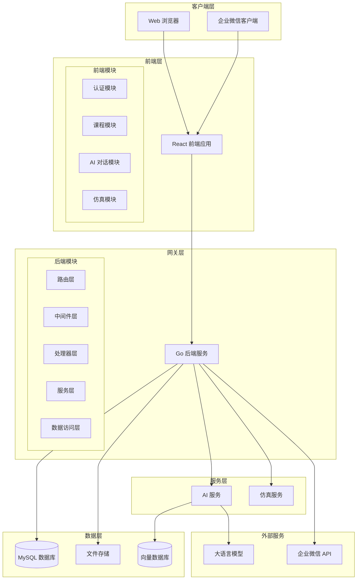

# 组件设计

## 概述

本文档详细描述了系统各个组件的设计，包括组件职责、接口定义、数据流和交互关系。

## 组件架构图



## 前端组件设计

### 1. 认证模块 (Authentication Module)

**职责**:
- 用户登录/登出
- Token 管理
- 权限验证
- 企业微信 OAuth 集成

**主要组件**:
```typescript
// 认证服务
class AuthService {
  async login(credentials: LoginCredentials): Promise<AuthResponse>
  async logout(): Promise<void>
  async refreshToken(): Promise<string>
  async getCurrentUser(): Promise<User>
  isAuthenticated(): boolean
  hasPermission(permission: string): boolean
}

// 认证状态管理
interface AuthState {
  user: User | null
  token: string | null
  permissions: string[]
  isLoading: boolean
}
```

**接口定义**:
- `POST /api/v1/auth/login` - 用户登录
- `POST /api/v1/auth/wecom` - 企业微信登录
- `GET /api/v1/auth/me` - 获取当前用户信息
- `POST /api/v1/auth/refresh` - 刷新 Token

### 2. 课程模块 (Course Module)

**职责**:
- 课程列表展示
- 课程详情管理
- 作业提交和查看
- 资源下载

**主要组件**:
```typescript
// 课程服务
class CourseService {
  async getCourses(): Promise<Course[]>
  async getCourse(id: string): Promise<Course>
  async createCourse(course: CreateCourseRequest): Promise<Course>
  async updateCourse(id: string, updates: UpdateCourseRequest): Promise<Course>
  async joinCourse(inviteCode: string): Promise<void>
}

// 课程状态管理
interface CourseState {
  courses: Course[]
  currentCourse: Course | null
  assignments: Assignment[]
  resources: Resource[]
  isLoading: boolean
}
```

### 3. AI 对话模块 (AI Chat Module)

**职责**:
- AI 对话界面
- 多模式切换
- 对话历史管理
- 流式响应处理

**主要组件**:
```typescript
// AI 服务
class AIService {
  async chat(request: ChatRequest): Promise<ChatResponse>
  async streamChat(request: ChatRequest): AsyncGenerator<ChatDelta>
  async getChatHistory(): Promise<Conversation[]>
  async deleteConversation(id: string): Promise<void>
}

// 对话状态管理
interface ChatState {
  conversations: Conversation[]
  currentConversation: Conversation | null
  messages: Message[]
  isStreaming: boolean
  currentMode: ChatMode
}
```

### 4. 仿真模块 (Simulation Module)

**职责**:
- 仿真参数配置
- 仿真结果展示
- 可视化图表渲染
- 历史记录管理

**主要组件**:
```typescript
// 仿真服务
class SimulationService {
  async runSimulation(type: string, params: any): Promise<SimulationResult>
  async getSimulationHistory(): Promise<SimulationRecord[]>
  async getSimulationResult(id: string): Promise<SimulationResult>
  async deleteSimulation(id: string): Promise<void>
}

// 仿真状态管理
interface SimulationState {
  currentSimulation: SimulationResult | null
  history: SimulationRecord[]
  isRunning: boolean
  parameters: Record<string, any>
}
```

## 后端组件设计

### 1. 路由层 (Router Layer)

**职责**:
- HTTP 路由定义
- 请求分发
- 中间件注册
- 模块化路由管理

**目录结构 (`internal/http/routes/`)**:
```text
internal/http/routes/
├── admin_routes.go
├── ai_routes.go
├── auth_routes.go
├── course_routes.go
...
└── middleware.go
```

```go
// 主路由入口 (internal/http/router.go)
func SetupRouter(cfg *config.Config, db *gorm.DB) *gin.Engine {
    r := gin.New()
    
    // 初始化各个 Handler...
    authHandler := http.NewAuthHandler(...)
    courseHandler := http.NewCourseHandler(...)

    api := r.Group("/api/v1")
    
    // 注册各模块路由
    routes.RegisterAuthRoutes(api, cfg.JWTSecret, authHandler)
    routes.RegisterCourseRoutes(api, cfg.JWTSecret, courseHandler)
    // ...
    
    return r
}

// 模块路由示例 (internal/http/routes/course_routes.go)
func RegisterCourseRoutes(rg *gin.RouterGroup, jwtSecret string, h *http.CourseHandler) {
    courses := rg.Group("/courses")
    courses.Use(middleware.AuthMiddleware(jwtSecret))
    {
        courses.GET("", h.ListCourses)
        courses.POST("", h.CreateCourse)
        courses.GET("/:id", h.GetCourse)
    }
}
```

### 2. 中间件层 (Middleware Layer)

**职责**:
- 请求认证
- 权限验证
- 日志记录
- 错误处理
- 跨域处理

```go
// 认证中间件
func AuthMiddleware(jwtService *auth.JWTService) gin.HandlerFunc {
    return func(c *gin.Context) {
        token := extractToken(c)
        if token == "" {
            c.JSON(401, gin.H{"error": "Missing token"})
            c.Abort()
            return
        }
        
        claims, err := jwtService.ValidateToken(token)
        if err != nil {
            c.JSON(401, gin.H{"error": "Invalid token"})
            c.Abort()
            return
        }
        
        c.Set("user_id", claims.UserID)
        c.Set("permissions", claims.Permissions)
        c.Next()
    }
}

// 权限验证中间件
func RequirePermission(permission string) gin.HandlerFunc {
    return func(c *gin.Context) {
        permissions, exists := c.Get("permissions")
        if !exists {
            c.JSON(403, gin.H{"error": "No permissions found"})
            c.Abort()
            return
        }
        
        if !hasPermission(permissions.([]string), permission) {
            c.JSON(403, gin.H{"error": "Insufficient permissions"})
            c.Abort()
            return
        }
        
        c.Next()
    }
}
```

### 3. 处理器层 (Handler Layer)

**职责**:
- HTTP 请求处理
- 参数验证
- 响应格式化
- 错误处理

```go
// 课程处理器
type CourseHandler struct {
    courseService *service.CourseService
    validator     *validator.Validate
}

func (h *CourseHandler) GetCourses(c *gin.Context) {
    userID := c.GetString("user_id")
    
    courses, err := h.courseService.GetUserCourses(userID)
    if err != nil {
        c.JSON(500, gin.H{"error": err.Error()})
        return
    }
    
    c.JSON(200, gin.H{
        "success": true,
        "data": courses,
    })
}

func (h *CourseHandler) CreateCourse(c *gin.Context) {
    var req CreateCourseRequest
    if err := c.ShouldBindJSON(&req); err != nil {
        c.JSON(400, gin.H{"error": err.Error()})
        return
    }
    
    if err := h.validator.Struct(&req); err != nil {
        c.JSON(400, gin.H{"error": err.Error()})
        return
    }
    
    userID := c.GetString("user_id")
    course, err := h.courseService.CreateCourse(userID, &req)
    if err != nil {
        c.JSON(500, gin.H{"error": err.Error()})
        return
    }
    
    c.JSON(201, gin.H{
        "success": true,
        "data": course,
    })
}
```

### 4. 服务层 (Service Layer)

**职责**:
- 业务逻辑实现
- 数据验证
- 外部服务调用
- 事务管理

**接口定义**:
```go
// 课程服务接口
type CourseService interface {
    CreateCourse(ctx context.Context, userID uint, req *CreateCourseRequest) (*models.Course, error)
    GetUserCourses(ctx context.Context, userID uint) ([]*models.Course, error)
    // ...
}
```

**实现示例**:
```go
// 课程服务实现
type courseService struct {
    courseRepo repositories.CourseRepository
    userRepo   repositories.UserRepository
    aiClient   clients.AIClientInterface
    db         *gorm.DB
}

func (s *courseService) CreateCourse(ctx context.Context, userID uint, req *CreateCourseRequest) (*models.Course, error) {
    // 验证用户权限
    user, err := s.userRepo.FindByID(ctx, userID)
    if err != nil {
        return nil, err
    }
    
    if user.Role != "teacher" && user.Role != "admin" {
        return nil, errors.New("insufficient permissions")
    }
    
    // 检查课程代码唯一性
    exists, err := s.courseRepo.ExistsByCode(ctx, req.Code)
    if err != nil {
        return nil, err
    }
    if exists {
        return nil, errors.New("course code already exists")
    }
    
    // 创建课程
    course := &models.Course{
        Name:        req.Name,
        Code:        req.Code,
        Semester:    req.Semester,
        Description: req.Description,
        TeacherID:   userID,
        Status:      "active",
    }
    
    return s.courseRepo.Create(ctx, course)
}
```

### 5. 数据访问层 (Repository Layer)

**职责**:
- 数据库操作
- 查询优化
- 数据映射

**接口定义**:
```go
// 课程仓储接口
type CourseRepository interface {
    Create(ctx context.Context, course *models.Course) (*models.Course, error)
    FindByID(ctx context.Context, id uint) (*models.Course, error)
    FindByCode(ctx context.Context, code string) (*models.Course, error)
    FindByTeacherID(ctx context.Context, teacherID uint) ([]*models.Course, error)
    FindByStudentID(ctx context.Context, studentID uint) ([]*models.Course, error)
    Update(ctx context.Context, course *models.Course) error
    Delete(ctx context.Context, id uint) error
    ExistsByCode(ctx context.Context, code string) (bool, error)
}
```

**实现示例**:
```go
// 课程仓储实现
type courseRepository struct {
    db *gorm.DB
}

func NewCourseRepository(db *gorm.DB) CourseRepository {
    return &courseRepository{db: db}
}

func (r *courseRepository) Create(ctx context.Context, course *models.Course) (*models.Course, error) {
    if err := r.db.WithContext(ctx).Create(course).Error; err != nil {
        return nil, err
    }
    return course, nil
}

func (r *courseRepository) FindByTeacherID(ctx context.Context, teacherID uint) ([]*models.Course, error) {
    var courses []*models.Course
    err := r.db.WithContext(ctx).Where("teacher_id = ?", teacherID).
        Preload("Teacher").
        Preload("Students").
        Find(&courses).Error
    return courses, err
}
```

## AI 服务组件设计

### 1. 对话管理器 (Chat Manager)

**职责**:
- 对话会话管理
- 上下文维护
- 模式切换
- 历史记录

```python
class ChatManager:
    def __init__(self, llm_client: LLMClient, rag_service: RAGService):
        self.llm_client = llm_client
        self.rag_service = rag_service
        self.conversations: Dict[str, Conversation] = {}
    
    async def chat(self, request: ChatRequest) -> ChatResponse:
        conversation = self.get_or_create_conversation(request.user_id)
        
        # 根据模式选择 prompt 模板
        prompt_template = self.get_prompt_template(request.mode)
        
        # 如果启用 RAG，检索相关知识
        context = ""
        if request.mode.endswith("_rag"):
            context = await self.rag_service.retrieve(
                request.messages[-1].content,
                request.context.get("course_id")
            )
        
        # 构建完整的 prompt
        messages = self.build_messages(
            conversation.history,
            request.messages,
            prompt_template,
            context
        )
        
        # 调用 LLM
        response = await self.llm_client.chat_completion(messages)
        
        # 更新对话历史
        conversation.add_exchange(request.messages[-1], response)
        
        return ChatResponse(
            reply=response.content,
            mode=request.mode,
            references=self.extract_references(context),
            tokens_used=response.usage
        )
```

### 2. RAG 服务 (RAG Service)

**职责**:
- 知识库检索
- 向量相似度计算
- 上下文排序
- 引用提取

```python
class RAGService:
    def __init__(self, vector_store: VectorStore, embeddings: Embeddings):
        self.vector_store = vector_store
        self.embeddings = embeddings
    
    async def retrieve(self, query: str, course_id: str = None) -> str:
        # 生成查询向量
        query_vector = await self.embeddings.embed_query(query)
        
        # 检索相似文档
        filters = {"course_id": course_id} if course_id else {}
        docs = await self.vector_store.similarity_search(
            query_vector,
            k=5,
            filters=filters
        )
        
        # 排序和格式化
        context_parts = []
        for doc in docs:
            if doc.score > 0.7:  # 相似度阈值
                context_parts.append(f"[{doc.source}] {doc.content}")
        
        return "\n\n".join(context_parts)
    
    async def build_index(self, documents: List[Document]) -> None:
        # 文档分块
        chunks = self.chunk_documents(documents)
        
        # 生成向量
        vectors = await self.embeddings.embed_documents([c.content for c in chunks])
        
        # 存储到向量数据库
        await self.vector_store.add_vectors(chunks, vectors)
```

## 仿真服务组件设计

### 1. 求解器管理器 (Solver Manager)

**职责**:
- 求解器注册
- 参数验证
- 计算调度
- 结果缓存

```python
class SolverManager:
    def __init__(self):
        self.solvers: Dict[str, BaseSolver] = {}
        self.register_default_solvers()
    
    def register_solver(self, name: str, solver: BaseSolver):
        self.solvers[name] = solver
    
    async def solve(self, solver_type: str, parameters: Dict) -> SimulationResult:
        if solver_type not in self.solvers:
            raise ValueError(f"Unknown solver type: {solver_type}")
        
        solver = self.solvers[solver_type]
        
        # 参数验证
        validated_params = solver.validate_parameters(parameters)
        
        # 执行计算
        result = await solver.solve(validated_params)
        
        # 生成可视化
        visualization = await solver.visualize(result)
        
        return SimulationResult(
            data=result,
            visualization=visualization,
            metadata=solver.get_metadata()
        )
```

### 2. 基础求解器 (Base Solver)

**职责**:
- 参数验证
- 数值计算
- 结果格式化
- 可视化生成

```python
class BaseSolver(ABC):
    @abstractmethod
    def validate_parameters(self, params: Dict) -> Dict:
        pass
    
    @abstractmethod
    async def solve(self, params: Dict) -> Any:
        pass
    
    @abstractmethod
    async def visualize(self, result: Any) -> str:
        pass
    
    def get_metadata(self) -> Dict:
        return {
            "solver_name": self.__class__.__name__,
            "version": "1.0.0",
            "computation_time": time.time() - self.start_time
        }

class Laplace2DSolver(BaseSolver):
    def validate_parameters(self, params: Dict) -> Dict:
        schema = {
            "nx": {"type": int, "min": 10, "max": 200},
            "ny": {"type": int, "min": 10, "max": 200},
            "v_top": {"type": float},
            "v_bottom": {"type": float},
            "v_left": {"type": float},
            "v_right": {"type": float}
        }
        return validate_against_schema(params, schema)
    
    async def solve(self, params: Dict) -> np.ndarray:
        nx, ny = params["nx"], params["ny"]
        
        # 初始化电位矩阵
        V = np.zeros((ny, nx))
        
        # 设置边界条件
        V[0, :] = params["v_top"]      # 上边界
        V[-1, :] = params["v_bottom"]  # 下边界
        V[:, 0] = params["v_left"]     # 左边界
        V[:, -1] = params["v_right"]   # 右边界
        
        # 迭代求解
        for iteration in range(1000):
            V_old = V.copy()
            V[1:-1, 1:-1] = 0.25 * (
                V[2:, 1:-1] + V[:-2, 1:-1] + 
                V[1:-1, 2:] + V[1:-1, :-2]
            )
            
            # 检查收敛
            if np.max(np.abs(V - V_old)) < 1e-6:
                break
        
        return V
    
    async def visualize(self, result: np.ndarray) -> str:
        fig, ax = plt.subplots(figsize=(10, 8))
        
        # 绘制等势线图
        contour = ax.contour(result, levels=20)
        ax.clabel(contour, inline=True, fontsize=8)
        
        # 绘制电场线
        Ex, Ey = np.gradient(-result)
        ax.streamplot(
            np.arange(result.shape[1]),
            np.arange(result.shape[0]),
            Ex, Ey,
            density=1.5,
            color='red',
            alpha=0.6
        )
        
        ax.set_title('2D Laplace Equation Solution')
        ax.set_xlabel('X')
        ax.set_ylabel('Y')
        
        # 转换为 base64
        buffer = io.BytesIO()
        plt.savefig(buffer, format='png', dpi=150, bbox_inches='tight')
        buffer.seek(0)
        image_base64 = base64.b64encode(buffer.getvalue()).decode()
        plt.close()
        
        return image_base64
```

## 数据模型设计

### 1. 用户模型

```go
type User struct {
    ID          string    `json:"id" gorm:"primaryKey"`
    Username    string    `json:"username" gorm:"uniqueIndex"`
    Password    string    `json:"-"`
    Name        string    `json:"name"`
    Email       string    `json:"email"`
    Role        string    `json:"role"`
    WecomUserID string    `json:"wecom_user_id,omitempty"`
    CreatedAt   time.Time `json:"created_at"`
    UpdatedAt   time.Time `json:"updated_at"`
    
    // 关联关系
    TeachingCourses []Course `json:"teaching_courses,omitempty" gorm:"foreignKey:TeacherID"`
    EnrolledCourses []Course `json:"enrolled_courses,omitempty" gorm:"many2many:course_students"`
}

func (u *User) HasPermission(permission string) bool {
    permissions := getRolePermissions(u.Role)
    return contains(permissions, permission)
}
```

### 2. 课程模型

```go
type Course struct {
    ID          string    `json:"id" gorm:"primaryKey"`
    Name        string    `json:"name"`
    Code        string    `json:"code" gorm:"uniqueIndex"`
    Semester    string    `json:"semester"`
    Description string    `json:"description"`
    TeacherID   string    `json:"teacher_id"`
    Status      string    `json:"status"`
    InviteCode  string    `json:"invite_code" gorm:"uniqueIndex"`
    CreatedAt   time.Time `json:"created_at"`
    UpdatedAt   time.Time `json:"updated_at"`
    
    // 关联关系
    Teacher     User         `json:"teacher" gorm:"foreignKey:TeacherID"`
    Students    []User       `json:"students" gorm:"many2many:course_students"`
    Assignments []Assignment `json:"assignments"`
    Resources   []Resource   `json:"resources"`
}
```

## 组件间通信

### 1. 同步通信

**HTTP REST API**:
- 前端 ↔ 后端：标准 REST API
- 后端 ↔ AI 服务：HTTP JSON API
- 后端 ↔ 仿真服务：HTTP JSON API

### 2. 异步通信

**消息队列**（可选扩展）:
- 长时间运行的仿真任务
- 批量数据处理
- 系统通知

### 3. 数据同步

**数据库事务**:
- 确保数据一致性
- 支持回滚操作
- 处理并发访问

## 错误处理策略

### 1. 分层错误处理

```go
// 自定义错误类型
type AppError struct {
    Code    string `json:"code"`
    Message string `json:"message"`
    Details string `json:"details,omitempty"`
}

// 错误处理中间件
func ErrorHandler() gin.HandlerFunc {
    return func(c *gin.Context) {
        c.Next()
        
        if len(c.Errors) > 0 {
            err := c.Errors.Last()
            
            switch e := err.Err.(type) {
            case *AppError:
                c.JSON(400, gin.H{
                    "success": false,
                    "error": e,
                })
            default:
                c.JSON(500, gin.H{
                    "success": false,
                    "error": AppError{
                        Code:    "INTERNAL_ERROR",
                        Message: "Internal server error",
                    },
                })
            }
        }
    }
}
```

### 2. 服务降级

- AI 服务不可用时返回预设响应
- 仿真服务超时时提供简化计算
- 数据库连接失败时使用缓存数据

## 性能优化

### 1. 缓存策略

- Redis 缓存热点数据
- 浏览器缓存静态资源
- CDN 加速文件下载

### 2. 数据库优化

- 合理使用索引
- 查询优化
- 连接池管理
- 读写分离

### 3. 并发处理

- Go 协程处理并发请求
- Python 异步处理 I/O 密集任务
- 数据库连接池复用

## 扩展性设计

### 1. 水平扩展

- 无状态服务设计
- 负载均衡支持
- 数据库分片

### 2. 功能扩展

- 插件化架构
- 配置驱动功能
- API 版本管理

这个组件设计确保了系统的模块化、可维护性和可扩展性，为后续的开发和维护提供了清晰的指导。
