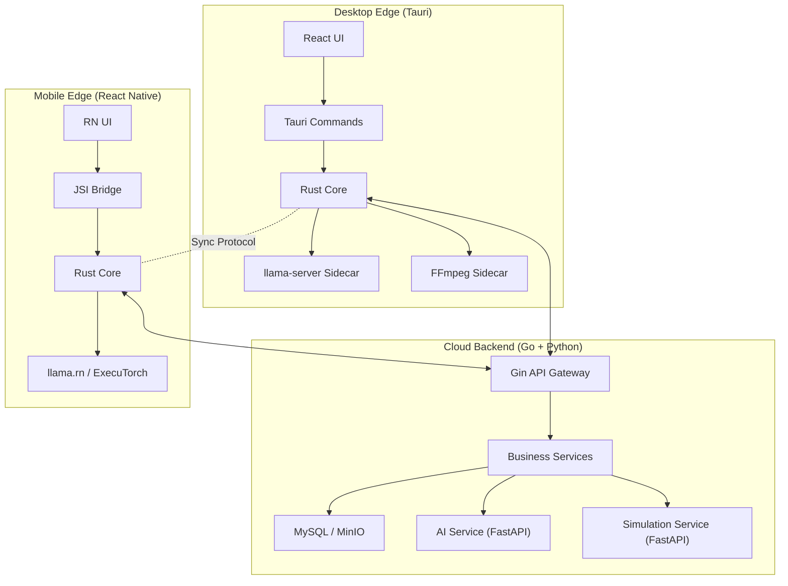

# Rust 增强初步计划（POC 选型 + 接口定义 + 迁移清单）

> 版本：v0.1（Draft）  
> 日期：2026-02-11  
> 适用范围：`code/backend`、`code/ai_service`、`code/simulation`、`code/frontend-react`、`code/mobile`

## 1. 目标与边界

### 1.1 目标
- 在不推翻现有 Go + Python 服务架构的前提下，引入 Rust 作为“边端统一核心”和“高性能计算增强层”。
- 满足答辩展示诉求：跨端一致逻辑、可量化性能提升、可控迁移风险。
- 先做可验证 POC，再决定是否扩大 Rust 覆盖范围。

### 1.2 非目标（本阶段不做）
- 不重写 `code/backend` 全量业务 API。
- 不替换 `code/ai_service` 的模型推理主流程。
- 不一次性改动数据库模型与主业务协议。

## 2. Rust POC 选型

### 2.1 候选项对比

| 候选 POC | 价值 | 改造成本 | 风险 | 答辩展示价值 | 结论 |
|---|---|---|---|---|---|
| POC-A：`router_core`（云/边路由决策 Rust 化，桌面+移动共用） | 高（统一逻辑 + 跨端复用） | 中 | 低 | 很高 | **P0 必做** |
| POC-B：`sim_kernel_rs`（仿真核心如 `wave_1d` Rust 化） | 高（CPU 密集可量化提速） | 中-高 | 中 | 高 | **P1 推荐** |
| POC-C：`secure_exec_rs`（替换 Python `run_code` 执行沙箱） | 高（安全性显著提升） | 高 | 中-高 | 高 | P2 加分项 |
| POC-D：GraphRAG 检索融合 Rust 化 | 中（性能潜力有，但收益依赖数据规模） | 高 | 中 | 中 | 后续评估 |

### 2.2 本轮落地选择
- **主线 POC（必须）**：POC-A `router_core`。
- **性能 POC（推荐）**：POC-B `sim_kernel_rs`（先覆盖 `wave_1d`，后续扩展 `laplace2d`）。
- **安全 POC（可选）**：POC-C `secure_exec_rs`，放在第二轮。

## 3. 目标架构（Rust 增强版）



## 4. 接口定义（初版）

### 4.1 Rust Core 逻辑接口（跨端统一）

建议新增工作区：`code/rust-core/`，包含：
- `router_core`：路由决策（local / cloud / auto）
- `sync_core`：离线同步计划与冲突策略
- `crypto_core`：端到端加密封装（可后续落地）

核心数据结构（示意）：

```rust
pub struct RouteInput {
    pub privacy_level: String,       // "private" | "public"
    pub user_preference: String,     // "latency" | "privacy" | "balanced"
    pub device_load: f32,            // 0.0 ~ 1.0
    pub battery_level: Option<f32>,  // mobile
    pub network_rtt_ms: u32,
    pub local_model_ready: bool,
}

pub struct RouteDecision {
    pub route: String,               // "local" | "cloud"
    pub reason: String,              // e.g. "privacy_high"
    pub ttl_seconds: u32,
}
```

### 4.2 Desktop（Tauri）接口

Tauri command（JSON I/O）：
- `router_decide(input) -> RouteDecision`
- `sync_plan(input) -> SyncPlan`
- `crypto_encrypt(input) -> CipherEnvelope`（第二阶段）

示例：

```json
{
  "privacy_level": "private",
  "user_preference": "balanced",
  "device_load": 0.42,
  "network_rtt_ms": 85,
  "local_model_ready": true
}
```

返回：

```json
{
  "route": "local",
  "reason": "privacy_high",
  "ttl_seconds": 30
}
```

### 4.3 Mobile（React Native + JSI）接口

对齐 Desktop，保持同构：
- `RustCore.decideRoute(json: string): string`
- `RustCore.buildSyncPlan(json: string): string`

要求：
- 参数与返回字段与 Tauri 保持一致，避免双套协议。
- JS 层仅做序列化，不承载核心策略分支。

### 4.4 与现有服务的 HTTP 接口衔接

### A. AI 路由衔接（复用现有能力）
- 现有 AI 服务已支持 `privacy/route` 语义（见 `code/ai_service/app/main.py`）。
- Rust 决策后，客户端按以下方式透传：
  - Header：`X-Privacy-Level`、`X-LLM-Route`
  - Body：`privacy`、`route`

### B. 仿真服务衔接（POC-B）
新增 Rust 仿真服务建议接口：
- `POST /v1/sim-rs/wave_1d`
- `POST /v1/sim-rs/laplace2d`（第二步）

Simulation FastAPI 迁移策略：
- `code/simulation/app/routes/wave.py` 优先改为调用 Rust 服务。
- 保留 Python 实现作为 fallback（环境变量开关 `SIM_ENGINE=python|rust`）。

## 5. 迁移清单（Checklist）

### 5.1 目录与工程结构变更

- [ ] 新增 `code/rust-core/`（Cargo workspace）
- [ ] 新增 `code/rust-core/crates/router_core/`
- [ ] 新增 `code/rust-core/crates/sync_core/`
- [ ] 新增 `code/rust-core/crates/ffi_bridge/`（Tauri + RN 共享 FFI 边界）
- [ ] 新增 `code/simulation-rs/`（POC-B 独立服务）
- [ ] 新增 `code/desktop-tauri/`（承载桌面端 POC）

### 5.2 分阶段计划

### Phase 0（1 周）：基线与骨架
- [ ] 建立性能基线：非 AI API、`/v1/sim/wave_1d`、AI 首字延迟
- [ ] 创建 Rust workspace，接入 CI 编译与单测
- [ ] 产出接口契约文档（本文件 v0.2）

验收：
- Rust 工程可在本地与 CI 构建。
- 基线报告可复现，可用于前后对比。

### Phase 1（1-2 周）：POC-A `router_core`
- [ ] 实现路由决策引擎（含 deterministic tests）
- [ ] 在 Desktop（Tauri）接入 `router_decide`
- [ ] 在 Mobile（RN）做最小 JSI 调用演示
- [ ] 客户端将决策结果透传到 AI 服务 `privacy/route`

验收：
- 同一组输入在 Desktop 与 Mobile 输出完全一致。
- 路由决策耗时 p95 < 1ms（本地）。

### Phase 2（1-2 周）：POC-B `sim_kernel_rs`
- [ ] Rust 实现 `wave_1d` 核心计算
- [ ] Simulation 服务接入 Rust 引擎并保留 fallback
- [ ] 增加端到端回归测试（数值误差阈值 + 图像结果可用性）

验收：
- `wave_1d` 接口在目标输入集下 p95 延迟降低 >= 30%。
- 数值误差在可接受阈值（例如相对误差 <= 1e-4）。

### Phase 3（可选，1 周）：POC-C `secure_exec_rs`
- [ ] 替换 `run_code` 的高风险执行路径
- [ ] 白名单执行模型 + 资源限制（CPU/内存/超时）
- [ ] 安全回归测试（逃逸样例）

验收：
- 关键逃逸样例全部阻断。
- 正常教学脚本执行成功率 >= 95%。

### 5.3 回滚策略

- Rust 路径均通过 feature flag 开关控制：
  - `EDGE_ROUTER_ENGINE=js|rust`
  - `SIM_ENGINE=python|rust`
  - `SECURE_EXEC_ENGINE=python|rust`
- 任一异常可在不改 DB schema 的情况下快速回退到现有实现。

## 6. 风险与缓解

| 风险 | 影响 | 缓解 |
|---|---|---|
| Tauri/RN 与 Rust FFI 工程复杂度高 | 进度延迟 | 先打通 `router_core` 单一能力，再扩展 |
| 仿真数值结果偏差 | 教学结果不一致 | 建立 golden case + 误差阈值门禁 |
| 团队 Rust 经验不足 | 维护成本上升 | 限定 Rust 职责边界，保持“薄而稳” |

## 7. 立即下一步（本周）

1. 在 `code/` 下初始化 `code/desktop-tauri/`（承载 React + Tauri）。
2. 同步初始化 `code/rust-core/`，先实现 `router_core` 和 20 条规则单测。
3. 在现有前端增加一个“路由决策调试面板”，实时展示 `route/reason/ttl`，作为答辩演示抓手。
