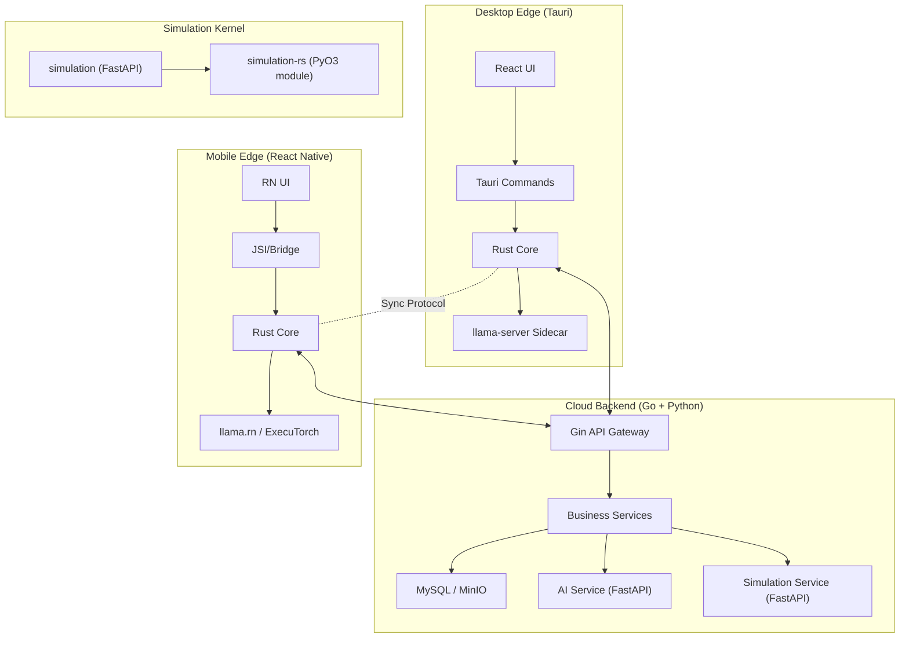

# Rust 增强执行计划（POC 选型 + 接口定义 + 迁移清单）

> 版本：v0.3  
> 日期：2026-02-11  
> 适用范围：`code/backend`、`code/ai_service`、`code/simulation`、`code/mobile`、`code/desktop-tauri`、`code/rust-core`

## 1. 目标与边界

### 1.1 目标
- 在不推翻现有 Go + Python 服务架构前提下，引入 Rust 作为“边端统一核心”和“高性能数值核”。
- 形成可答辩演示的两条主线：
  - 主线 A：端云路由统一（Desktop + Mobile 同一策略）。
  - 主线 B：仿真计算加速（`wave_1d` Rust 核）。
- 全程可回滚，不改变现有对外 REST 契约。

### 1.2 非目标（本轮）
- 不重写 `code/backend` 业务 API。
- 不替换 `code/ai_service` 主推理链路。
- 不纳入 `run_code` 全量替换交付（只保留 POC-C 延期方案）。

## 2. Rust POC 选型

| 候选 POC | 价值 | 成本 | 风险 | 结论 |
|---|---|---|---|---|
| POC-A：`router_core`（端云路由决策 Rust 化） | 高 | 中 | 低 | **P0 必做** |
| POC-B：`simulation-rs`（`wave_1d` 数值核 Rust 化） | 高 | 中 | 中 | **P1 推荐** |
| POC-C：`secure_exec_rs`（`run_code` 安全执行） | 中-高 | 高 | 中-高 | **延期探索** |
| POC-D：GraphRAG 图扩展 Rust 化 | 中 | 高 | 中 | **A/B 达标后可选** |

已确认：`run_code` 当前位于 `code/simulation/app/main.py`，不在 `ai_service`。

## 3. 目标架构（Rust 增强版）



## 4. 接口定义（v0.3）

### 4.1 `router_core` 强类型接口

新增工作区：`code/rust-core/`。

```rust
#[derive(Serialize, Deserialize)]
pub enum PrivacyLevel { Private, Public }

#[derive(Serialize, Deserialize)]
pub enum UserPreference { Latency, Privacy, Balanced }

#[derive(Serialize, Deserialize)]
pub enum ThermalState { Nominal, Fair, Serious, Critical }

#[derive(Serialize, Deserialize)]
pub struct DeviceContext {
    pub battery_level: Option<f32>,
    pub thermal_state: Option<ThermalState>,
    pub memory_available_mb: u32,
}

#[derive(Serialize, Deserialize)]
pub struct RouteInput {
    pub privacy_level: PrivacyLevel,
    pub user_preference: UserPreference,
    pub device_load: f32,
    pub device_context: DeviceContext,
    pub network_rtt_ms: u32,
    pub local_model_ready: bool,
    pub cloud_model_ready: bool,
}

#[derive(Serialize, Deserialize)]
pub enum RouteTarget { Local, Cloud }

#[derive(Serialize, Deserialize)]
pub struct RouteDecision {
    pub route: RouteTarget,
    pub reason: String,
    pub ttl_seconds: u32,
}
```

规则约束：
- 高隐私（`Private`）优先本地。
- 高热（`Serious/Critical`）优先云端。
- 弱网（高 RTT）优先本地。
- 引擎不可用时自动回退到可用引擎。

### 4.2 Desktop 接口

Tauri command（JSON I/O）：
- `router_decide(input) -> RouteDecision`

### 4.3 Mobile 接口

RN bridge 壳（先可调用，后优化 JSI）：
- `RustCoreBridge.decideRoute(inputJson) -> decisionJson`
- JSI 阻塞时使用 HTTP fallback，不阻塞主线。

### 4.4 与现有服务契约衔接

- AI：客户端透传 `privacy/route` 到现有 `/ai/chat` 请求体，并附加请求头：
  - `X-Privacy-Level`
  - `X-LLM-Route`
- Simulation：`/v1/sim/wave_1d` 返回 schema 保持不变：
  - `png_base64`、`n_time_steps`、`dx`、`dt`

## 5. 迁移清单

### 5.1 工程结构

```text
code/
  rust-core/
    Cargo.toml
    crates/
      router_core/
      sync_core/
      ffi_bridge/
  simulation-rs/      # PyO3 扩展模块，不是独立 HTTP 服务
  desktop-tauri/
  backend/
  ai_service/
  simulation/
  mobile/
```

### 5.2 分阶段计划

#### Phase 0（1 周）：基线与骨架
- [ ] 建立性能基线（route + wave_1d）。
- [ ] 创建 `rust-core` 并接入 CI（`cargo fmt --check`、`cargo test`）。
- [ ] 完成接口契约文档收敛（本版本）。

#### Phase 1a（1 周）：POC-A Desktop 先行
- [ ] 完成 `router_core` 路由规则与单测。
- [ ] Desktop Tauri 暴露 `router_decide` command。
- [ ] 客户端透传 `privacy/route` 到 AI 服务。

#### Phase 1b（1 周）：POC-A Mobile 接入
- [ ] Mobile bridge 接口壳接入。
- [ ] 若 JSI 未就绪，先走 HTTP fallback。
- [ ] 与 Desktop 做一致性对比测试。

#### Phase 2（1-2 周）：POC-B 仿真加速
- [ ] `simulation-rs` 导出 `simulate_wave_1d`。
- [ ] `simulation` 服务增加 `SIM_ENGINE=python|rust` 分流。
- [ ] Python 侧保留绘图逻辑（`plot_wave_snapshot/plot_wave_spacetime`）。

#### Phase 3（延期探索）：POC-C
- [ ] 仅保留威胁建模与最小 PoC 设计。
- [ ] 确认 `run_code` 调用链后再排期实现。

#### Phase 4（可选）：POC-D
- [ ] A/B 达标后再评估 `petgraph + PyO3` GraphRAG 热路径替换。

## 6. 验收指标

| 指标 | 目标 |
|---|---|
| 决策一致性 | Desktop 输出 = Mobile 输出（同输入） |
| 路由延迟 | `router_decide` p95 < 1ms |
| 路由内存 | `router_core` 常驻 RSS < 2MB |
| 二进制体积 | iOS `.a` < 500KB，Android `.so` < 600KB |
| 仿真正确性 | Rust vs Python 误差 <= 1e-4 |
| 仿真性能 | `wave_1d` p95 降低 >= 30% |

## 7. 回滚与开关

- `EDGE_ROUTER_ENGINE=js|rust`
- `SIM_ENGINE=python|rust`
- （预留）`SECURE_EXEC_ENGINE=python|rust`

任一路径异常可直接切回旧实现，不改数据库与外部 API。

## 8. 当前执行优先级

1. 立即执行：Phase 0 + Phase 1a。  
2. 并行推进：Phase 2（PyO3 方案）。  
3. 暂缓：POC-C。  
4. 可选：POC-D（不阻塞主线交付）。
