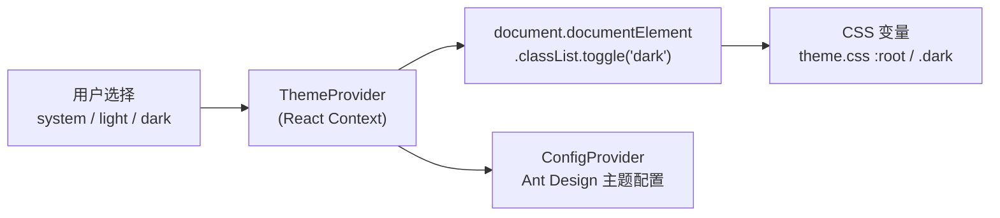
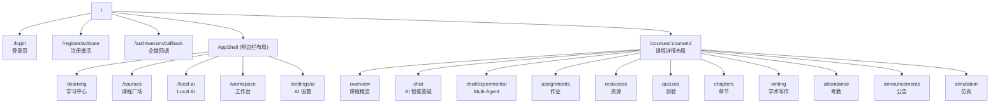
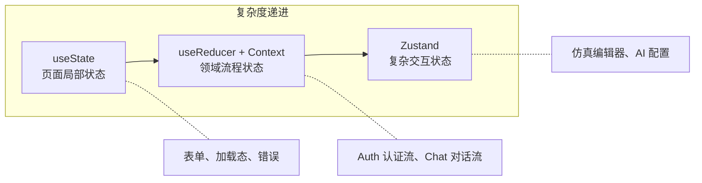
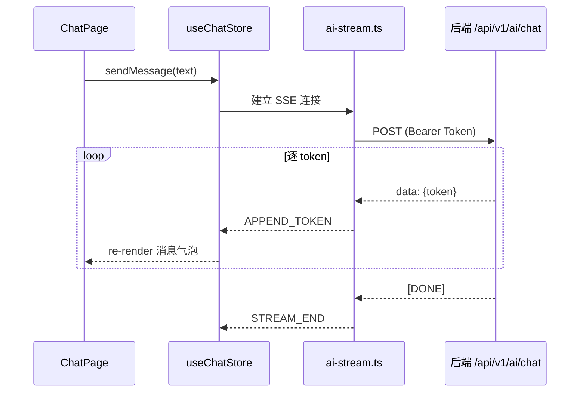

# 前端页面设计思路

> 本文档系统阐述智能教学平台 Web 前端的页面设计思路，涵盖整体架构分层、设计语言与主题系统、路由与页面结构、核心页面设计、组件化策略、响应式适配、状态管理以及关键交互模式。

---

## 1. 整体设计理念

### 1.1 设计目标

| 目标 | 说明 |
|------|------|
| **以学习为中心** | 首页即为学习仪表盘，学生打开即见自己的学习热力图、待办作业与能力雷达图 |
| **多端一致** | Web / Mobile / Desktop / 企业微信共享同一套 React 组件与设计语言 |
| **AI 原生体验** | AI 对话、写作反馈、润色助手等深度融入页面流程，而非孤立入口 |
| **低认知负担** | Apple / Linear 风格的极简侧边栏，聚焦 4 个一级导航，减少迷路 |
| **深色/浅色自适应** | 全局主题系统支持 `system / light / dark` 三模式，切换无闪烁 |

### 1.2 设计原则

- **分层清晰**：App → Layout → Pages → Components → Domains → API → Lib，依赖方向自上而下
- **契约驱动**：前后端共享 `@classplatform/shared` SDK，类型与 API 保持一致
- **渐进式增强**：核心功能在所有端可用，端侧 AI（Local AI）仅在桌面端激活
- **懒加载优先**：所有页面通过 `React.lazy` + `Suspense` 按需加载，首屏仅加载 Shell

---

## 2. 技术选型

| 维度 | 选型 | 说明 |
|------|------|------|
| 框架 | React 19 + TypeScript | 函数组件 + Hooks，类型安全 |
| 构建 | Vite 7 | HMR 热更新，开发秒级启动 |
| 路由 | React Router v6 | 嵌套路由 + ProtectedRoute 守卫 |
| UI 组件库 | Ant Design 5 | Card、Modal、Table、Upload 等重交互组件 |
| CSS 方案 | TailwindCSS 4 + CSS 变量 + 部分 Vanilla CSS | 原子化 + 设计令牌 + 手写样式混合 |
| 图标 | Ant Design Icons + Lucide React | 系统图标用 antd，AI/功能图标用 lucide |
| 状态管理 | useState / useReducer + Context / Zustand | 按复杂度递进选择 |
| 国际化 | antd/locale/zh_CN | 当前以中文为主 |

---

## 3. 主题与设计系统

### 3.1 CSS 设计令牌体系

前端采用 **CSS 变量（Custom Properties）** 作为唯一主题令牌源，在 `src/styles/theme.css` 中定义，通过 `.dark` 类名切换暗色模式。

**核心令牌示例：**

```
Light Mode                        Dark Mode
──────────────────────           ──────────────────────
--app-bg:      #ffffff           --app-bg:      #0f172a
--app-panel:   #f8fafc           --app-panel:   #020617
--app-border:  #e2e8f0           --app-border:  #1e293b
--app-text:    #0f172a           --app-text:    #f8fafc
--app-primary: #2563eb           --app-primary: #2563eb (不变)
--local-ai:    #7c3aed           --local-ai:    #7c3aed (不变)
```

### 3.2 主题切换机制



- `ThemeProvider` 监听系统 `prefers-color-scheme` 媒体查询
- 用 `useLayoutEffect` 同步切换 `<html>` 的 `dark` 类名，避免闪烁
- Ant Design 通过 `ConfigProvider` 的 `theme` prop 同步切换令牌
- 用户偏好持久化至 `localStorage('theme-mode')`

### 3.3 色彩系统

| 用途 | 色值 | 说明 |
|------|------|------|
| **主蓝** | `#2563eb` → `#1d4ed8` | 品牌色、导航高亮、按钮 CTA |
| **AI 紫** | `#7c3aed` | Local AI 模块专属标识色 |
| **成功** | `#16a34a` | 提交成功、在线状态 |
| **警告** | `#f59e0b` | 学习连续天数火焰、待办提醒 |
| **危险** | `#ef4444` | 错误提示、删除操作 |
| **中性** | `slate-50 → slate-950` | 全色阶用于文字/背景/边框 |

---

## 4. 路由与页面结构

### 4.1 路由树总览



### 4.2 路由守卫

- **`ProtectedRoute`**：未登录用户重定向至 `/login`
- **`AuthProvider`**：在路由树顶层注入认证状态（JWT 解码 → 用户信息）
- **Hash vs Browser Router**：Tauri 桌面端使用 `HashRouter`，Web 使用 `BrowserRouter`

### 4.3 懒加载策略

所有页面组件通过 `React.lazy()` + `Suspense` 实现代码分割：

```typescript
const ChatPage = lazy(() =>
    import('@/pages/ChatPage').then((m) => ({ default: m.ChatPage }))
);
```

加载态统一展示 **蓝色脉冲小点 + "正在加载页面模块..."** 的极简 loading 指示器。

---

## 5. 页面布局体系

### 5.1 AppShell 应用壳

`AppShell` 是全局布局容器，采用 **响应式双态设计**：

```
Desktop (≥768px)                    Mobile (<768px)
┌──────────┬────────────────┐       ┌────────────────────┐
│ Sidebar  │                │       │  Top Header Bar    │
│  w-64    │   Main Content │       ├────────────────────┤
│          │   (Outlet)     │       │                    │
│  • 学习   │                │       │   Main Content     │
│  • 课程   │                │       │   (Outlet)         │
│  • AI    │                │       │                    │
│  • 工作台 │                │       ├────────────────────┤
│          │                │       │ Bottom Tab Bar     │
│ ──────── │                │       │ 学习 | 课程 | AI | 台│
│ AI状态面板│                │       └────────────────────┘
│ 设置/通知 │                │
└──────────┴────────────────┘
```

**桌面端侧边栏**包含：
- 品牌标识（EduCloud 渐变图标）
- 4 个一级导航项（学习 / 课程 / Local AI / 工作台）
- AI 服务状态面板（云端 + 本地 NPU 就绪状态）
- 设置 / 通知按钮

**移动端**包含：
- 固定顶部栏（品牌 + 当前模块名 + 通知/设置）
- 固定底部 Tab Bar（安全区域适配 `safe-area-inset-bottom`）

### 5.2 CourseLayout 课程详情布局

进入课程 `/courses/:courseId` 后，使用 `CourseLayout` 作为嵌套布局：
- 课程头部信息栏
- 课程内导航（概览 / 答疑 / 作业 / 资源 / 测验 / 章节 / 写作 / 考勤 / 公告 / 仿真）
- `<Outlet />` 渲染子页面

---

## 6. 核心页面设计

### 6.1 学习中心 (`/learning` — LearningHubPage)

**定位**：学生的个人学习仪表盘，平台首页。

**布局模块**：

| 区域 | 内容 | 交互 |
|------|------|------|
| 学习热力图 | 12 周 × 7 天的 Git 风格热力图 | 悬浮显示每日学习时长 |
| 统计指标 | 本周学习时长、连续学习天数 | 🔥 火焰图标强调连续性 |
| 知识库管理 | 我的知识库列表 + 文件管理 | 新建、上传、删除文件 |
| 待办作业 | 跨课程聚合的待办作业列表 | 按截止时间排序，点击跳转 |
| AI 写作雷达图 | 6 维能力评估（逻辑性/创造力/深度/表达/引用/原创） | SVG 手绘雷达图 + 数值展示 |

**响应式策略**：
- 桌面端：三栏网格布局（知识库 2/3 + 待办 1/3）
- 移动端：单栏流式布局，间距缩小

### 6.2 AI 智能答疑 (`/courses/:courseId/chat` — ChatPage)

**定位**：课程级 AI 对话页面，仿 ChatGPT 交互范式。

**布局**：

```
┌─────────────┬──────────────────────────────┐
│ History     │  Header (AI 智能答疑)         │
│ Sidebar     ├──────────────────────────────┤
│ (可折叠)     │                              │
│             │  Messages Stream             │
│ • 新对话     │    用户消息 → 蓝色气泡 右对齐   │
│ • 对话 1    │    AI 回复 → 灰色气泡 左对齐    │
│ • 对话 2    │    思考中 → 脉冲动画指示器       │
│             │                              │
│             ├──────────────────────────────┤
│             │  Input Bar (圆角输入 + 发送)   │
└─────────────┴──────────────────────────────┘
```

**关键交互**：
- **流式输出**：SSE (Server-Sent Events) 逐 token 渲染，光标闪烁指示
- **停止生成**：流式过程中可点击"停止"按钮中断
- **对话管理**：侧边栏支持新建、切换、删除对话
- **Multi-Agent 入口**：可切换到实验性多 Agent 版本
- **移动端适配**：侧边栏变为左滑抽屉 + 遮罩层

### 6.3 学术写作 (`/courses/:courseId/writing` — WritingPage)

**定位**：写作提交与 AI 反馈的核心工作流。

**三 Tab 结构**：

| Tab | 功能 | 关键组件 |
|-----|------|---------|
| 📝 提交写作 | 选择写作类型 → 填写标题 → 粘贴内容 → 提交 | 写作类型网格卡片、字数统计 |
| 📋 历史记录 | 查看历史提交、AI 评分、分析状态 | 提交卡片列表、评分展示 |
| ✨ 润色助手 | 实时 AI 润色交互 | `WritingPolishPanel` 组件 |

**写作类型感知**：支持 `literature_review`、`course_paper`、`thesis`、`abstract` 等类型，每种类型对应不同的评估维度和 rubric。

### 6.4 其他核心页面

| 页面 | 路径 | 设计特点 |
|------|------|---------|
| 课程广场 | `/courses` | 卡片网格 + 课程进度条 + 角色标签 |
| Local AI | `/local-ai` | NPU/GPU 硬件状态 + 模型下载 + 本地对话 |
| AI 设置 | `/settings/ai` | 模型选择、路由策略、API 密钥配置 |
| 课程概览 | `overview` | 课程描述 + AI Drawer 侧边面板 |
| 作业详情 | `assignments/:id` | 提交表单 + AI 评分反馈 |
| 测验详情 | `quizzes/:id` | 计时器 + 答题卡 + 提交确认 |
| 章节内容 | `chapters/:id` | 富文本渲染 + 学习进度标记 |
| 个人档案 | `/profile` | 全局学生画像 + 学习统计 |

---

## 7. 组件化策略

### 7.1 组件分层

```
src/components/          ← 可复用 UI 组件
├── chat/
│   └── ThoughtTimeline  ← AI 思考链可视化时间线
├── course/
│   └── AICourseDrawer   ← 课程级 AI 侧边面板
├── workspace/           ← 仿真工作台组件
├── writing/
│   └── WritingPolishPanel ← AI 润色交互面板
├── GlobalProfileCard    ← 全局学生画像卡片
└── StudyTimer           ← 学习计时器
```

### 7.2 Storybook 驱动开发

项目配置了 `.storybook/`，核心组件均有 Stories 文件用于独立开发和视觉回归：
- `ChatMessage.stories.tsx`
- `CourseCard.stories.tsx`
- `QuizCard.stories.tsx`
- `GlobalProfileCard.stories.tsx`
- `WritingPolishPanel.stories.tsx`

---

## 8. 状态管理策略



| 层级 | 方案 | 适用场景 | 示例 |
|------|------|---------|------|
| 页面级 | `useState` | 表单输入、UI 开关、加载态 | `WritingPage` 的表单状态 |
| 领域级 | `useReducer` + Context | 有明确状态转换流的业务 | `useAuth`（登录/登出状态机）、`useChatStore`（对话流） |
| 全局级 | Zustand | 多组件共享的复杂状态 | `useAiConfigStore`（AI 配置）、`useSimStore`（仿真状态） |
| 持久化 | localStorage | 跨会话持久数据 | JWT Token、主题偏好 |

---

## 9. 关键交互模式

### 9.1 SSE 流式输出

AI 对话采用 **Server-Sent Events** 实现流式响应：



### 9.2 端云感知 UI

AppShell 侧边栏底部实时显示 AI 服务健康状态：
- **云端状态**：`useCloudAiHealth` 定期轮询后端健康检查端点
- **本地状态**：`useAiConfigStore.localModelStatus`（ready / downloading / not_downloaded / error）
- 使用 **彩色圆点** 指示状态：🟢 就绪 / 🟡 检测中 / 🔴 异常

### 9.3 推理路由透明化

`useInferenceRouter` Hook 封装端云路由决策，前端开发者无需关心当前走本地还是云端：
- Desktop 端优先走 `LocalAI.streamChat()`（端侧推理）
- Web/Mobile 端走标准 API 路由
- 超时或异常自动 fallback

---

## 10. 响应式与多端适配

### 10.1 断点策略

| 断点 | 设备 | 布局变化 |
|------|------|---------|
| `<768px` | 手机/企业微信 H5 | 底部 Tab Bar + 顶部标题栏 |
| `≥768px` | 平板/桌面/Tauri | 左侧固定侧边栏 |

通过 `useMobile()` Hook（基于 `window.innerWidth`）程序化判断。

### 10.2 企业微信适配

- 路由支持 `BrowserRouter`（标准 Web）和 `HashRouter`（Tauri/微信 H5）
- 认证支持 `/auth/wecom/callback` 企业微信 OAuth 回调
- 安全区域适配：底部导航使用 `env(safe-area-inset-bottom)` 避免被手机底部横条遮挡

### 10.3 Tauri 桌面端增强

- `data-tauri-drag-region`：品牌区域可拖拽窗口
- 自动检测 `tauri:` 协议切换至 HashRouter
- Local AI 模块仅在桌面端展示完整功能

---

## 11. 前端代码组织总览

```
src/
├── app/                 ← 应用层：路由编排 + 启动配置
│   ├── router.tsx       ← 路由树（lazy + Suspense）
│   └── ProtectedRoute   ← 鉴权守卫
├── pages/               ← 页面层：34 个页面文件
├── layouts/             ← 布局层：AppShell 应用壳
├── components/          ← 组件层：可复用 UI 组件
├── domains/             ← 领域层：业务状态 + 逻辑
│   ├── ai/              ← AI 配置与状态
│   ├── auth/            ← 认证状态机
│   ├── chapter/         ← 章节领域
│   ├── chat/            ← 对话领域
│   └── course/          ← 课程领域
├── api/                 ← API 层：类型定义 + 请求封装
├── services/            ← 服务层：带 Mock 能力的接口
├── hooks/               ← 自定义 Hooks
│   ├── useCloudAiHealth ← 云端 AI 健康检测
│   ├── useInferenceRouter ← 端云推理路由
│   ├── useLocalInference ← 本地推理能力
│   ├── useMobile        ← 响应式断点
│   └── usePlatform      ← 运行平台检测
├── lib/                 ← 基础设施：HTTP Client、JWT、SSE
├── styles/              ← 样式系统
│   ├── theme.css        ← CSS 变量设计令牌
│   ├── themeConfig.ts   ← Ant Design 主题映射
│   └── tailwind.css     ← Tailwind 入口
├── types/               ← 全局类型定义
├── utils/               ← 工具函数
├── ThemeProvider.tsx     ← 主题上下文
└── main.tsx             ← 应用入口（ErrorBoundary + Provider 链）
```

---

## 12. 设计决策总结

| 决策 | 选择 | 理由 |
|------|------|------|
| 4 项一级导航 | 学习 / 课程 / Local AI / 工作台 | 覆盖核心场景，避免导航过载 |
| CSS 变量而非 JS 主题 | `theme.css` | 零 JS 开销切换主题，TailwindCSS 原生集成 |
| 页面全部懒加载 | `React.lazy` | 首屏仅加载 AppShell（~14KB），其余按需 |
| 对话侧边栏在页面内 | ChatPage 自管理 | 独立于全局 Shell，避免状态泄漏 |
| 热力图手绘 SVG | 无第三方图表库 | 轻量、主题一致、无额外依赖 |
| 雷达图手绘 SVG | 同上 | 完全控制样式与交互 |
| 写作类型网格卡片 | 可视化选择而非下拉 | 提升写作类型的认知效率 |
| Storybook + 独立 Stories | 组件驱动开发 | 确保组件可复用，支持视觉回归测试 |
