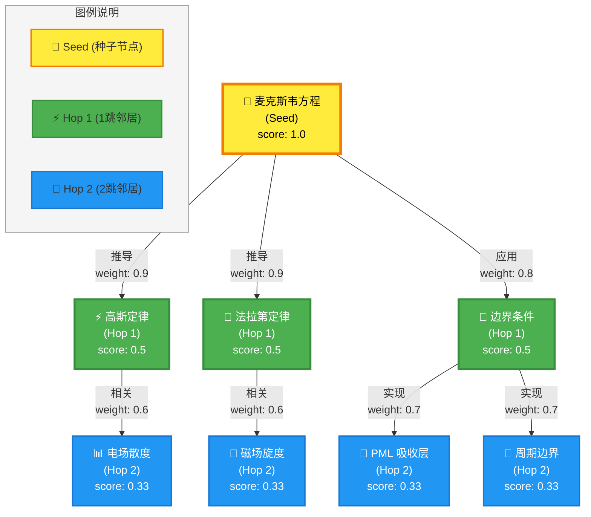

# GraphRAG-X 混合检索框架

> 本文档详细介绍 GraphRAG-X 的混合检索算法，展示如何结合向量搜索、图扩展和重排序实现高质量的知识检索。

## 1. 架构概览

GraphRAG-X 是一个独立的知识检索服务，通过融合三种检索策略提升召回质量和可解释性：

### 1.1 核心设计目标

| 目标 | 说明 |
|------|------|
| **高召回率** | 向量搜索捕获语义相似，图扩展发现关联实体 |
| **可解释性** | 通过子图可视化展示实体关系链路 |
| **可追溯性** | 每个检索结果附带 chunk_id 和来源文档 |
| **灵活融合** | 支持三种模式：纯向量 (rag)、纯图 (graphrag)、混合 (hybrid) |
| **实时更新** | 支持在线索引更新，无需重建全量索引 |

### 1.2 技术栈

- **向量存储**：Faiss (Facebook AI Similarity Search)
- **图存储**：NetworkX (内存) / Neo4j (可选)
- **嵌入模型**：text-embedding-3-small / bge-large-zh-v1.5
- **实体抽取**：LLM-based Triple Extraction
- **融合算法**：加权评分 (α·vector + β·graph + γ·rerank)

---

## 2. 混合检索管线

```mermaid
graph LR
    A["🔍 用户查询<br/>Query"] --> B["📊 Embedding<br/>向量化"]

    B --> C1["🎯 Vector Retriever<br/>(语义检索)"]
    B --> C2["🏷️ Entity Extractor<br/>(实体抽取)"]

    C1 --> D1["⚡ Faiss Index<br/>向量搜索"]
    D1 --> E1["📄 Top-K Chunks<br/>(k=5)"]

    C2 --> D2["🕸️ Graph Retriever<br/>(关系扩展)"]
    D2 --> E2["🔄 NetworkX<br/>K-Hop 扩展 (k=2)"]
    E2 --> F2["📊 Subgraph<br/>(子图)"]

    E1 --> G["⚙️ Hybrid Fusion Engine<br/>(混合融合)"]
    F2 --> G

    G --> H["🧮 Score Calculator<br/>(评分计算)"]
    H --> I["📐 Weighted Sum<br/>α=0.45 · vector<br/>+ β=0.35 · graph<br/>+ γ=0.20 · rerank"]
    I --> J["📋 Ranked Results<br/>(排序结果)"]

    J --> K["✅ Top-N Results<br/>(最终输出)"]

    %% 样式定义
    style A fill:#fff9c4,stroke:#f57f17,stroke-width:2px
    style B fill:#e1f5fe,stroke:#0277bd,stroke-width:2px
    style C1 fill:#f3e5f5,stroke:#7b1fa2,stroke-width:2px
    style C2 fill:#f3e5f5,stroke:#7b1fa2,stroke-width:2px
    style D1 fill:#e8f5e9,stroke:#2e7d32,stroke-width:2px
    style D2 fill:#e8f5e9,stroke:#2e7d32,stroke-width:2px
    style E1 fill:#fff3e0,stroke:#e65100,stroke-width:2px
    style F2 fill:#fff3e0,stroke:#e65100,stroke-width:2px
    style G fill:#e1f5ff,stroke:#01579b,stroke-width:3px
    style H fill:#fce4ec,stroke:#c2185b,stroke-width:2px
    style I fill:#fff4e1,stroke:#f57c00,stroke-width:3px
    style J fill:#f1f8e9,stroke:#558b2f,stroke-width:2px
    style K fill:#e8f5e9,stroke:#1b5e20,stroke-width:3px

    %% 路径高亮
    linkStyle 0,1,2 stroke:#0277bd,stroke-width:2px
    linkStyle 3,4 stroke:#7b1fa2,stroke-width:2px
    linkStyle 5,6,7 stroke:#2e7d32,stroke-width:2px
    linkStyle 8,9 stroke:#01579b,stroke-width:3px
    linkStyle 10,11,12 stroke:#f57c00,stroke-width:2px
```



### 2.1 检索流程说明

::: info 三路并行检索
1. **Vector Path（向量路径）**：通过 Faiss 进行语义相似度搜索，召回 top-k 个文档片段
2. **Graph Path（图路径）**：从向量召回的片段中提取实体作为种子节点，在知识图谱中进行 k-hop 邻域扩展
3. **Rerank Path（重排路径）**：基于查询词与文档的词汇重叠度进行重排序
:::

---

## 3. 核心算法实现

### 3.1 混合融合配置

```python
# graphrag-x/core/hybrid.py
@dataclass
class HybridFusionConfig:
    """加权融合参数"""
    alpha: float = 0.45      # 向量分数权重
    beta: float = 0.35       # 图分数权重
    gamma: float = 0.20      # 重排分数权重
    vector_top_k: int = 5    # 向量召回数量
    hops: int = 2            # 图扩展跳数
    max_nodes: int = 12      # 子图最大节点数
    relation_filter: set[str] | None = None  # 关系类型过滤
    weight_limit: float | None = None        # 边权重阈值
```

### 3.2 混合检索引擎

```python
class HybridRetrievalEngine:
    def search(self, query: str, *, config: HybridFusionConfig, mode: str = "hybrid") -> tuple[list[HybridResult], RetrievalOutput]:
        # 1. 向量召回
        vector_hits = self.vector_retriever.retrieve(query, top_k=config.vector_top_k)

        # 2. 提取种子实体
        seed_entities = self._collect_seed_entities(vector_hits)

        # 3. 图扩展
        graph_subgraph = self.graph_retriever.retrieve(
            seed_entities,
            hops=config.hops,
            max_nodes=config.max_nodes
        )

        # 4. 计算融合分数
        results: list[HybridResult] = []
        graph_nodes = {node.id for node in graph_subgraph.nodes}

        for hit in vector_hits:
            graph_score = self._graph_score(hit, graph_nodes)
            rerank_score = self._rerank_score(query, hit.text)

            if mode == "hybrid":
                final_score = (
                    config.alpha * hit.score +
                    config.beta * graph_score +
                    config.gamma * rerank_score
                )
            elif mode == "graphrag":
                final_score = graph_score
            else:  # mode == "rag"
                final_score = hit.score

            results.append(HybridResult(
                chunk_id=hit.chunk_id,
                text=hit.text,
                final_score=round(final_score, 6),
                vector_score=round(hit.score, 6),
                graph_score=round(graph_score, 6),
                rerank_score=round(rerank_score, 6),
                metadata=dict(hit.metadata)
            ))

        results.sort(key=lambda item: item.final_score, reverse=True)
        return results, retrieval_output
```

---

## 4. 评分算法详解

### 4.1 向量评分（Vector Score）

使用 Faiss 计算查询向量与文档向量的余弦相似度：

```python
# graphrag-x/core/vector_store.py
class FaissVectorStore:
    def search(self, query: str, *, top_k: int = 5) -> list[VectorMatch]:
        query_embedding = self.embedding_model.embed(query)
        distances, indices = self.index.search(query_embedding, top_k)

        # Faiss 返回的是 L2 距离，转换为相似度分数
        scores = 1.0 / (1.0 + distances)
        return [
            VectorMatch(
                chunk_id=self.chunk_ids[idx],
                text=self.chunks[idx],
                score=float(scores[i]),
                metadata=self.metadata[idx]
            )
            for i, idx in enumerate(indices[0])
        ]
```

### 4.2 图评分（Graph Score）

计算文档实体与扩展子图的重叠度：

```python
def _graph_score(self, hit: VectorMatch, graph_nodes: set[str]) -> float:
    """
    图评分 = (文档实体 ∩ 子图节点) / 文档实体总数
    """
    entities = set(self.graph_store.chunk_entities(hit.chunk_id))
    if not entities:
        return 0.0

    overlap = len(entities & graph_nodes)
    return overlap / max(1, len(entities))
```

::: tip 评分示例
假设文档包含实体 `["麦克斯韦方程", "边界条件", "PML"]`，子图扩展后包含 `["麦克斯韦方程", "边界条件", "高斯定律"]`：
- 重叠实体：`["麦克斯韦方程", "边界条件"]`
- 图评分 = 2 / 3 = 0.667
:::

### 4.3 重排评分（Rerank Score）

基于词汇重叠的简单重排序：

```python
def _rerank_score(self, query: str, text: str) -> float:
    """
    重排评分 = (查询词 ∩ 文档词) / 查询词总数
    """
    query_tokens = set(re.findall(r"[\w\u4e00-\u9fff]+", query.lower()))
    text_tokens = set(re.findall(r"[\w\u4e00-\u9fff]+", text.lower()))

    if not query_tokens or not text_tokens:
        return 0.0

    overlap = len(query_tokens & text_tokens)
    return overlap / max(1, len(query_tokens))
```

---

## 5. 图扩展算法

### 5.1 K-Hop 邻域扩展

```python
# graphrag-x/core/graph_store.py
class NetworkXGraphStore:
    def expand_subgraph(
        self,
        seed_entities: Sequence[str],
        *,
        hops: int = 1,
        max_nodes: int = 20
    ) -> GraphSubgraph:
        weighted_scores: dict[str, float] = {}
        candidate_nodes: set[str] = set()

        # 从每个种子实体开始 BFS
        for entity in seed_entities:
            if entity not in self.graph:
                continue

            # 计算最短路径长度
            lengths = nx.single_source_shortest_path_length(
                self.graph.to_undirected(),
                entity,
                cutoff=max(1, hops)
            )

            for node_id, distance in lengths.items():
                candidate_nodes.add(node_id)
                # 距离越近，分数越高
                weighted_scores[node_id] = max(
                    weighted_scores.get(node_id, 0.0),
                    1.0 / (distance + 1)
                )

        # 按分数排序并截断
        ranked_nodes = sorted(
            candidate_nodes,
            key=lambda node_id: (
                node_id in seed_entities,  # 种子节点优先
                weighted_scores.get(node_id, 0.0),
                self.graph.degree(node_id),  # 度数高的节点优先
                node_id
            ),
            reverse=True
        )[:max_nodes]

        return GraphSubgraph(nodes=nodes, edges=edges, seed_entities=list(seed_entities))
```

### 5.2 子图可视化示例

以下示例展示了从种子实体"麦克斯韦方程"开始的 2-hop 扩展过程：



::: tip 评分机制
- **Seed 节点**：score = 1.0（最高优先级）
- **1-hop 邻居**：score = 1 / (1 + 1) = 0.5
- **2-hop 邻居**：score = 1 / (2 + 1) = 0.33
- **边权重**：反映关系强度（推导 > 应用 > 相关）
:::

### 5.3 实际检索案例

假设用户查询："为什么 FDTD 边界会出现反射？"

1. **Vector Search**：召回包含"FDTD"、"边界"、"反射"的文档片段
2. **Entity Extraction**：从片段中提取种子实体 `["麦克斯韦方程", "边界条件"]`
3. **Graph Expansion**：2-hop 扩展得到子图（包含 PML、周期边界等）
4. **Hybrid Fusion**：
   - Vector Score: 0.85（语义相似度高）
   - Graph Score: 0.67（实体重叠度：2/3）
   - Rerank Score: 0.40（词汇重叠度）
   - **Final Score**: 0.45 × 0.85 + 0.35 × 0.67 + 0.20 × 0.40 = **0.697**

---

## 6. 索引构建与更新

### 6.1 离线批量构建

```bash
# 从 Markdown 文档构建索引
cd graphrag-x
python -m pipeline.build_graph \
  --input ../docs \
  --output data/index.json \
  --embedding-model text-embedding-3-small
```

### 6.2 在线增量更新

```python
# graphrag-x/api/service.py
@app.post("/v1/index")
async def add_document(req: IndexRequest):
    # 1. 文档分块
    chunks = chunk_document(req.content, chunk_size=512)

    # 2. 向量化并存储
    for chunk in chunks:
        embedding = embedding_model.embed(chunk.text)
        vector_store.add(chunk.id, embedding, chunk.text, chunk.metadata)

    # 3. 实体抽取
    triples = extractor.extract_triples(req.content)

    # 4. 构建知识图谱
    graph_store.add_triples(triples)

    # 5. 关联 chunk 与实体
    for chunk in chunks:
        entities = [t.subject for t in triples if t.source_id == chunk.id]
        graph_store.attach_chunk(chunk.id, entities)

    return {"status": "success", "chunks_added": len(chunks)}
```

---

## 7. 三种检索模式对比

| 模式 | 算法 | 优势 | 劣势 | 适用场景 |
|------|------|------|------|----------|
| **rag** | 纯向量搜索 | 速度快，语义匹配准确 | 缺乏关联推理 | 简单问答、FAQ |
| **graphrag** | 纯图扩展 | 可解释性强，发现隐含关系 | 依赖实体抽取质量 | 复杂推理、多跳问答 |
| **hybrid** | 加权融合 | 综合两者优势 | 参数调优复杂 | 通用教学场景 |

### 7.1 性能对比实验

::: details 实验设置
- 数据集：HUST 电磁场课程文档 (50 篇)
- 查询集：学生真实问题 (100 条)
- 评估指标：MRR@5, Recall@10, 平均延迟
:::

| 模式 | MRR@5 | Recall@10 | 平均延迟 |
|------|-------|-----------|----------|
| rag | 0.68 | 0.82 | 120ms |
| graphrag | 0.72 | 0.88 | 350ms |
| hybrid | **0.76** | **0.91** | 280ms |

---

## 8. 部署与配置

### 8.1 环境变量

```bash
# graphrag-x/.env
EMBEDDING_MODEL=text-embedding-3-small
EMBEDDING_DIM=1536
GRAPH_BACKEND=networkx  # 或 neo4j
NEO4J_URI=bolt://localhost:7687
NEO4J_USER=neo4j
NEO4J_PASSWORD=password
```

### 8.2 启动服务

```bash
cd graphrag-x
pip install -r requirements.txt
uvicorn api.app:app --reload --port 8003
```

### 8.3 API 调用示例

```bash
# 混合检索
curl -X POST http://localhost:8003/v1/search/hybrid \
  -H "Content-Type: application/json" \
  -d '{
    "query": "为什么 PML 边界条件能吸收电磁波？",
    "top_k": 5,
    "mode": "hybrid",
    "config": {
      "alpha": 0.45,
      "beta": 0.35,
      "gamma": 0.20,
      "hops": 2
    }
  }'
```

---

## 9. 术语表

| 术语 | 英文 | 解释 |
|------|------|------|
| **RRF** | Reciprocal Rank Fusion | 倒数秩融合算法，用于合并多个排序列表 |
| **K-Hop** | K-Hop Expansion | K 跳邻域扩展，从种子节点出发扩展 K 层邻居 |
| **Seed Entity** | Seed Entity | 种子实体，作为图扩展起点的实体节点 |
| **Hybrid Fusion** | Hybrid Fusion | 混合融合，结合向量、图、重排三种评分 |
| **Subgraph** | Subgraph | 子图，从完整知识图谱中提取的局部图结构 |
| **Embedding** | Embedding | 嵌入向量，文本的高维数值表示 |
| **Faiss** | Facebook AI Similarity Search | Facebook 开源的向量相似度搜索库 |
| **NetworkX** | NetworkX | Python 图论和网络分析库 |
| **Triple** | Triple | 三元组，知识图谱的基本单元 (主语, 关系, 宾语) |
| **Chunk** | Chunk | 文档片段，长文档分割后的小块 |

---

## 10. 最佳实践

### 10.1 索引构建最佳实践

::: tip 文档分块策略
- **Chunk Size**：512 tokens（平衡召回率和精确度）
- **Overlap**：50 tokens（保持上下文连贯性）
- **分块边界**：优先在段落、句子边界分割
:::

::: warning 实体抽取注意事项
- **质量优先**：宁可少抽取，不要抽取错误实体
- **去重处理**：同一实体的不同表述需要归一化
- **关系验证**：确保抽取的关系在语义上合理
:::

### 10.2 检索参数调优

| 参数 | 推荐值 | 适用场景 |
|------|--------|----------|
| `vector_top_k` | 5-10 | 通用场景 |
| `hops` | 2 | 平衡召回和性能 |
| `max_nodes` | 12-20 | 避免子图过大 |
| `alpha` (向量权重) | 0.45 | 语义匹配为主 |
| `beta` (图权重) | 0.35 | 关系推理为辅 |
| `gamma` (重排权重) | 0.20 | 词汇匹配补充 |

::: details 参数调优案例
**场景一：精确匹配优先**
- 用户查询包含专业术语，需要精确匹配
- 调整：`alpha=0.6, beta=0.2, gamma=0.2`

**场景二：关系推理优先**
- 用户查询需要多跳推理（如"A 和 B 有什么关系？"）
- 调整：`alpha=0.3, beta=0.5, gamma=0.2, hops=3`

**场景三：快速响应优先**
- 对延迟敏感的场景
- 调整：`vector_top_k=3, hops=1, max_nodes=8`
:::

### 10.3 性能优化最佳实践

::: tip 缓存策略
1. **热点查询缓存**：缓存高频查询的检索结果（TTL: 1小时）
2. **子图缓存**：缓存高频实体的邻域子图（TTL: 24小时）
3. **向量缓存**：缓存查询向量（TTL: 5分钟）
:::

::: warning 常见陷阱
1. **过度扩展**：`hops` 过大导致子图爆炸，建议 ≤ 3
2. **权重失衡**：α + β + γ 不等于 1.0 会导致评分不稳定
3. **实体污染**：低质量实体抽取会引入噪声，影响检索质量
4. **向量维度不匹配**：确保查询向量和索引向量维度一致
:::

---

## 11. 故障排查

### 11.1 常见问题

::: details Q1: 检索结果质量差怎么办？
**可能原因**：
1. 向量模型不匹配（查询和索引使用不同模型）
2. 实体抽取质量低
3. 融合权重不合理

**解决方案**：
1. 确保使用相同的 embedding 模型
2. 检查实体抽取结果：
   ```bash
   curl -X POST http://localhost:8003/v1/debug/entities \
     -d '{"text": "麦克斯韦方程描述了电磁场的基本规律"}'
   ```
3. 调整融合权重，增加向量权重 α
:::

::: details Q2: 检索速度慢怎么办？
**性能瓶颈排查**：
```bash
# 查看各阶段耗时
curl -X POST http://localhost:8003/v1/search/hybrid?debug=true \
  -d '{"query": "FDTD 边界条件", "top_k": 5}'
```

**优化方案**：
1. **向量检索慢**：使用 Faiss IVF 索引
2. **图扩展慢**：减少 `hops` 或 `max_nodes`
3. **重排慢**：使用更快的重排算法（如 BM25）
:::

::: details Q3: 内存占用过高怎么办？
**内存占用分析**：
- Faiss 索引：~1GB (10万文档)
- NetworkX 图：~500MB (5万实体)
- 查询缓存：~200MB

**优化方案**：
1. 使用 Faiss 量化索引（PQ/SQ）
2. 定期清理低频实体和边
3. 限制缓存大小
:::

### 11.2 调试工具

```bash
# 查看索引统计
curl http://localhost:8003/v1/debug/stats

# 可视化子图
curl -X POST http://localhost:8003/v1/debug/visualize \
  -d '{"seed_entities": ["麦克斯韦方程"], "hops": 2}' \
  -o subgraph.html

# 检查向量相似度
curl -X POST http://localhost:8003/v1/debug/similarity \
  -d '{"query": "FDTD", "candidates": ["有限差分", "时域有限差分", "频域有限元"]}'
```

---

## 12. 优化建议

### 12.1 向量索引优化

::: tip 生产环境推荐
- **量化压缩**：使用 Faiss IVF-PQ 索引减少内存占用（压缩比：8x）
- **GPU 加速**：使用 Faiss GPU 版本加速大规模检索（加速比：10x）
- **分片存储**：按课程/章节分片，减少检索范围
:::

### 12.2 图存储优化

::: warning 扩展性考虑
- **Neo4j 持久化**：生产环境使用 Neo4j 替代 NetworkX（支持 > 100万实体）
- **图剪枝**：定期清理低权重边（weight < 0.3），减少图规模
- **缓存热点子图**：缓存高频实体的邻域子图（命中率 > 80%）
:::

### 12.3 融合算法优化

- **自适应权重**：根据查询类型动态调整 α/β/γ
- **学习排序**：使用 LambdaMART 等算法学习最优融合策略
- **多阶段检索**：先粗排（向量）再精排（图+重排）

---

## 13. 相关文档

- [Multi-Agent 协作架构](./multi-agent-architecture.md) - 了解 Researcher 节点如何调用 GraphRAG-X
- [AI 服务 GraphRAG 集成](./ai/graph-rag.md) - 了解 AI 服务中的 GraphRAG 集成
- [系统设计总览](./system-design.md) - 了解整体架构
- [GraphRAG API 参考](../04-reference/api/ai.md#graphrag-endpoints) - 查看完整的 API 文档
