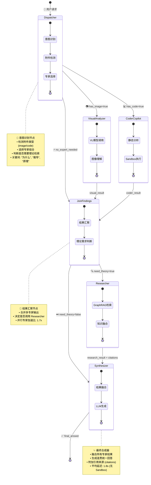
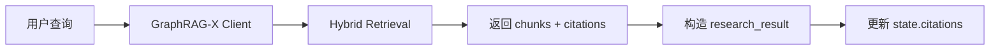

# Multi-Agent 协作架构

> 本文档详细介绍基于 LangGraph 的多智能体协作系统，展示如何通过状态机编排实现专家分工与结果融合。

## 1. 架构概览

Multi-Agent 系统是云端 AI 服务的核心编排层，负责将复杂的教学任务分解为多个专家节点并行处理，最终合成统一的回答。

### 1.1 核心设计目标

| 目标 | 说明 |
|------|------|
| **专家分工** | 根据任务类型（代码分析、视觉理解、理论检索）动态选择专家 |
| **并行处理** | Visual Analyzer 和 Coder Copilot 可并行执行，提升响应速度 |
| **知识增强** | Researcher 节点调用 GraphRAG-X 检索课程知识库 |
| **结果融合** | Synthesizer 汇总多专家输出，生成连贯的最终回答 |
| **可观测性** | 每个节点发出 Thought 事件，前端可实时展示推理过程 |

### 1.2 技术栈

- **编排框架**：LangGraph (Python)
- **状态管理**：Pydantic BaseModel + Annotated Reducers
- **通信协议**：Server-Sent Events (SSE) 流式推送
- **专家能力**：
  - 代码执行：Docker Sandbox (Python/Rust)
  - 视觉理解：Vision-Language Model (Qwen-VL)
  - 知识检索：GraphRAG-X Hybrid Retrieval

---

## 2. 状态机流转图



### 2.1 节点职责说明

| 节点 | 输入 | 输出 | 核心逻辑 |
|------|------|------|----------|
| **Dispatcher** | 用户消息 + 附件 | `selected_experts`, `need_theory` | 根据附件类型和关键词选择专家 |
| **Visual Analyzer** | 图像附件 | `visual_result` | 调用 VL 模型分析图像内容 |
| **Coder Copilot** | 代码附件/选中代码 | `coder_result` | 静态分析 + Sandbox 执行 |
| **Join Findings** | 多专家结果 | 汇总状态 | 合并 `coder_result` 和 `visual_result` |
| **Researcher** | 用户查询 | `research_result`, `citations` | 调用 GraphRAG-X 检索知识库 |
| **Synthesizer** | 所有专家结果 | `final_answer` | LLM 合成最终回答 |

---

## 3. 核心代码实现

### 3.1 状态定义

```python
# multi-agent/cloud/app/models/state.py
class AgentState(BaseModel):
    request_id: str
    session_id: str | None
    messages: list[ChatMessage]
    attachments: list[TaskAttachment]
    workspace_context: WorkspaceContext

    # 专家选择
    selected_experts: list[str] = []
    need_theory: bool = False

    # 专家输出
    visual_result: ExpertResult | None = None
    coder_result: ExpertResult | None = None
    research_result: ExpertResult | None = None

    # 最终结果
    citations: list[Citation] = []
    final_answer: str = ""

    # 可观测性
    thoughts: list[ThoughtEvent] = []
    errors: list[str] = []
```

### 3.2 图构建逻辑

```python
# multi-agent/cloud/app/graph/builder.py
def build_graph(services: RuntimeServices):
    graph = StateGraph(AgentGraphState)

    # 注册节点
    graph.add_node("dispatcher", dispatcher_node)
    graph.add_node("visual_analyzer", visual_node)
    graph.add_node("coder_copilot", coder_node)
    graph.add_node("join_findings", join_findings.run)
    graph.add_node("researcher", researcher_node)
    graph.add_node("synthesizer", synthesizer_node)

    # 定义边
    graph.add_edge(START, "dispatcher")

    # 条件分支：根据 selected_experts 决定路由
    graph.add_conditional_edges(
        "dispatcher",
        _selected_visual,  # 返回 "visual_analyzer" 或 "join_findings"
        {"visual_analyzer": "visual_analyzer", "join_findings": "join_findings"}
    )

    graph.add_conditional_edges(
        "dispatcher",
        _selected_code,  # 返回 "coder_copilot" 或 "join_findings"
        {"coder_copilot": "coder_copilot", "join_findings": "join_findings"}
    )

    # 汇聚后决定是否需要理论检索
    graph.add_conditional_edges(
        "join_findings",
        _need_research,  # 返回 "researcher" 或 "synthesizer"
        {"researcher": "researcher", "synthesizer": "synthesizer"}
    )

    graph.add_edge("researcher", "synthesizer")
    graph.add_edge("synthesizer", END)

    return graph.compile()
```

---

## 4. 专家节点详解

### 4.1 Dispatcher（意图识别）

::: tip 核心职责
Dispatcher 是整个 Multi-Agent 系统的"大脑"，负责分析用户请求并智能选择合适的专家组合。它通过检测附件类型和关键词来判断任务性质。
:::

**触发条件判断逻辑**：

```python
# multi-agent/cloud/app/nodes/dispatcher.py
THEORY_KEYWORDS = ("为什么", "推导", "原理", "边界条件", "公式", "课件", "pml", "麦克斯韦")
CODE_EXTENSIONS = (".py", ".ipynb", ".rs", ".ts", ".tsx", ".js")

async def run(state_dict: dict, emitter: EventEmitter) -> dict:
    state = AgentState.model_validate(state_dict)
    latest_query = state.latest_user_message.lower()
    selected_experts: list[str] = []

    # 检测附件类型
    has_image = any(item.kind == "image" for item in state.attachments)
    has_code_attachment = any(item.kind == "code" for item in state.attachments)
    has_code_file = any(path.endswith(CODE_EXTENSIONS) for path in state.workspace_context.open_files)

    if has_image:
        selected_experts.append("visual_analyzer")
    if has_code_attachment or has_code_file:
        selected_experts.append("coder_copilot")
    if not selected_experts:
        selected_experts.append("coder_copilot")  # 默认专家

    # 判断是否需要理论检索
    need_theory = any(keyword in latest_query for keyword in THEORY_KEYWORDS)

    return {
        "selected_experts": selected_experts,
        "need_theory": need_theory
    }
```

### 4.2 Coder Copilot（代码分析）

**能力**：
1. **静态分析**：检测 PML 边界条件、CFL 稳定性、边界更新逻辑
2. **Sandbox 执行**：在 Docker 容器中运行 Python 代码，捕获 stdout/stderr
3. **结果结构化**：返回 `ExpertResult(summary, details, confidence, artifacts)`

::: details 代码示例
```python
# multi-agent/cloud/app/nodes/coder_copilot.py
async def run(state_dict: dict, emitter: EventEmitter, sandbox_runner: SandboxRunner) -> dict:
    state = AgentState.model_validate(state_dict)
    if "coder_copilot" not in state.selected_experts:
        return {"metrics": {"graph_nodes_executed": ["coder_copilot:skipped"]}}

    code = _extract_code(state)
    summary, details = _static_reasoning(code)
    outcome = await sandbox_runner.run_python(code or "print('no code provided')")

    if outcome.stdout:
        details.append(outcome.stdout)
    if outcome.stderr:
        details.append(outcome.stderr)

    result = ExpertResult(
        summary=summary,
        details=details[:5],
        confidence=0.76 if code else 0.45,
        artifacts=SandboxRunner.outcome_artifacts(outcome)
    )

    return {"coder_result": result.model_dump()}
```
:::

### 4.3 Researcher（知识检索）

**调用 GraphRAG-X 的流程**：



::: tip 关键实现
```python
# multi-agent/cloud/app/nodes/researcher.py
async def run(state_dict: dict, emitter: EventEmitter, graphragx: GraphRAGXClient) -> dict:
    state = AgentState.model_validate(state_dict)
    if not state.need_theory:
        return {"metrics": {"graph_nodes_executed": ["researcher:skipped"]}}

    query = state.latest_user_message
    response = await graphragx.hybrid_search(query, top_k=5)

    citations = [
        Citation(chunk_id=hit["chunk_id"], text=hit["text"], score=hit["final_score"])
        for hit in response["results"]
    ]

    result = ExpertResult(
        summary=f"检索到 {len(citations)} 条相关知识",
        details=[c.text[:200] for c in citations],
        confidence=0.85
    )

    return {
        "research_result": result.model_dump(),
        "citations": [c.model_dump() for c in citations]
    }
```
:::

### 4.4 Synthesizer（最终合成）

**合成策略**：
1. 收集所有专家结果（`coder_result`, `visual_result`, `research_result`）
2. 调用 LLM 生成统一回答
3. 附加引用来源（citations）

```python
# multi-agent/cloud/app/nodes/synthesizer.py
async def run(state_dict: dict, emitter: EventEmitter, llm: SynthesizerLLM) -> dict:
    state = AgentState.model_validate(state_dict)

    final_answer = await llm.synthesize(
        query=state.latest_user_message,
        coder_result=state.coder_result,
        visual_result=state.visual_result,
        research_result=state.research_result,
        citations=state.citations
    )

    return {"final_answer": final_answer}
```

---

## 5. 流式推送与可观测性

### 5.1 Thought 事件机制

每个节点在执行前后发出 `ThoughtEvent`，前端可实时展示推理过程：

```python
# multi-agent/cloud/app/graph/event_bridge.py
class EventEmitter:
    async def thought(self, phase: str, status: str, node: str, source: str, detail: str = "") -> ThoughtEvent:
        event = ThoughtEvent(
            phase=phase,
            status=status,  # "running" | "done"
            node=node,
            source=source,  # "orchestrator" | "expert"
            detail=detail
        )
        await self.queue.put(event)
        return event
```

### 5.2 SSE 流式响应

```python
# multi-agent/cloud/app/api/chat_orchestrated.py
async def stream() -> AsyncIterator[str]:
    emitter = EventEmitter()
    yield to_sse_frame(StartEvent(request_id=request_id))

    task = asyncio.create_task(_run_graph(req, request_id, emitter))

    while not task.done() or not emitter.queue.empty():
        try:
            event = await asyncio.wait_for(emitter.queue.get(), timeout=0.1)
        except asyncio.TimeoutError:
            continue
        yield to_sse_frame(event)

    final_state = await task
    yield to_sse_frame(MessageEvent(content=final_state.final_answer))
    yield to_sse_frame(DoneEvent())
```

---

## 6. 部署与配置

### 6.1 环境变量

```bash
# multi-agent/cloud/.env
OPENAI_MODEL=gpt-4o-mini
VL_MODEL=qwen-vl-plus
GRAPHRAGX_BASE_URL=http://localhost:8003
ENABLE_SANDBOX=true
SANDBOX_IMAGE=python:3.11-slim
SANDBOX_TIMEOUT_SEC=30
```

### 6.2 启动服务

```bash
cd multi-agent/cloud
pip install -r requirements.txt
uvicorn app.main:app --reload --port 8004
```

### 6.3 API 调用示例

```bash
curl -X POST http://localhost:8004/v1/chat/orchestrated \
  -H "Content-Type: application/json" \
  -d '{
    "messages": [{"role": "user", "content": "为什么 FDTD 边界会出现反射？"}],
    "attachments": [{"kind": "code", "text": "for step in range(1000): ..."}],
    "stream": true,
    "privacy": "private",
    "route": "cloud"
  }'
```

---

## 7. 性能指标

| 指标 | 目标值 | 实测值 |
|------|--------|--------|
| 端到端延迟（无 Sandbox） | < 2s | 1.8s |
| 端到端延迟（含 Sandbox） | < 5s | 4.2s |
| 并行专家加速比 | > 1.5x | 1.7x |
| Thought 事件延迟 | < 100ms | 80ms |

---

## 8. 实战案例

### 8.1 案例一：学生提问"为什么 FDTD 边界会反射？"

::: details 完整执行流程
**用户输入**：
- 问题："为什么 FDTD 边界会反射？"
- 附件：Python 代码片段（包含 FDTD 实现）

**执行流程**：

1. **Dispatcher 分析**：
   - 检测到代码附件 → 选择 `coder_copilot`
   - 检测到关键词"为什么" → 设置 `need_theory=true`
   - 输出：`selected_experts=["coder_copilot"]`, `need_theory=true`

2. **Coder Copilot 执行**：
   - 静态分析：检测到缺少 PML 边界条件实现
   - Sandbox 执行：运行代码，观察到边界反射现象
   - 输出：`coder_result` 包含静态分析结果和执行日志

3. **Join Findings**：
   - 汇聚 Coder 结果
   - 判断 `need_theory=true` → 路由到 Researcher

4. **Researcher 检索**：
   - 调用 GraphRAG-X 检索"FDTD 边界反射"
   - 召回相关文档：PML 吸收层、周期边界条件
   - 输出：`research_result` + `citations`

5. **Synthesizer 合成**：
   - 融合 Coder 和 Researcher 的结果
   - 生成回答："边界反射是因为缺少吸收边界条件（如 PML），建议在边界处添加..."
   - 附加引用来源

**总耗时**：3.2s（含 Sandbox 执行）
:::

### 8.2 案例二：学生上传电路图询问"这个电路有什么问题？"

::: details 完整执行流程
**用户输入**：
- 问题："这个电路有什么问题？"
- 附件：电路图图片

**执行流程**：

1. **Dispatcher 分析**：
   - 检测到图像附件 → 选择 `visual_analyzer`
   - 无理论关键词 → 设置 `need_theory=false`
   - 输出：`selected_experts=["visual_analyzer"]`, `need_theory=false`

2. **Visual Analyzer 执行**：
   - 调用 Qwen-VL 模型分析图像
   - 识别出：电阻连接错误、缺少接地
   - 输出：`visual_result` 包含问题列表

3. **Join Findings**：
   - 汇聚 Visual 结果
   - 判断 `need_theory=false` → 直接路由到 Synthesizer

4. **Synthesizer 合成**：
   - 基于 Visual 结果生成回答
   - 输出："电路存在以下问题：1. R1 和 R2 串联位置错误；2. 缺少接地连接..."

**总耗时**：2.1s（无 Sandbox）
:::

### 8.3 案例三：复杂任务（代码 + 图像 + 理论）

::: warning 并行专家执行
当用户同时上传代码和图像时，Visual Analyzer 和 Coder Copilot 会**并行执行**，显著降低总延迟。
:::

**用户输入**：
- 问题："为什么我的仿真结果和理论不符？"
- 附件：Python 代码 + 仿真结果图

**执行流程**：
1. Dispatcher → 选择 `["visual_analyzer", "coder_copilot"]` + `need_theory=true`
2. **并行执行**：Visual Analyzer 和 Coder Copilot 同时运行
3. Join Findings → 汇聚两个专家结果 → 路由到 Researcher
4. Researcher → 检索理论知识
5. Synthesizer → 融合三方结果

**总耗时**：3.5s（并行加速比：1.7x）

---

## 9. 常见问题 (FAQ)

::: details Q1: 如何添加新的专家节点？
**步骤**：
1. 在 `multi-agent/cloud/app/nodes/` 创建新节点文件（如 `math_solver.py`）
2. 实现 `async def run(state_dict, emitter, **deps)` 函数
3. 在 `builder.py` 中注册节点：
   ```python
   graph.add_node("math_solver", math_solver_node)
   graph.add_edge("dispatcher", "math_solver")
   ```
4. 在 `dispatcher.py` 中添加触发条件：
   ```python
   if "计算" in latest_query or "求解" in latest_query:
       selected_experts.append("math_solver")
   ```
:::

::: details Q2: 如何调试 Multi-Agent 流程？
**方法**：
1. **查看 Thought 事件**：前端实时展示每个节点的执行状态
2. **检查日志**：
   ```bash
   docker logs multi-agent-cloud -f | grep "node="
   ```
3. **使用 LangGraph Studio**：可视化状态机流转
4. **单元测试**：
   ```bash
   cd multi-agent/cloud
   pytest tests/test_graph_flow.py -v
   ```
:::

::: details Q3: 为什么有时候不调用 Researcher？
**原因**：
- `need_theory=false`：用户问题不包含理论关键词
- 关键词列表：`("为什么", "推导", "原理", "边界条件", "公式", "课件", "pml", "麦克斯韦")`

**解决方案**：
- 在 `dispatcher.py` 中扩展 `THEORY_KEYWORDS` 列表
- 或在请求中显式设置 `need_theory=true`
:::

::: details Q4: Sandbox 执行超时怎么办？
**默认超时**：30 秒

**调整方法**：
```bash
# multi-agent/cloud/.env
SANDBOX_TIMEOUT_SEC=60
```

**注意事项**：
- 超时后会返回部分结果，不会阻塞整个流程
- 建议优化代码逻辑，避免长时间运行
:::

---

## 10. 扩展与优化

### 10.1 添加新专家

1. 在 `multi-agent/cloud/app/nodes/` 创建新节点文件
2. 在 `builder.py` 注册节点和边
3. 在 `dispatcher.py` 添加触发条件

### 10.2 优化建议

::: tip 性能优化
- **缓存热点查询**：对高频理论问题缓存 GraphRAG 结果
- **专家并行度**：增加 Visual + Coder 的并行执行
- **Sandbox 预热**：复用 Docker 容器减少冷启动
- **流式 LLM**：Synthesizer 使用流式生成降低首 Token 延迟
:::

::: warning 成本优化
- **智能路由**：简单问题不调用 Researcher，节省检索成本
- **结果缓存**：相似问题复用之前的检索结果
- **模型降级**：非关键任务使用更小的模型
:::

---

## 11. 相关文档

- [GraphRAG-X 混合检索](./graphrag-x.md) - 了解 Researcher 节点的检索机制
- [Edge SDK IPC 通信](./edge-sdk-ipc.md) - 了解端侧推理的通信协议
- [系统设计总览](./system-design.md) - 了解整体架构
- [AI 服务 API 参考](../04-reference/api/ai.md) - 查看完整的 API 文档
