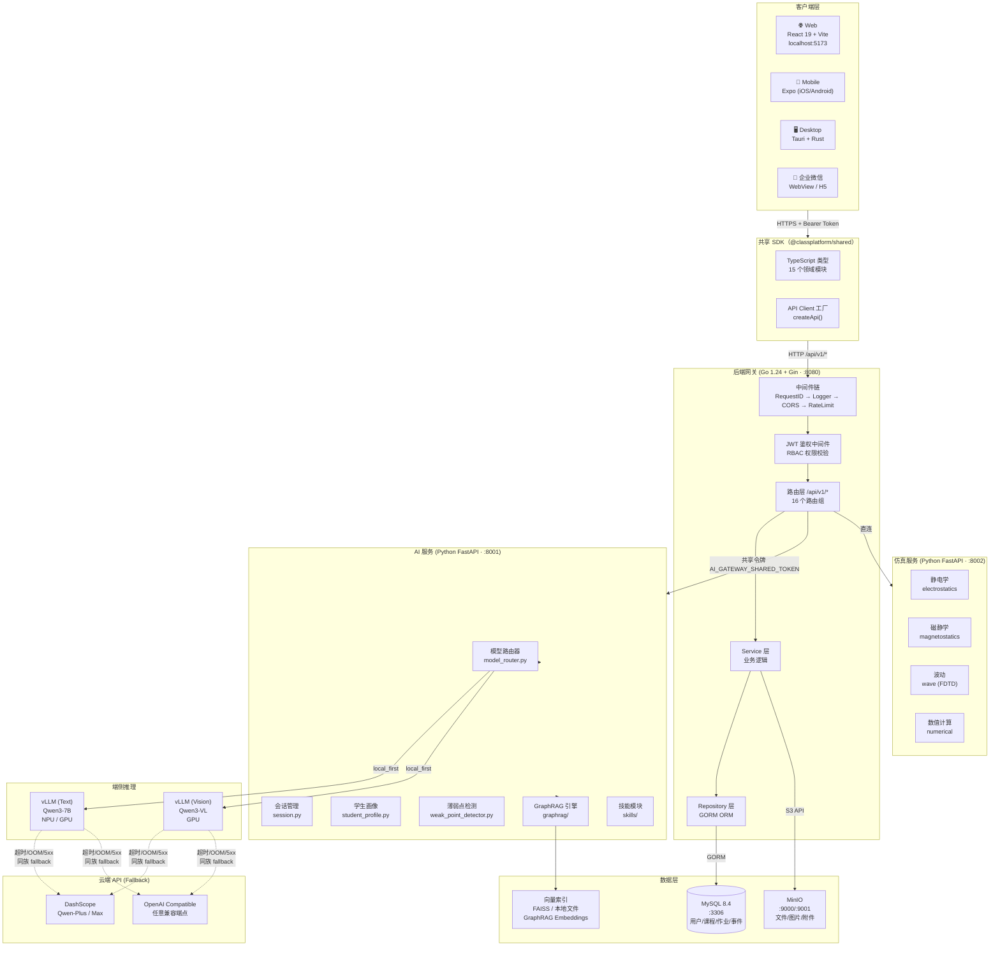
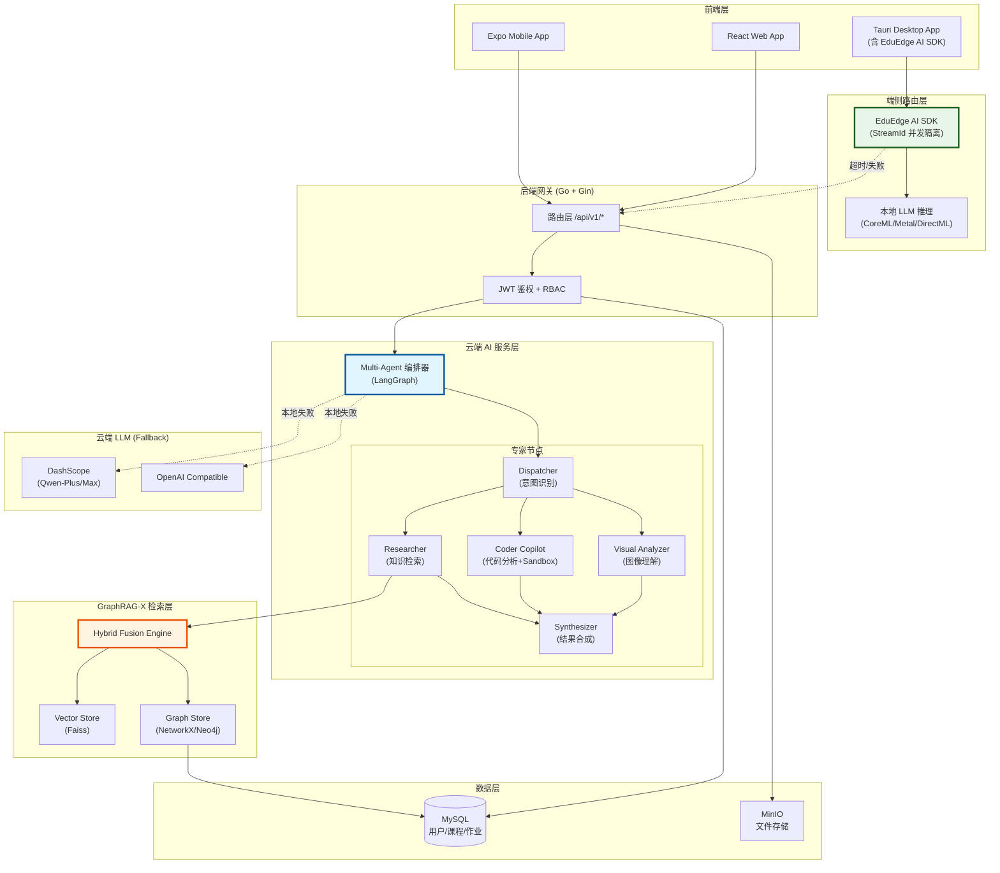
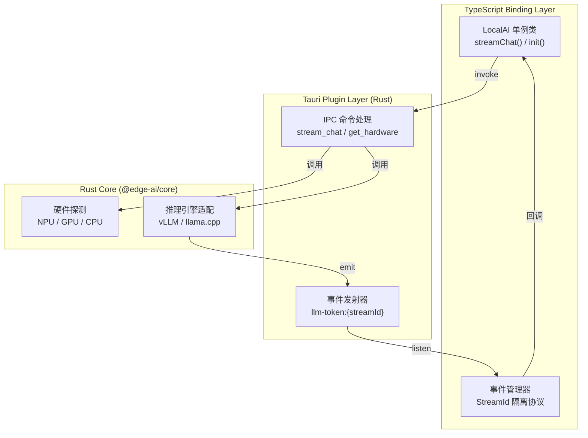
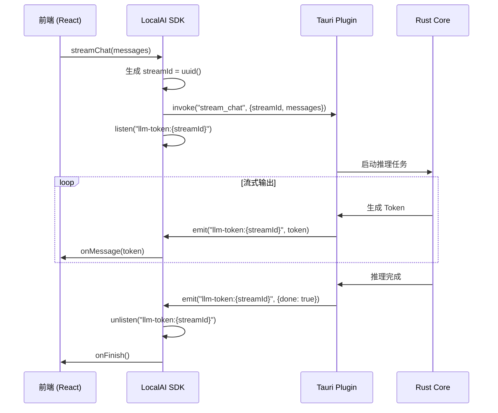
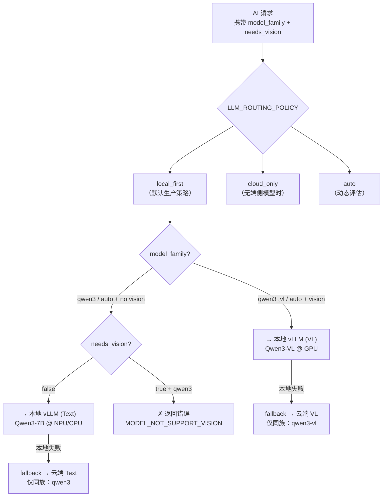
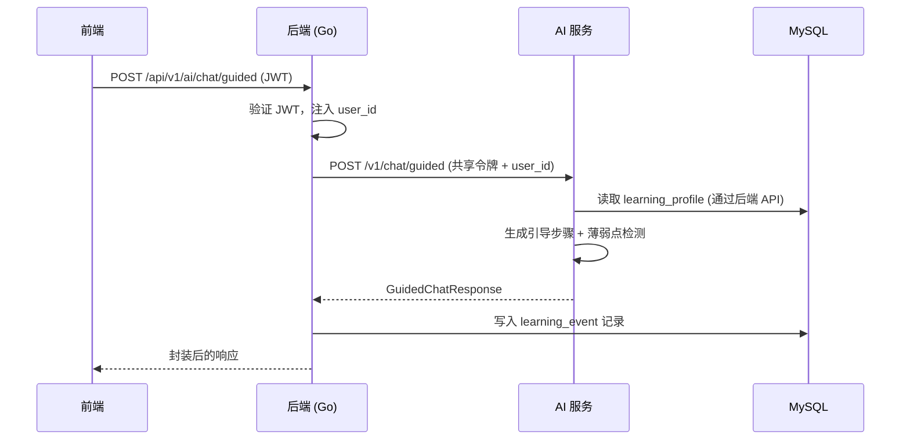
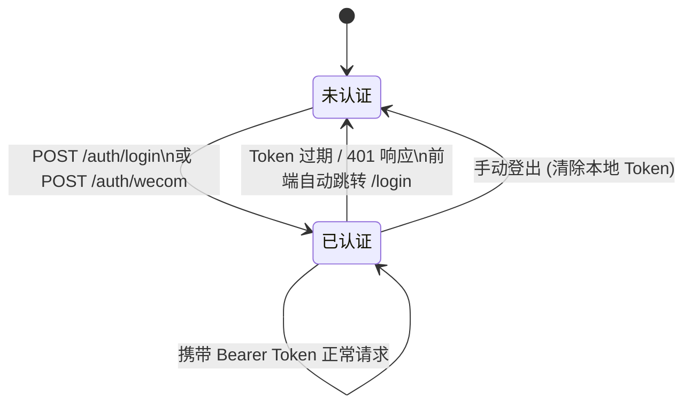
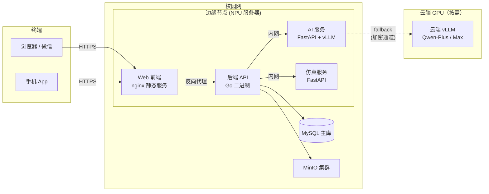

# 系统设计与架构总览

> 本文档为平台架构权威参考，涵盖系统整体拓扑、端云协同机制、模块职责边界与关键设计决策。

## 1. 设计目标与原则

### 1.1 核心目标

| 目标 | 说明 |
|------|------|
| **以学生为中心** | 长期学习档案追踪、跨课程薄弱点记录、个性化 AI 辅导 |
| **端云协同** | 学生隐私数据本地优先处理，仅在端侧资源不足时才 fallback 至云端 |
| **能力服务化** | AI 与仿真独立为微服务，可独立扩容、替换上游模型 |
| **可追溯 AI** | GraphRAG 支持引用来源编号，降低幻觉风险 |
| **多端一致** | Web / Mobile / Desktop / 企业微信 共享同一 API 契约与类型体系 |

### 1.2 设计原则

- **关注点分离**：Handler → Service → Repository 三层，职责不得跨越
- **契约优先**：`docs/04-reference/api/openapi.yaml` 是前后端唯一契约源，改代码前先改契约
- **最小权限**：RBAC 角色从 `student < teacher < admin` 逐级授权，无越权访问
- **配置驱动**：功能开关（多模态、GraphRAG、仿真模块）均通过环境变量控制，无代码侵入

---

## 2. 系统整体拓扑



---

## 2.3 端云协同完整架构（含 Multi-Agent + GraphRAG-X）

以下架构图展示了最新的端云协同设计，包括 Multi-Agent 编排层和 GraphRAG-X 混合检索框架的集成：



### 2.3.1 架构层次说明

| 层级 | 组件 | 职责 |
|------|------|------|
| **前端层** | React/Expo/Tauri | 用户交互界面，统一使用 `@classplatform/shared` SDK |
| **端侧路由层** | EduEdge AI SDK | 本地模型推理，StreamId 并发隔离，硬件感知优化 |
| **后端网关** | Go + Gin | JWT 鉴权、RBAC 权限校验、请求路由 |
| **云端 AI 服务** | Multi-Agent 编排器 | 基于 LangGraph 的状态机编排，专家分工协作 |
| **GraphRAG-X 检索层** | 混合检索引擎 | 向量搜索 + 图扩展 + 重排序融合 |
| **数据层** | MySQL + MinIO | 结构化数据 + 对象存储 |
| **云端 Fallback** | DashScope/OpenAI | 本地推理失败时的云端备份 |

### 2.3.2 关键数据流

::: info 典型请求流程：学生提问"为什么 FDTD 边界会反射？"
1. **前端**：用户在 Web 端输入问题，附带代码片段
2. **后端网关**：验证 JWT，提取 `user_id`，转发到 Multi-Agent
3. **Dispatcher**：检测到代码附件，选择 `coder_copilot` 专家；检测到关键词"为什么"，设置 `need_theory=true`
4. **Coder Copilot**：静态分析代码，检测 PML 边界条件缺失，在 Sandbox 中执行代码
5. **Researcher**：调用 GraphRAG-X 检索"FDTD 边界反射"相关知识
   - Vector Store 召回 top-5 相关文档片段
   - Graph Store 从种子实体扩展 2-hop 子图
   - Hybrid Fusion 计算加权分数并排序
6. **Synthesizer**：融合 Coder 和 Researcher 的结果，生成最终回答
7. **后端网关**：记录学习事件到 MySQL，返回响应给前端
:::

### 2.3.3 并发与隔离

- **前端并发**：多个聊天窗口通过 `streamId` 隔离，互不干扰
- **专家并发**：Visual Analyzer 和 Coder Copilot 可并行执行
- **检索并发**：Vector Search 和 Graph Expansion 并行执行

---

## 2.5 端侧推理引擎选型与架构

### 2.5.1 @jadesnow7/edge-ai-sdk 分层架构

桌面端（Tauri）通过 **@jadesnow7/edge-ai-sdk** 实现本地大模型推理能力。该 SDK 采用三层架构设计：



**核心组件职责：**

| 层级 | 组件 | 职责 |
|------|------|------|
| **TS Binding** | `LocalAI` 单例 | 前端统一入口，封装 Tauri IPC 调用 |
| **TS Binding** | 事件管理器 | StreamId 生成、事件挂载与自动解绑 |
| **Tauri Plugin** | IPC 命令处理 | 接收前端请求，调度 Rust Core |
| **Tauri Plugin** | 事件发射器 | 将推理 Token 通过 IPC 发送至前端 |
| **Rust Core** | 硬件探测 | 检测 NPU/GPU 可用性与性能参数 |
| **Rust Core** | 推理引擎 | 加载模型、执行推理、流式输出 |

### 2.5.2 IPC 并发流隔离协议（StreamId）

**问题背景**：桌面端可能同时运行多个 AI 会话（如"代码审查"和"侧边栏答疑"），若所有会话共享同一个全局事件名（如 `llm-token`），会导致 Token 串流污染前端 UI。

**解决方案**：引入 **StreamId 隔离协议**，为每次会话生成独立的 UUID，底层事件名动态拼接为 `llm-token:${streamId}`。



**关键特性：**

- **自动化生命周期管理**：SDK 内部自动挂载事件监听器，并在流结束时自动 `unlisten`，完全杜绝内存泄漏
- **并发安全**：多个会话的 Token 通过不同的 `streamId` 隔离，互不干扰
- **透明化**：前端开发者无需手动管理 `streamId` 和事件解绑，调用 `LocalAI.streamChat()` 即可

**前端调用示例：**

```typescript
import { LocalAI } from '@jadesnow7/edge-ai-sdk';

// 初始化（应用启动时执行一次）
await LocalAI.init();

// 流式对话（SDK 自动管理 StreamId 和事件生命周期）
await LocalAI.streamChat(
  [{ role: 'user', content: '解释电磁感应定律' }],
  {
    onMessage: (token) => setReply(prev => prev + token),
    onFinish: () => setStatus('done'),
    onError: (err) => console.error(err),
  }
);
```

---

## 3. 端云协同机制

### 3.1 路由策略总览

平台 AI 推理请求遵循**端云分层路由**原则。路由决策发生在 `code/ai_service/app/model_router.py`：



### 3.2 何时使用本地端侧（NPU / CPU）

| 场景 | 路由 | 原因 |
|------|------|------|
| 学生作文辅导（含个人草稿） | 本地 | 含隐私内容，不出园区 |
| 课堂问答辅助（实时性高） | 本地 | 低延迟，≤300ms p95 |
| 学生学习档案分析 | 本地 | FERPA 类合规要求 |
| 简单引导式学习对话 | 本地 | 轻量任务，避免云端费用 |

### 3.3 何时 Fallback 至云端 GPU

| 触发条件 | 行为 |
|----------|------|
| 本地 vLLM 连接超时（`LLM_LOCAL_TIMEOUT_SEC`） | 同族自动 fallback |
| 本地推理服务 OOM / 5xx 错误 | 同族自动 fallback |
| `LLM_ROUTING_POLICY=cloud_only` | 绕过本地，直连云端 |
| 请求显式携带 `route: "cloud"` | 强制云端 |

::: warning 重要约束
**多模态失败不跨族降级**：当 `model_family=qwen3_vl` 的本地请求失败时，只会 fallback 到**云端 Qwen3-VL**，不会降级为纯文本 Qwen3 模型返回错误的答案。业务逻辑错误（4xx）不触发 fallback。
:::

### 3.4 隐私分级

请求可通过 `privacy` 字段或 `X-Privacy-Level` 请求头声明数据敏感级别：

| 级别 | 含义 | 路由影响 |
|------|------|----------|
| `private` | 含用户隐私数据 | 强制本地，cloud_only 环境下拒绝 |
| `public` | 通用知识问答 | 按正常策略路由 |

### 3.5 移动端路由说明

::: info 移动端依赖服务端路由（不做客户端网络探测）
Mobile 客户端（Expo React Native）当前**未引入 NetInfo 或其他网络状态感知库**，不在客户端侧做主动路由决策。路由判断完全由服务端 `model_router.py` 执行：

| 情形 | 移动端行为 |
|------|-----------|
| 正常请求 | 通过后端网关转发，AI 服务按 `LLM_ROUTING_POLICY` 路由 |
| 本地推理超时 / 5xx | AI 服务自动 fallback（同族）；Mobile 端仅收到最终结果或错误响应 |
| 网络完全不可达 | 客户端捕获请求超时异常，展示错误提示，无自动路由切换 |

客户端侧网络探测（如 `@react-native-community/netinfo`）作为**后续优化议题**，当前版本不实现。移动端路由行为的唯一可信来源是**服务端错误码与响应状态**。
:::

---

## 4. 模块职责边界

### 4.1 后端网关（Go + Gin）

后端是**唯一对外入口**，所有客户端请求必须经过后端鉴权后再转发到下游服务。

```
/api/v1/
├── auth/*          → JWT 登录、WeChat Work OAuth
├── users/*         → 用户统计、AI 配置
├── courses/*       → 课程 CRUD、章节、资源
├── assignments/*   → 作业提交、AI 评分
├── quizzes/*       → 测验管理
├── ai/*            → 代理转发到 AI Service（注入 user_id）
├── sim/*           → 代理转发到 Simulation Service
├── workspace/*     → 异步仿真任务调度（队列 + 状态查询）
├── writing/*       → 写作模块（写作类型感知，功能门控）
├── learning-profiles/* → 学习画像（课程级）
├── students/*/global-profile → 全局学生档案
└── admin/*         → 管理员接口
```

::: info 功能门控（Module Gating）
写作模块（`/api/v1/writing/*`）通过 `RequireWritingModule` 中间件控制，可在课程粒度启用/禁用。详见 `docs/05-explanation/architecture/module-gating-plan.md`。
:::

### 4.2 AI 服务（Python FastAPI）

AI 服务是**能力引擎**，对后端网关暴露内部路由 `/v1/*`，通过 `AI_GATEWAY_SHARED_TOKEN` 鉴权：

| 路由 | 功能 |
|------|------|
| `POST /v1/chat` | 文本对话，支持所有 mode |
| `POST /v1/chat/multimodal` | 图文混合输入（Qwen3-VL） |
| `POST /v1/chat_with_tools` | 带工具调用（仿真工作台触发） |
| `POST /v1/chat/hybrid` | GraphRAG 混合检索增强 |
| `POST /v1/chat/guided` | 引导式学习结构化输出 |
| `POST /v1/graphrag/index` | 文档入库 |
| `DELETE /v1/graphrag/index` | 文档删除 |
| `GET /v1/skills` | 列出可用技能 |

### 4.3 仿真服务（Python FastAPI）

仿真服务专注**数值计算**，无状态，每次请求独立：

| 路由组 | 物理模型 |
|--------|---------|
| `/electrostatics/*` | 点电荷场、Laplace 方程（2D FDM）、Gauss 定律 |
| `/magnetostatics/*` | Biot-Savart 定律、Ampere 环路 |
| `/wave/*` | 1D FDTD、Fresnel 系数 |
| `/numerical/*` | 数值积分、微分、向量运算 |

### 4.4 共享 SDK（@classplatform/shared）

所有前端（Web / Mobile / Desktop）通过 `@classplatform/shared` 包消费统一的 API 类型与客户端工厂：

```typescript
// 所有端的统一初始化方式
import { createApi } from '@classplatform/shared';

const api = createApi({
    baseUrl: process.env.API_BASE_URL || '/api/v1',
    getAccessToken: () => tokenStore.get(),
    getTokenType: () => 'Bearer',
    onUnauthorized: () => { /* redirect to login */ },
    timeoutMs: 60000,
});
```

---

## 5. 数据架构

### 5.1 存储策略

| 数据类型 | 存储 | 说明 |
|----------|------|------|
| 用户、课程、作业、测验 | MySQL（GORM） | 结构化事务数据 |
| 文件附件、图片、报告 | MinIO（S3 兼容） | 对象存储，预签名 URL 下发 |
| GraphRAG 知识图谱 | 本地 JSON 文件 | `app/data/graphrag_index.json` |
| 向量 Embeddings | 本地向量文件 | `app/data/vector_index/` |
| 学习会话状态 | 内存（进程生命周期） | `session.py` 字典缓存 |

### 5.2 学生数据流



---

## 6. 认证与权限模型

### 6.1 角色矩阵

| 资源 | student | teacher | admin |
|------|---------|---------|-------|
| 查看课程内容 | ✅ | ✅ | ✅ |
| 提交作业/测验 | ✅ | — | — |
| 管理课程/成员 | — | ✅ | ✅ |
| AI 对话 | ✅ | ✅ | ✅ |
| 写作反馈 | ✅ | ✅ | ✅ |
| 查看全班学情 | — | ✅ | ✅ |
| 系统管理 | — | — | ✅ |

### 6.2 Token 生命周期



---

## 7. 部署拓扑（生产环境）



::: tip 更多部署细节
- [NPU 分层部署策略](/03-how-to-guides/deployment/npu-tiered-deployment)
- [Docker 部署指南](/03-how-to-guides/deployment/docker-deployment)
- [生产环境部署](/03-how-to-guides/deployment/production-deployment)
:::

---

## 8. 关键技术决策记录

| 决策 | 选择 | 放弃的替代方案 | 理由 |
|------|------|----------------|------|
| 后端语言 | Go + Gin | Node.js / Python | 并发性能、二进制部署简单、类型安全 |
| AI 服务语言 | Python + FastAPI | Go | AI/ML 生态（transformers、FAISS）成熟度 |
| 前端框架 | React 19 + Vite 7 | Vue / SvelteKit | 团队熟悉度、企业微信 H5 兼容性 |
| 移动端 | Expo (React Native) | Flutter | 与 Web 共享业务逻辑、JS 生态复用 |
| Desktop | Tauri (Rust) | Electron | 内存占用低 50%，本地推理安全沙箱 |
| **端侧推理 SDK** | **@jadesnow7/edge-ai-sdk** | **直接调用 Tauri IPC** | **StreamId 隔离协议、自动事件管理、并发安全** |
| 数据库 | MySQL 8.4 | PostgreSQL | 国内高校运维熟悉度、分层索引兼容性 |
| 向量存储 | 本地文件 (FAISS) | Weaviate / Qdrant | 无外部依赖，适合私有化部署 |
| API 版本 | `/api/v1` 前缀 | URL-less 版本 | 显式版本，便于运维审计与 Nginx 路由 |

---

## 9. 相关架构文档


- [本地 LLM Runtime 架构](/05-explanation/architecture/local-ai-runtime) — Desktop 壳层队列机制与云端职责边界
- [React 分层架构](/05-explanation/architecture/react-layered-architecture) — 前端领域层与 SDK 结构
- [Rust 增强 POC 计划](/05-explanation/architecture/rust-enhancement-poc-plan-2026-02-11) — Edge Router 与 Rust core 规划
