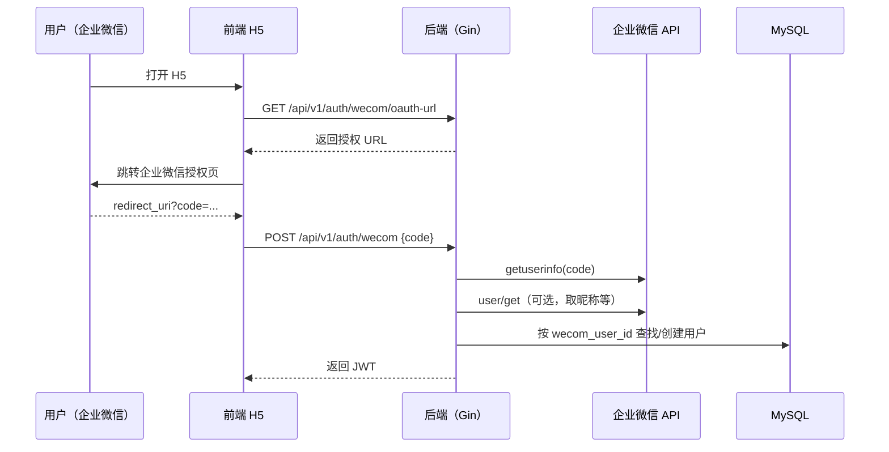

# 系统架构（原型 + 扩展）

## 1. 目标与原则
- **统一入口**：企业微信内嵌 H5（同时兼容普通浏览器）承载核心流程：课程 → AI 答疑/批改 → 仿真/数值计算。
- **后端统一治理**：教学业务后端统一鉴权（JWT）、权限（RBAC）、审计/限流入口（预留），对 AI/仿真进行网关式调度。
- **能力服务化**：AI 与仿真拆为独立服务，便于替换上游模型/数值实现与独立扩容。
- **可追溯 AI**：可选 GraphRAG（本地知识库检索增强），降低幻觉并支持引用片段编号。

## 2. 系统架构图
```mermaid
flowchart LR
  subgraph Client[客户端]
    WeCom[企业微信客户端<br/>(内置 WebView)]
    Browser[普通浏览器]
  end

  subgraph FE[Frontend · Vue 3 H5]
    Pages[登录 / 课程 / AI 对话 / 仿真与数值工具]
  end

  subgraph BE[Backend · Go (Gin)]
    API[/REST API<br/>/api/v1/*/]
    Auth[JWT 鉴权]
    RBAC[RBAC 权限]
    Course[课程管理]
    AIGW[AI 网关<br/>POST /ai/chat]
    SimGW[仿真网关<br/>POST /sim/*<br/>POST /calc/*]
    WecomAuth[企业微信 OAuth<br/>/auth/wecom*]
  end

  subgraph SVC[能力服务]
    AI[AI Service · FastAPI<br/>POST /v1/chat]
    Sim[Sim Service · FastAPI<br/>/v1/sim/* · /v1/calc/*]
  end

  subgraph Data[数据与索引]
    MySQL[(MySQL<br/>users / courses ...)]
    RAG[(GraphRAG Index<br/>JSON 文件)]
  end

  subgraph External[外部依赖]
    LLM[上游大模型<br/>OpenAI 兼容接口<br/>(如 Qwen)]
    WecomAPI[企业微信开放接口]
  end

  WeCom --> FE
  Browser --> FE
  FE -->|HTTP JSON| API

  API --> Auth
  API --> RBAC
  API --> Course
  API --> AIGW
  API --> SimGW
  API --> WecomAuth
  API --> MySQL

  AIGW -->|HTTP JSON| AI
  SimGW -->|HTTP JSON| Sim

  AI -->|可选读取| RAG
  AI -->|POST /v1/chat/completions| LLM

  WecomAuth -->|HTTPS| WecomAPI
```

## 3. 组件与职责（对应仓库目录）
- `frontend/`（Vue H5）：页面与交互；通过 `VITE_API_BASE_URL` 调用后端；支持账号密码登录与企业微信 OAuth 登录。
- `backend/`（Gin）：
  - `Auth`：`POST /auth/login`、`GET /auth/me`（JWT）。
  - `RBAC`：按角色授予权限（如 `course:read/course:write/ai:use/sim:use`）。
  - `Course API`：`GET/POST /courses`（原型已实现）。
  - `AI 网关`：`POST /ai/chat`，统一鉴权与权限校验后转发 AI 服务。
  - `仿真网关`：`POST /sim/*` 与 `POST /calc/*`，转发仿真/数值计算服务。
  - `企业微信接入`：`/auth/wecom`（OAuth code 登录）、`/auth/wecom/jsconfig`（JS-SDK 签名）、`/auth/wecom/oauth-url`（生成授权地址）。
- `services/ai/`（FastAPI）：
  - `POST /v1/chat`：封装上游大模型的 OpenAI 兼容接口，提供多模式 System Prompt（`tutor/grader/...`）。
  - GraphRAG（可选）：`mode` 追加 `_rag` 后缀触发检索注入；索引由离线脚本从 Markdown 构建为 JSON。
- `services/sim/`（FastAPI）：电磁场仿真与数值计算服务，覆盖静电/静磁/电磁波与通用计算（积分/微分/矢量算子等）。
- `deploy/`：Docker Compose 编排（`mysql + backend + ai + sim`）。

## 4. 典型调用链

### 4.1 AI 答疑（可选 GraphRAG）
前端 → 后端 `POST /api/v1/ai/chat`（JWT + `ai:use`）→ AI 服务 `POST /v1/chat` →（可选）GraphRAG 注入 → 上游 LLM `POST /v1/chat/completions` → 返回 `reply`

### 4.2 仿真/数值计算
前端 → 后端 `POST /api/v1/sim/*` 或 `POST /api/v1/calc/*`（JWT + `sim:use`）→ 仿真服务 `POST /v1/sim/*` / `POST /v1/calc/*` → 返回结果（JSON/PNG base64）

### 4.3 企业微信 OAuth 登录


## 5. 权限模型（RBAC）
原型采用“角色 → 权限集合”的 RBAC 映射：
- `admin`：全权限
- `teacher`：课程读写、AI/仿真使用
- `assistant`：课程只读、AI/仿真使用
- `student`：课程只读、AI/仿真使用

后续可扩展方向：
- 细粒度权限（作业/成绩/资源/讨论等）与数据范围（课程/班级维度）。
- 企业微信组织结构映射（部门/班级）、消息推送、免登等能力。
