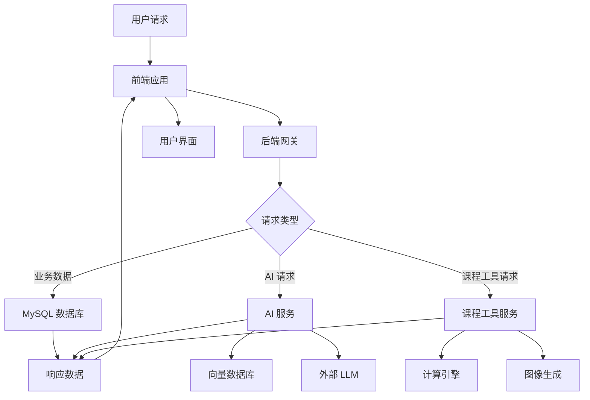

# 系统架构总览

## 1. 目标与原则

### 1.1 设计目标
- **统一入口**：企业微信内嵌 H5（同时兼容普通浏览器）承载核心流程：课程 → AI/学情 → 课程专属工具
- **后端统一治理**：教学业务后端统一鉴权（JWT）、权限（RBAC）、审计/限流入口（预留），对 AI/课程工具进行网关式调度
- **能力服务化**：AI 与课程工具拆为独立服务，便于替换上游模型/工具实现与独立扩容
- **可追溯 AI**：可选 GraphRAG（本地知识库检索增强），降低幻觉并支持引用片段编号

### 1.2 设计原则
- **关注点分离**：代码、文档、学术材料完全分离
- **模块化设计**：每个组件都有独立的职责和接口
- **可扩展性**：支持功能模块的独立扩展和替换
- **标准化**：遵循行业标准的接口和协议

## 2. 整体架构

### 2.1 分层架构
```
┌─────────────────────────────────────────────────────────────┐
│                        客户端层                              │
│  企业微信客户端 (WebView)  │  普通浏览器 (Chrome/Edge)      │
└─────────────────────────────────────────────────────────────┘
                                │
┌─────────────────────────────────────────────────────────────┐
│                        前端层                                │
│            React + TypeScript + Vite Web 应用               │
│  登录 │ 课程管理 │ AI 对话 │ 课程工具 │ 学情分析            │
└─────────────────────────────────────────────────────────────┘
                                │ HTTP/JSON
┌─────────────────────────────────────────────────────────────┐
│                        网关层                                │
│                   Go + Gin 后端服务                         │
│  鉴权 │ 权限 │ 课程API │ AI网关 │ 工具网关 │ 企微OAuth       │
└─────────────────────────────────────────────────────────────┘
                                │
┌─────────────────────────────────────────────────────────────┐
│                        服务层                                │
│    AI 服务 (FastAPI)    │  课程工具服务 (FastAPI)         │
│  大模型对接 │ GraphRAG   │  专属工具 │ 可视化输出            │
└─────────────────────────────────────────────────────────────┘
                                │
┌─────────────────────────────────────────────────────────────┐
│                        数据层                                │
│     MySQL 数据库        │    文件存储    │   向量索引        │
│  用户 │ 课程 │ 作业     │  附件 │ 图片   │  知识库 Embedding │
└─────────────────────────────────────────────────────────────┘
```

### 2.2 技术栈选择

| 层级 | 技术选择 | 选择理由 |
|------|----------|----------|
| 前端 | React + TypeScript + Vite | 组件化生态成熟、工程化完善、适配 WebView/浏览器场景 |
| 后端 | Go + Gin | 高性能、并发友好、部署简单 |
| AI 服务 | Python + FastAPI | 丰富的 AI 生态、异步支持 |
| 课程工具服务 | Python + NumPy/SciPy | 科学计算/工具生态成熟 |
| 数据库 | MySQL | 成熟稳定、事务支持 |
| 容器化 | Docker + Docker Compose | 环境一致性、部署便利 |

## 3. 核心组件

### 3.1 前端应用 (Frontend)
- **技术栈**：React + TypeScript + Vite（状态管理可选 Zustand）
- **主要功能**：
  - 用户界面展示
  - 用户交互处理
  - API 调用封装
  - 状态管理
- **特点**：
  - 响应式设计，适配移动端
  - 企业微信内嵌优化
  - 组件化开发

### 3.2 后端网关 (Backend Gateway)
- **技术栈**：Go + Gin + GORM
- **主要功能**：
  - 统一鉴权和权限控制
  - 业务逻辑处理
  - 服务调度和路由
  - 数据持久化
- **特点**：
  - 高并发处理能力
  - 微服务网关模式
  - RESTful API 设计

### 3.3 AI 服务 (AI Service)
- **技术栈**：Python + FastAPI + LangChain
- **主要功能**：
  - 大模型接口封装
  - GraphRAG 知识检索
  - 多模式 Prompt 管理
  - 流式响应处理
- **特点**：
  - 模块化 Prompt 设计
  - 可插拔的 RAG 系统
  - 异步处理支持

### 3.4 课程工具服务 (Course Tool Service)
- **技术栈**：Python + FastAPI + NumPy/SciPy + Matplotlib
- **主要功能**：
  - 课程专属工具能力（仿真/实验/写作分析等）
  - 可视化与结果输出
  - 参数化任务执行
  - 课程级扩展与隔离
- **特点**：
  - 丰富的物理模型库
  - 高质量可视化输出
  - 参数验证和错误处理

## 4. 数据架构

### 4.1 数据存储策略
- **关系型数据**：MySQL 存储用户、课程、作业等结构化数据
- **文件存储**：本地文件系统存储附件、图片、生成的图表
- **向量数据**：FAISS/Chroma 存储知识库 Embeddings
- **缓存数据**：Redis（可选）用于会话和临时数据

### 4.2 数据流设计


## 5. 安全架构

### 5.1 认证机制
- **JWT Token**：无状态认证，支持分布式部署
- **企业微信 OAuth**：集成企业身份认证
- **多因子认证**：预留扩展接口

### 5.2 权限控制
- **RBAC 模型**：基于角色的访问控制
- **API 级权限**：细粒度的接口访问控制
- **数据级权限**：基于用户角色的数据访问限制

### 5.3 数据安全
- **传输加密**：全链路 HTTPS
- **存储加密**：敏感数据加密存储
- **输入验证**：防止注入攻击
- **内容过滤**：AI 输入输出安全检查

## 6. 扩展性设计

### 6.1 水平扩展
- **无状态设计**：支持多实例部署
- **负载均衡**：支持反向代理和负载分发
- **数据库分片**：支持数据水平分割

### 6.2 功能扩展
- **插件化架构**：支持功能模块的动态加载
- **配置驱动**：通过配置文件控制功能开关
- **API 版本化**：支持接口的向后兼容

## 7. 监控与运维

### 7.1 监控指标
- **系统指标**：CPU、内存、磁盘、网络
- **应用指标**：响应时间、错误率、吞吐量
- **业务指标**：用户活跃度、功能使用率

### 7.2 日志管理
- **结构化日志**：统一的日志格式
- **日志聚合**：集中式日志收集和分析
- **错误追踪**：异常信息的完整记录

### 7.3 部署策略
- **容器化部署**：Docker 容器化
- **编排管理**：Docker Compose 或 Kubernetes
- **持续集成**：自动化构建和部署流程
