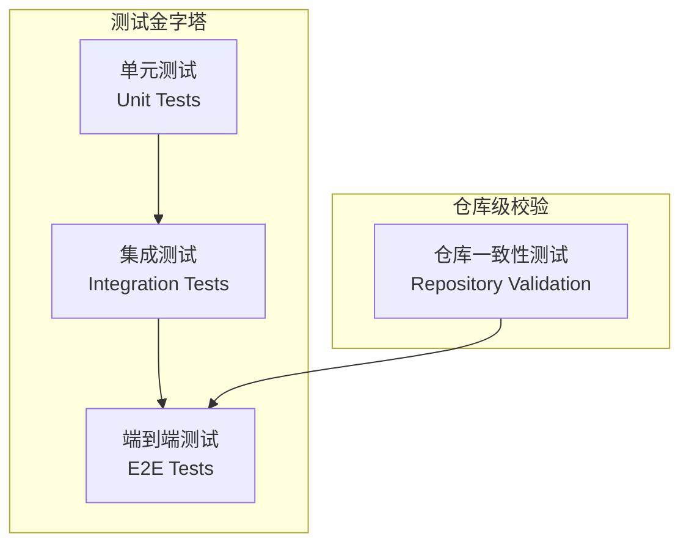

# 标准化测试流程指南

本文档定义了项目的标准测试流程、测试路径与覆盖指标，确保代码质量和发布可靠性。

---

## 测试架构总览



---

## 测试路径一览

| 服务 | 测试目录 | 测试框架 | 运行命令 |
|------|----------|----------|----------|
| **仓库一致性** | `tests/` | vitest | `cd tests && npm test` |
| **Go Backend** | `code/backend/internal/` | go test | `cd code/backend && go test ./...` |
| **AI Service** | `code/ai_service/tests/` | pytest | `cd code/ai_service && pytest` |
| **Simulation** | `code/simulation/` | pytest (待建) | `cd code/simulation && pytest` |
| **Frontend Vue** | `code/frontend/` | - | `cd code/frontend && npm run build` |
| **Frontend React** | `code/frontend-react/` | - | `cd code/frontend-react && npm run build` |
| **E2E** | `scripts/` | bash/curl | `./scripts/e2e_guided_learning.sh` |
| **全流程** | `scripts/` | bash | `./scripts/test_pipeline.sh` |

---

## 覆盖指标与目标

> [!IMPORTANT]
> 以下为建议阈值，可按环境与阶段调整。关键指标未达标视为测试失败。

| 范畴 | 指标 | 目标 | 采集方式 |
|------|------|------|----------|
| **覆盖率** | 核心模块行覆盖率 | ≥60% | `go test -cover` / `pytest --cov` |
| **稳定性** | 关键路径用例通过率 | ≥95% | 集成 + E2E 通过数/总数 |
| **性能** | 非 AI API p95 响应 | ≤300ms | k6/wrk 压测报告 |
| **性能** | AI/仿真接口平均响应 | ≤10s | 压测或采样统计 |
| **质量** | 引用正确率 (GraphRAG) | ≥85% | 标准评测集 |
| **质量** | 工具调用正确率 | ≥90% | 标准评测集 |

---

## 标准测试流程（7 步法）

该流程适用于合并到 `main` 或发布前的统一测试。

### 步骤 1：范围确认与测试矩阵

明确受影响的模块，列出需执行的测试类型：

```bash
# 确认变更范围
git diff --name-only main...HEAD | head -20
```

**测试矩阵示例**：

| 变更模块 | 单元测试 | 集成测试 | E2E | 性能测试 |
|----------|----------|----------|-----|----------|
| `code/backend` | ✅ | ✅ | ✅ | ✅ |
| `code/ai_service` | ✅ | ✅ | ✅ | ✅ |
| `code/simulation` | ✅ | - | - | ✅ |
| `code/frontend` | 构建 | - | ✅ | - |
| `docs/` | - | - | - | - |

---

### 步骤 2：仓库一致性测试

验证目录结构、文档与迁移规则符合标准。

```bash
cd tests
npm install  # 首次运行
npm test
```

**预期输出**：
```
✓ directory-structure.test.ts (X tests)
✓ documentation-system.test.ts (X tests)
✓ overall-structure-validation.test.ts (X tests)
...
```

---

### 步骤 3：服务级单元测试与覆盖率

#### 3.1 Go Backend

```bash
cd code/backend

# 运行测试
go test -v ./...

# 生成覆盖率报告
go test -coverprofile=coverage.out ./...
go tool cover -func=coverage.out | tail -1  # 查看总覆盖率
go tool cover -html=coverage.out -o coverage.html  # HTML 报告
```

#### 3.2 AI Service (Python)

```bash
cd code/ai_service

# 运行测试
pytest -v

# 生成覆盖率报告
pytest -v --cov=app --cov-report=term-missing --cov-report=html
```

**现有测试文件**：
- `tests/test_session.py` - 会话管理测试
- `tests/test_student_profile.py` - 学生画像测试
- `tests/test_weak_point_detector.py` - 薄弱点检测测试

#### 3.3 Simulation Service (Python)

```bash
cd code/simulation

# 运行测试（如果有）
pytest -v --cov=app --cov-report=term-missing
```

> [!NOTE]
> Simulation 服务当前无独立测试目录，建议后续补充。

#### 3.4 Frontend 构建校验

```bash
# Vue 前端
cd code/frontend
npm run build

# React 前端
cd code/frontend-react
npm run build
```

---

### 步骤 4：集成测试

在 Docker Compose 或开发环境下验证服务间调用。

```bash
# 启动开发环境
cd code
./scripts/dev-up.sh

# 等待服务就绪后执行测试
curl -sf http://localhost:8080/healthz  # 验证 Backend
curl -sf http://localhost:8001/healthz  # 验证 AI Service
```

**集成测试覆盖**：
- [ ] 用户认证流程
- [ ] 课程 CRUD 操作
- [ ] 作业提交与评分
- [ ] AI 对话接口
- [ ] 仿真执行链路

---

## API 测试流程（基于 API 规范）

该流程是对“步骤 4 集成测试 / 步骤 6 性能评测”的细化，适用于后端接口或客户端调用发生变化的场景。以 `docs/api/README.md` 与各模块接口文档为唯一规范来源；若维护了 OpenAPI（`docs/api/swagger.yaml`），则以 OpenAPI 为机器可验证的“契约”。

### A. 接口清单与风险分级

1. 依据 API 文档整理**本次变更影响的接口清单**（模块、方法、路径、权限、关键字段）。
2. 按风险划分优先级：
   - P0：鉴权、写操作（创建/提交/评分）、AI/仿真调用
   - P1：读取列表/详情
   - P2：统计/只读查询

### B. 契约一致性（规范 → 真实响应）

**目标**：确保实现与文档一致，避免字段漂移与兼容性破坏。

- 请求字段：必填/可选、类型、枚举值（如 `mode`、`role`）
- 响应结构：统一包装 `{ success, data }` / `{ data }` / 直接返回是否仍被客户端兼容
- 时间/数字：时间格式、单位、边界值
- 错误规范：错误码、message、HTTP 状态码一致

> 若存在 `swagger.yaml`，建议用 OpenAPI 校验工具对响应进行 schema 校验；若暂未维护 OpenAPI，至少以接口文档与 `code/mobile/src/api.ts` 实际字段为基准做人工核对。

### C. 正向 + 反向用例

每个 P0/P1 接口至少覆盖：
- 正向：合法参数、权限正确，返回数据与文档一致
- 反向：缺失参数、越权、非法枚举、边界值（空字符串、极大数值）

### D. 权限与鉴权测试

- 401：未携带 Token
- 403：角色不匹配（学生访问教师接口）
- Token 过期/无效

### E. 数据一致性与幂等性

- 写操作：写后读一致（创建 → 查询）
- 提交类接口：重复提交是否幂等或明确返回错误
- 关联字段：`course_id` / `assignment_id` 是否一致

### F. 关键路径回归

将 API 测试结果与 E2E 用例对齐，至少保证：
1. 登录 → 课程列表 → 课程详情
2. 作业/测验/写作提交链路
3. AI 对话请求与响应格式稳定

### 执行方式（建议）

- **手工验证**：使用 curl/Postman 对 P0/P1 接口逐一执行正反用例。
- **自动化回归**：若维护了 Postman Collection，可用 Newman 执行；若维护了 OpenAPI，可用 schema 校验工具进行响应校验。

示例（手工）：

```bash
# 登录
curl -sS -X POST http://localhost:8080/api/v1/auth/login \\
  -H 'Content-Type: application/json' \\
  -d '{"username":"student","password":"student123"}'

# 课程列表（需替换 token）
curl -sS http://localhost:8080/api/v1/courses \\
  -H 'Authorization: Bearer <token>'
```

### API 测试用例模板（建议）

| 接口 | 用例 | 期望 | 实际 | 状态 | 证据 |
|------|------|------|------|------|------|
| POST /auth/login | 正常登录 | 200 + token 返回 |  | ⬜ | 日志/截图 |
| POST /ai/chat | 无 token | 401 |  | ⬜ | 日志/截图 |

### API 变更回归清单模板（建议）

> 适用于每次接口变更后的回归记录，便于对齐需求与验收。

**回归信息**

- 变更日期：YYYY-MM-DD
- 变更模块：认证 / 课程 / 作业 / AI / 仿真 / 其他
- 影响范围：新增/修改/删除接口
- 负责人：姓名
- 关联文档：`docs/api/README.md` / 模块接口文档 / `swagger.yaml`

**回归结果**

| 接口 | 变更类型 | 用例覆盖 | 结果 | 备注 |
|------|----------|----------|------|------|
| /api/v1/xxx | 修改 | 正向 + 反向 | ✅/❌ |  |

**结论**

- 是否通过：✅/❌
- 风险说明：若存在未覆盖项或暂缓问题，需说明原因与补测计划。

---

### 步骤 5：端到端测试

运行关键路径脚本验证完整业务流程。

```bash
# 前置条件
# 1. 安装 jq: brew install jq (macOS) / apt install jq (Linux)
# 2. 启动 Backend: localhost:8080
# 3. 启动 AI Service: localhost:8001
# 4. 测试用户存在: student/student123 (数据库种子用户)

# 运行 E2E
./scripts/e2e_guided_learning.sh
```

**E2E 验证点**：
1. ✅ 用户登录获取 Token
2. ✅ 创建引导式学习会话
3. ✅ 正确回答推进进度
4. ✅ 错误回答触发薄弱点检测
5. ✅ 学习画像记录

---

### 步骤 6：性能与质量评测

#### 6.1 API 性能测试

使用 k6 或 wrk 进行压测：

```bash
# 安装 k6
brew install k6  # macOS

# 运行压测脚本（需创建）
k6 run scripts/perf/api_load_test.js
```

**性能基线**：
- 非 AI API (课程列表、作业查询): p95 ≤ 300ms
- AI 接口 (对话、检索): 平均 ≤ 10s

#### 6.2 质量评测

```bash
# GraphRAG 引用正确率评测（需创建评测脚本）
python scripts/eval/graphrag_citation_eval.py

# 工具调用正确率评测
python scripts/eval/tool_calling_eval.py
```

---

### 步骤 7：门槛判定

汇总测试结果，判定是否达标：

| 指标 | 实际值 | 目标 | 状态 |
|------|--------|------|------|
| 核心模块行覆盖率 | __ % | ≥60% | ⬜ |
| 关键路径用例通过率 | __ % | ≥95% | ⬜ |
| 非 AI API p95 响应 | __ ms | ≤300ms | ⬜ |
| AI/仿真接口平均响应 | __ s | ≤10s | ⬜ |
| 引用正确率 | __ % | ≥85% | ⬜ |
| 工具调用正确率 | __ % | ≥90% | ⬜ |

> [!CAUTION]
> 关键指标未达标视为测试失败。如需调整阈值，必须在评审中说明原因并给出整改计划。

---

## 快速测试命令（Makefile）

项目提供统一的 Makefile 入口，位于 `code/Makefile`：

> [!WARNING]
> `make test` 当前会因前端缺少 test script 而失败。建议分别执行后端和 Python 测试。

```bash
cd code

# 仅运行后端测试（推荐）
make test-backend

# 仅运行 Python 测试（推荐）
make test-python

# 生成覆盖率报告
make coverage

# 运行所有 Lint 检查
make lint

# 完整质量检查 (lint + format + test) - 前端暂不可用
# make quality

# 安全检查
make security
```

---

## 测试文件组织规范

```
graduationDesign/
├── tests/                          # 仓库级一致性测试
│   ├── directory-structure.test.ts
│   ├── documentation-system.test.ts
│   ├── overall-structure-validation.test.ts
│   └── ...
│
├── scripts/
│   └── e2e_guided_learning.sh      # E2E 测试脚本
│
└── code/
    ├── backend/
    │   └── internal/
    │       └── service/
    │           └── *_test.go       # Go 单元测试
    │
    ├── ai_service/
    │   └── tests/
    │       ├── test_session.py
    │       ├── test_student_profile.py
    │       └── test_weak_point_detector.py
    │
    ├── simulation/
    │   └── tests/                  # (待建)
    │
    ├── frontend/
    │   └── src/__tests__/          # (待建)
    │
    └── frontend-react/
        └── src/__tests__/          # (待建)
```

---

## 待完善项

以下为当前测试体系的待完善项，建议按优先级逐步补充：

| 优先级 | 待办事项 | 说明 |
|--------|----------|------|
| P0 | Simulation 服务单元测试 | 补充 `code/simulation/tests/` |
| P1 | 性能压测脚本 | 创建 `scripts/perf/` 目录并添加 k6 脚本 |
| P1 | GraphRAG 质量评测脚本 | 创建 `scripts/eval/` 并添加评测集 |
| P2 | 前端单元测试 | 配置 Vue/React 测试框架 |
| P2 | CI/CD 集成 | GitHub Actions 自动化测试流水线 |

---

## 全流程测试脚本

项目提供一键执行所有测试步骤的脚本 `scripts/test_pipeline.sh`：

```bash
# 完整测试（执行所有 7 步）
./scripts/test_pipeline.sh

# 快速测试（跳过性能评测）
./scripts/test_pipeline.sh --quick

# 跳过特定步骤
./scripts/test_pipeline.sh --skip-unit    # 跳过单元测试
./scripts/test_pipeline.sh --skip-e2e     # 跳过 E2E 测试
./scripts/test_pipeline.sh --skip-perf    # 跳过性能评测

# 详细输出
./scripts/test_pipeline.sh --verbose
```

**脚本功能**：
- 自动执行 7 步测试流程
- 彩色输出与进度显示
- 生成 JSON 格式测试报告到 `test_reports/` 目录
- 自动门槛判定（覆盖率、通过率）

**输出示例**：
```json
{
  "timestamp": "2026-01-16T09:45:59+08:00",
  "summary": { "passed": 8, "failed": 0, "skipped": 2, "pass_rate": "100%" },
  "steps": { "step1_scope": "pass", "step2_repo": "pass", ... },
  "details": { "backend_coverage": "65%", "ai_coverage": "72%", ... }
}
```

---

## 参考文档

- [项目规范指南](file:///Users/huaodong/graduationDesign/docs/contributing/项目规范指南.md) - 测试规范章节
- [E2E 脚本](file:///Users/huaodong/graduationDesign/scripts/e2e_guided_learning.sh) - 引导式学习端到端测试
- [Makefile](file:///Users/huaodong/graduationDesign/code/Makefile) - 统一构建与测试命令
