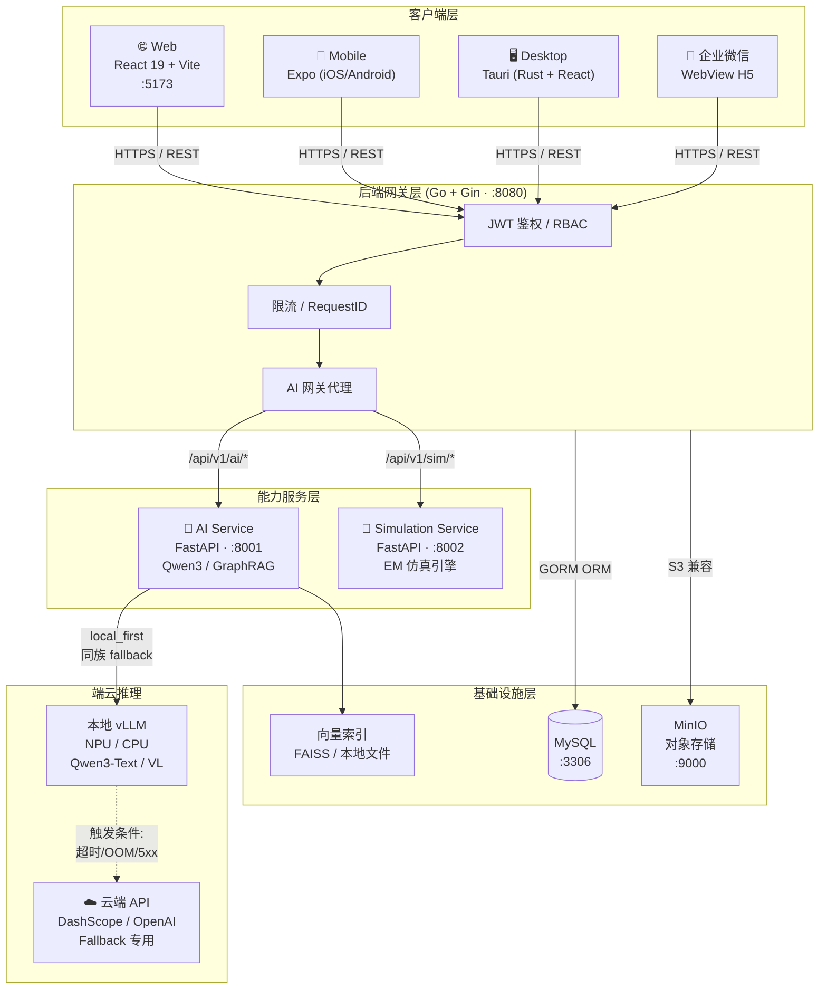

## 平台架构一览

## 核心特性速查

| 特性 | 说明 | 相关文档 |
|------|------|----------|
| **端云协同路由** | `local_first` 策略，同族 fallback（不跨能力降级） | [模型路由策略](/05-explanation/ai/model-routing-policy) |
| **GraphRAG 知识库** | 可追溯引用、混合向量检索、热更新索引 | [GraphRAG 说明](/05-explanation/ai/graph-rag) |
| **引导式学习** | 结构化学习路径 + 薄弱点检测 + 会话持久化 | [引导式学习](/05-explanation/ai/guided-learning) |
| **多模态** | Qwen3-VL 支持图文混合输入（默认关闭） | [AI 服务接口](/04-reference/api/ai) |
| **EM 仿真工作台** | 异步任务调度 + 进度轮询 + Base64 图像输出 | [工作台接口](/04-reference/api/workspace) |
| **NPU 分层部署** | 边缘服务器 NPU + 校园 GPU + 公有云三层 | [NPU 分层部署](/03-how-to-guides/deployment/npu-tiered-deployment) |

## 推荐阅读路径

::: tip 开发者入门（30 分钟）
1. [环境要求](/01-getting-started/prerequisites) — 确认本机依赖版本
2. [快速开始](/01-getting-started/quick-start) — Docker 一键启动全栈
3. [API 总览](/04-reference/api/) — 了解 `/api/v1` 端点体系
4. [代码规范](/06-contributing/code-style) — 多端提交规范
:::

::: tip 架构师 / 运维（深度理解）
1. [系统设计](/05-explanation/system-design) — 端云协同机制与拓扑图
2. [模型路由策略](/05-explanation/ai/model-routing-policy) — 本地/云端路由决策
3. [NPU 分层部署](/03-how-to-guides/deployment/npu-tiered-deployment) — 生产环境多层部署
4. [AI 服务接口](/04-reference/api/ai) — 流式对话与工具调用契约
:::

::: tip AI 研究 / 数据
1. [GraphRAG 说明](/05-explanation/ai/graph-rag) — 知识库检索增强
2. [引导式学习](/05-explanation/ai/guided-learning) — 学习路径与薄弱点
3. [训练数据规范](/05-explanation/ai/training-data-spec) — LoRA/QLoRA 管线
4. [Qwen3-VL 迁移基线](/05-explanation/ai/qwen3-vl-migration-baseline-2026-02-09) — 多模态升级
:::

## 文档结构

| 目录 | 用途 |
|------|------|
| `01-getting-started/` | 项目简介、环境要求、快速上手 |
| `02-tutorials/` | 完整场景教程（创建课程、服务器部署） |
| `03-how-to-guides/` | 运维、部署、CI/CD 操作指南 |
| `04-reference/` | API 契约、版本治理、CLI、配置手册 |
| `05-explanation/` | 系统设计、AI 机制、架构决策解释 |
| `06-contributing/` | 协作流程、代码规范、测试指南 |
| `07-release-notes/` | 变更日志与发布说明 |
