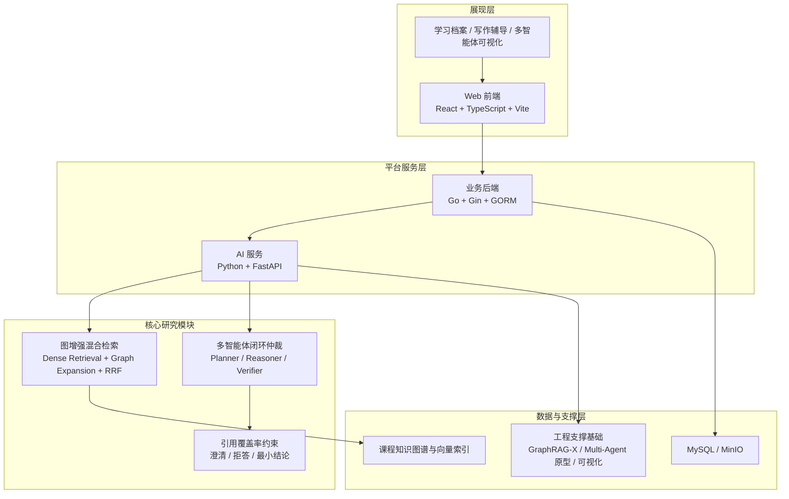

# 基于图增强检索与多智能体协同的智能教学平台设计与实现

> 主要验证场景为研究生《学术规范与专业写作》课程；本科《电磁场与电磁波》课程仅作为扩展场景，用于说明平台的课程适配能力，不作为本次开题主评测对象。

## 一、研究背景与意义

### 1.1 问题背景

高校智能教学系统正在从“资源管理平台”向“过程性学习支持平台”演进，但在面向复杂课程辅导场景时仍存在三类突出问题。

第一，**多跳知识检索不足**。传统向量检索能够解决表层语义匹配问题，但在涉及规范条款、案例片段、写作目标与评价维度之间的跨文档关联时，容易出现证据链断裂，难以支撑需要多步关联的教学问答与写作辅导任务[1-4]。

第二，**多智能体推理稳定性不足**。在复杂问答与学习辅导任务中，单一大模型往往难以同时完成任务拆解、证据检索、答案生成与结果核验；即使引入多智能体协作，若缺乏明确的回退规则与停止条件，也容易出现“反复重试但不收敛”的问题[5-8]。

第三，**可信生成与用户体验存在权衡**。教育场景既要求答案有据可依，又不能因为严格约束而频繁拒答。如何在引用覆盖率、拒答率与任务完成率之间建立可解释、可调节的平衡，是教学类 AI 系统走向可用的重要前提[2][9][10]。

本课题以研究生《学术规范与专业写作》课程为主要验证场景。该课程具有以下特点：一是课程语料天然包含“规范条款、范文片段、常见错误、教师反馈”等结构化程度较高的知识单元；二是学生问题往往不是单跳事实问答，而是需要综合“写作任务类型、学术规范、证据使用、表达风格”的多因素推理；三是生成内容必须具备较强的可追溯性，不能只给出笼统建议。这些特征决定了该场景既适合作为图增强检索的验证对象，也适合作为多智能体可信推理的实验载体。

### 1.2 研究意义

本课题的意义主要体现在三个层面。

在**教学应用层面**，本研究试图将“检索增强 + 多智能体协同 + 证据约束”组合成一套可落地的教学辅导流程，使系统不仅能回答问题，还能给出带引用的、可复核的建议，降低教学辅助过程中的幻觉风险。

在**方法研究层面**，本研究关注的不是单一新算法发明，而是如何在教育场景下将图增强混合检索、基于规则与 NLI 的闭环仲裁、引用覆盖率约束三类机制集成到同一条端到端推理管线中，从而提升多跳问答与写作辅导的稳定性与可信度。

在**工程实现层面**，本课题依托已有的智能教学平台原型展开，目标不是从零搭建整个平台，而是在既有前后端、AI 服务、GraphRAG 原型和多智能体实验基础上，聚焦完成两个核心研究模块的设计、实现与评估，为后续毕业论文与系统验收提供可复现的技术路径。

## 二、相关工作与研究空白

### 2.1 检索增强生成与图增强检索

RAG 通过在生成前引入外部知识检索，有效缓解了纯参数化大模型的知识陈旧与幻觉问题[1]。Self-RAG 进一步引入自反思 token，使模型能够动态决定是否检索与如何利用检索结果[2]。在图增强方向，Microsoft GraphRAG 强调从文档图出发进行社区摘要与全局问答[3]；QA-GNN 则在问答与知识图谱之间建立联合推理图，利用 GNN 传播实现结构化推理[4]；Think-on-Graph 将语言模型视为可在知识图谱上进行探索的代理，通过束搜索逐步寻找推理路径[5]；G-Retriever 进一步把图检索与文本生成结合到统一的 GraphQA 框架中[9]。

这些工作为本课题提供了重要基础，但其主要不足在于：一是很多方法更侧重通用知识图谱问答，未直接面对教育场景中的证据引用约束；二是图检索与向量检索往往被分别优化，缺乏面向异构信号融合的简洁、稳定排序机制；三是生成后的核验与回退机制常被弱化为 prompt 级策略，而非显式的系统停止规则。

### 2.2 多智能体协作与闭环核验

ReAct 通过交错生成推理轨迹与行动，实现了“推理 + 外部交互”的统一[7]。Reflexion 将语言反馈引入智能体记忆，使模型能够在试错过程中进行自我修正[6]。Multi-Agent Debate 证明了多代理协作与辩论机制能够提升事实性与推理能力[8]。CRAG 从检索质量评估入手，提出检索纠错与回退流程，用于在检索结果不可靠时触发额外检索行动[10]。

这些研究说明，“生成前检索”和“生成后核验”都对系统可信度有重要影响。但现有工作多面向开放域问答、代码或通用任务，在教学平台场景中还缺少一种同时满足以下条件的方案：能够围绕课程知识图谱进行图增强检索，能够对生成内容进行证据核验，能够在核验失败时触发受控回退，并能够把成本、延迟和任务完成率纳入统一评估。

### 2.3 研究空白与本课题定位

本课题不声称发明 RRF 或 Verifier 等基础方法，而是将研究贡献明确定位为**场景化的集成创新**：在教育场景下，把图增强混合检索与多智能体闭环仲裁组合进同一教学平台，并通过引用覆盖率约束把“可生成”进一步提升为“可信生成”。

表 1 给出本课题与代表性工作的差异。

**表 1 相关工作差异对比**

| 方法 | 多跳推理 | 图结构利用 | 闭环核验 | 生成后回退 | 成本/延迟约束 | 教育场景适配 |
| --- | --- | --- | --- | --- | --- | --- |
| Vanilla RAG | 弱 | 否 | 否 | 否 | 弱 | 弱 |
| Self-RAG[2] | 中 | 否 | 部分 | 部分 | 弱 | 弱 |
| Microsoft GraphRAG[3] | 强 | 强 | 否 | 否 | 弱 | 弱 |
| QA-GNN[4] | 强 | 强 | 否 | 否 | 否 | 弱 |
| Think-on-Graph[5] | 强 | 强 | 部分 | 否 | 部分 | 弱 |
| CRAG[10] | 中 | 否 | 强 | 强 | 部分 | 弱 |
| Reflexion[6] | 中 | 否 | 部分 | 强 | 否 | 弱 |
| Multi-Agent Debate[8] | 强 | 否 | 部分 | 部分 | 否 | 弱 |
| 本研究 | 强 | 强 | 强 | 强 | 强 | 强 |

## 三、系统定位与总体架构

### 3.1 系统定位

本课题的定位是：**面向研究生《学术规范与专业写作》课程的智能教学平台设计与实现，其中图增强混合检索与多智能体闭环仲裁是两项核心研究模块**。

因此，本课题既不是纯算法论文，也不是泛泛而谈的平台工程介绍。平台是验证载体，算法模块是研究内核。具体边界如下：

- **核心研究模块**
  - 图增强混合检索
  - 多智能体闭环仲裁
- **工程支撑模块**
  - Web 前端、Go 后端、Python AI 服务
  - GraphRAG 服务封装与知识库更新
  - 推理过程可视化与流式交互
  - 已有 Edge AI / StreamId / 端云协同基础设施

本次开题仅将核心研究模块作为主要研究内容展开，工程支撑模块只作为已有基础与验证条件说明。

### 3.2 总体架构

**图 1 系统总体架构**

该架构体现了本课题的双层叙事：平台层提供稳定的教学服务与实验载体；研究层负责提升复杂教学问答任务中的检索质量、推理稳定性与证据可信度。

## 四、研究问题、假设与技术路线

### 4.1 核心研究问题

围绕上述系统定位，本研究关注三个问题。

- **RQ1**：图-向量异构检索融合如何提升多跳召回能力？
- **RQ2**：多智能体闭环仲裁如何提升推理稳定性与事实一致性？
- **RQ3**：引用覆盖率阈值如何平衡可信度、拒答率与任务完成率？

### 4.2 研究假设与指标映射

**表 2 RQ-假设-方法-指标映射**

| RQ | 研究假设 | 核心方法 | 核心指标 | 预期趋势 |
| --- | --- | --- | --- | --- |
| RQ1 | 基于名次的 RRF 融合能够比线性加权更稳定地融合向量得分与图扩展信号，从而提升多跳证据召回 | Dense Retrieval + Graph Expansion + RRF | nDCG@10、Multi-hop Recall | RRF 优于线性融合 |
| RQ2 | 引入具备规则与 NLI 双判别的 Verifier，可在有限回退轮次内提升事实一致性与收敛性 | Planner / Reasoner / Verifier 闭环状态机 | Faithfulness、Groundedness、回退触发率、P95 Latency | 闭环优于无核验流水线 |
| RQ3 | 将引用覆盖率作为生成治理阈值，可在提升可信度的同时把任务完成率维持在可接受范围 | 覆盖率阈值 τ 扫描 + 拒答/澄清/最小结论策略 | 拒答率、任务完成率、Groundedness | 存在可接受的平衡区间 |

### 4.3 技术路线

本研究采取“系统载体先行、核心模块深化”的路线。

第一阶段，以已有平台原型为基础整理课程语料、构建初版课程知识图谱与评测样本。  
第二阶段，实现并优化图增强混合检索模块，重点验证图扩展与 RRF 融合的有效性。  
第三阶段，在现有多智能体实验原型上实现闭环核验、回退与停止规则。  
第四阶段，通过课程主场景和公开泛化数据集完成对照实验与消融实验。  

## 五、核心研究模块设计

### 5.1 图增强混合检索模块

#### 5.1.1 模块目标

该模块用于回答“为什么仅靠向量检索不够”。在《学术规范与专业写作》课程中，很多问题需要同时关联“写作任务类型、规范条款、案例片段、教师反馈”和“常见错误模式”。如果仅依赖向量相似度，容易召回表面相关但缺乏推理链支撑的片段。

#### 5.1.2 设计思路

本研究采用两类主信号：

- **Dense Retrieval**：对课程规范、案例片段和讲义切片建立语义向量索引，完成初始召回；
- **Graph Expansion**：围绕命中的种子节点在课程知识图中进行受限扩展，补充前置概念、关联规范和相邻案例。

在此基础上，使用 RRF 进行异构信号融合：

$$
RRF(d)=\sum_{i=1}^{m}\frac{1}{k+r_i(d)}
$$

其中，$r_i(d)$ 表示文档在第 $i$ 路检索结果中的名次，$k$ 为平滑常数。开题阶段将对 $k \in [10, 60]$ 做网格搜索，pilot 实验后固定默认值为 40。

选择 RRF 的原因不是因为其“新”，而是因为它用名次而不是原始得分做融合，天然适合处理向量距离与图扩展权重这类量纲不一致的异构信号[11]。本研究的创新点在于将这一机制引入教育场景下的图-向量混合检索流程，并与受限图扩展策略组合使用。

#### 5.1.3 边界与代价

该模块的适用边界是：课程知识图谱规模中等、问题强调证据完整性高于极致实时性。其代价在于检索链路更长、融合过程更复杂，因此需要在实验中同时报告 P95 延迟与召回提升，而不是只报告准确率。

### 5.2 多智能体闭环仲裁模块

#### 5.2.1 模块目标

该模块用于回答“有了检索为什么仍然会出错”。实践中，检索结果相关并不等于最终回答可靠；模型仍可能误引规范、遗漏必要条件或在表述中引入过度概括。因此，本研究将生成过程拆分为多个角色，并在生成后增加可执行的核验与回退机制。

#### 5.2.2 角色设计

- **Planner**：对用户问题进行任务拆解，判断是否需要检索、是否需要澄清；
- **Reasoner**：结合检索证据生成候选回答与引用；
- **Verifier**：对候选回答进行规则与 NLI 双判别。

其中，Verifier 采用两级检查：

- **规则检查**：引用格式是否完整、关键陈述是否有证据对应、是否缺少必要规范条款；
- **NLI 检查**：对“陈述-证据”对执行蕴含/矛盾判别，用于识别“看似引用了证据但推断方向错误”的问题。

#### 5.2.3 回退与停止规则

本研究设定最大回退轮次 $R=3$。当 Verifier 发现下列情况之一时触发回退：

- 关键主张缺乏证据支持；
- 引用覆盖率低于阈值 $\tau$；
- NLI 判断存在明显矛盾；
- 系统认为需要补充用户上下文才能安全作答。

若回退后仍不能提升可信度，则执行降级输出：

- 优先澄清提问；
- 若澄清后仍失败，则输出“最小结论 + 不确定性声明”；
- 必要时拒答。

该设计的贡献不在于 Verifier 概念本身，而在于将规则检查、NLI 判别、受限回退轮次和降级策略整合到教学辅导平台中，使系统具备明确的停止条件与可解释的失败方式。

### 5.3 引用覆盖率约束与系统治理

引用覆盖率约束不作为独立原创算法处理，而作为生成治理机制纳入整体系统。其核心思想是：若回答中的关键结论无法被课程知识库中的证据覆盖，则系统不应继续输出高置信结论。

开题阶段拟对 $\tau \in [0.4, 0.8]$、步长为 0.1 的范围进行扫描，考察不同阈值下的：

- Groundedness
- 拒答率
- 任务完成率

其中，“任务完成率”定义为：在限定交互轮次内，系统能够给出可执行建议、充分证据答复或有效澄清路径的比例，而不是只统计“是否直接给出最终答案”。

## 六、前期工作基础与可行性分析

### 6.1 已有系统基础

本课题并非从零开始。当前仓库中已经存在一套可运行的智能教学平台原型，形成了“前端 - 后端 - AI 服务 - 数据与文档”的完整基础。

根据现有代码统计，主要模块规模如下：

**表 3 已有工程基础**

| 模块 | 技术栈 | 现有规模 |
| --- | --- | --- |
| frontend | React + TypeScript + Vite | 约 60,268 行 |
| backend | Go + Gin + GORM | 约 16,327 行 |
| ai_service | Python + FastAPI | 约 18,312 行 |
| simulation | Python | 约 2,371 行 |
| 仓库主要代码总量 | 多语言混合 | 约 199,927 行 |

现有系统已具备以下与本课题直接相关的能力：

- 课程与用户管理的基础平台能力；
- 写作辅导与学习档案相关页面；
- AI 服务的 OpenAI-compatible 接口；
- GraphRAG 原型与知识库更新能力；
- 多智能体实验原型与事件编排基础；
- 技术文档、训练脚本与阶段性验证记录。

### 6.2 与本课题直接相关的代码基础

#### 6.2.1 GraphRAG 与知识库原型

现有 AI 服务中已包含 GraphRAG 相关模块，包括：

- `build.py`：索引构建
- `ingest.py`：语料摄取
- `retrieve.py`：检索流程
- `reranker.py`：重排模块
- `updater.py`：增量更新

此外，独立的 `graphrag-x` 子项目中已具备：

- 图构建与查询管线；
- 检索与评测脚本；
- 子图可视化能力；
- API 服务封装。

这意味着本课题的图增强混合检索并非从空白起步，而是在既有 GraphRAG 原型上做“课程知识图 + 受限扩展 + RRF 融合”的进一步聚焦。

#### 6.2.2 多智能体原型

现有 `multi-agent/cloud` 模块已具备多智能体编排基础，包括：

- `dispatcher.py`
- `researcher.py`
- `synthesizer.py`
- `join_findings.py`
- `graph/builder.py`
- `api/chat_orchestrated.py`

这些模块说明，系统已经有了事件驱动与多节点协作的实验底座。本课题需要完成的是从“可编排”走向“可验证、可回退、可停机”的闭环仲裁机制，而不是从零设计多智能体框架。

#### 6.2.3 可展示的前端载体

前端已有页面包括：

- `WritingPage`
- `TeacherWritingDashboard`
- `MultiAgentChatPage`

这些页面可以直接作为“前期工作基础”的展示证据，用于说明平台载体已经存在，开题后的主要工作集中于算法模块强化与实验验证。

### 6.3 训练与验证链路基础

在已有开题简版材料中，项目已经记录了 2026-02-08 的训练与回归链路验证结果。这些结果不能作为正式实验结论，但足以证明：

- 数据准备、训练、评测与文档同步链路已经打通；
- GraphRAG 与教学风格相关能力已有工程验证基础；
- 项目具备继续收集课程数据并开展正式实验的条件。

因此，本课题的可行性建立在“已有系统 + 已有 GraphRAG 原型 + 已有多智能体原型 + 已有训练验证链路”的基础上，而不是对未来工作的空泛设想。

### 6.4 可行性判断

在范围收窄后，本课题的主要工作集中为两项：

1. 完成图增强混合检索模块的课程场景适配与评测；
2. 完成多智能体闭环仲裁模块的实现、阈值校准与对比实验。

相较于同时推进 Edge AI SDK、端云路由、桌面端协议、整平台大规模联调等更大范围内容，上述目标更符合本科毕业设计 20 周周期内“紧凑但可完成”的合理负载。

## 七、实验设计与评估方案

### 7.1 数据集与场景设置

本研究采用“双层数据集”设计。

#### 7.1.1 主评测数据集

主评测数据集来源于研究生《学术规范与专业写作》课程材料，包括但不限于：

- 学术规范讲义
- 教师给定写作要求
- 范文片段
- 常见错误案例
- 课程答疑资料

开题阶段的实际承诺如下：

- **20 条 pilot case**：用于快速验证检索链路与核验闭环是否可跑通；
- **100 条可行性验证样本**：用于正式的开题后对照与消融实验；
- **300 条样本**：作为论文阶段的扩展目标，不作为开题前置条件。

#### 7.1.2 泛化验证数据集

为验证方法的跨域泛化能力，本研究将使用 HotpotQA 子集作为辅助测试集，但其作用仅限于方法泛化验证，不作为主场景成绩展示。

### 7.2 对照组与消融设计

#### 7.2.1 检索模块对照

- Dense RAG
- 图扩展 + 线性融合
- 图扩展 + RRF

该组实验用于验证 RQ1。

#### 7.2.2 仲裁模块对照

- 无 Verifier
- 规则 Verifier
- 规则 + NLI Verifier

该组实验用于验证 RQ2，并区分“形式化回退机制”与“NLI 判别”各自的增量价值。

#### 7.2.3 阈值扫描实验

对引用覆盖率阈值 $\tau$ 进行扫描，测量：

- Groundedness
- 拒答率
- 任务完成率

该组实验用于验证 RQ3。

### 7.3 评估指标

本研究采用以下指标：

- **nDCG@10**：评估排序质量；
- **Multi-hop Recall**：评估多跳证据召回能力；
- **Faithfulness**：评估回答与证据的一致性；
- **Groundedness**：评估关键结论是否有足够证据支撑；
- **P95 Latency**：评估系统时延成本；
- **拒答率**：评估安全阈值带来的副作用；
- **任务完成率**：评估在约束条件下用户是否仍能获得可执行帮助。

若条件允许，将补充 3-5 名人工评测者做小规模盲评；若评测资源不足，则以自动指标为主、人工抽样校准为辅。

### 7.4 Backbone 与实验设置

当前原型基于 OpenAI-compatible 接口调用 Qwen 系列模型，工程验证配置使用 `qwen-plus`。本研究在开题阶段不追求大规模模型横向比较，而是固定一套主 backbone，优先验证方法本身的有效性，必要时再补充高低配模型对照。

## 八、风险、进度安排与预期成果

### 8.1 主要风险与降级方案

#### 风险 1：范围失控

若继续把 Edge AI、端云协同、桌面端协议、GraphRAG、多智能体、整平台联调全部作为核心内容，则工作量明显超出 20 周承载范围。

**降级方案**：明确只将“图增强混合检索 + 多智能体闭环仲裁”作为核心研究内容，其余内容全部降级为工程基础或备份材料。

#### 风险 2：时间不足

课程数据清洗、图构建、对照实验和论文撰写同时推进时，可能挤压实验时间。

**降级方案**：优先保证 20 条 pilot 与 100 条可行性样本实验；若论文阶段时间允许，再扩展到 300 条样本。

#### 风险 3：NLI Verifier 效果不稳定

轻量 NLI 模型在教育写作领域可能存在误判。

**降级方案**：退化为“规则 Verifier + 回退机制”，保留系统框架，减少对单一判别器性能的依赖。

#### 风险 4：人工评测资源不足

课程场景的人工盲评组织成本较高。

**降级方案**：人工评测做小规模抽样，自动指标做主评测，并在论文中明确说明局限性。

### 8.2 20 周进度安排

**表 4 进度安排**

| 周次 | 主要任务 | 预期产出 |
| --- | --- | --- |
| 第 1-2 周 | 完成课程语料筛选、pilot 样本设计、知识图初版整理 | 20 条 pilot case、初版语料清单 |
| 第 3-6 周 | 实现并调试图扩展与 RRF 融合，完成检索对照实验 | 检索模块初版、RQ1 初步结果 |
| 第 7-10 周 | 完成 Planner/Reasoner/Verifier 闭环实现与阈值校准 | 闭环仲裁原型、RQ2 初步结果 |
| 第 11-14 周 | 构建 100 条可行性验证集，运行主实验与消融实验 | 完整实验表、案例分析 |
| 第 15-17 周 | 完成阈值扫描、误差分析、图表整理 | RQ3 结果、风险分析 |
| 第 18-20 周 | 整理论文、系统演示、答辩材料与复现实验说明 | 论文初稿、答辩 PPT、演示脚本 |

### 8.3 预期成果

本课题预期形成以下成果：

1. 一套面向《学术规范与专业写作》课程的智能教学平台原型；
2. 一个基于图增强混合检索的课程问答与写作辅导模块；
3. 一个具备规则与 NLI 双判别的多智能体闭环仲裁模块；
4. 一组围绕主场景开展的对照实验与消融实验结果；
5. 一份结构完整、论证清晰、可复现性较强的毕业论文与答辩材料。

## 九、参考文献

[1] Lewis P, Perez E, Piktus A, et al. Retrieval-augmented generation for knowledge-intensive NLP tasks[C]//Advances in Neural Information Processing Systems. 2020: 9459-9474.

[2] Asai A, Wu Z, Wang Y, et al. Self-RAG: Learning to retrieve, generate, and critique through self-reflection[EB/OL]. (2023-10-17)[2026-03-02]. https://arxiv.org/abs/2310.11511.

[3] Edge D, Trinh H, Cheng N, et al. From local to global: A graph RAG approach to query-focused summarization[EB/OL]. (2024-04-18)[2026-03-02]. https://arxiv.org/abs/2404.16130.

[4] Yasunaga M, Ren H, Bosselut A, et al. QA-GNN: Reasoning with language models and knowledge graphs for question answering[C]//Proceedings of the 2021 Conference of the North American Chapter of the Association for Computational Linguistics: Human Language Technologies. Online: Association for Computational Linguistics, 2021: 535-546.

[5] Sun J, Xu C, Tang L, et al. Think-on-Graph: Deep and responsible reasoning of large language model on knowledge graph[EB/OL]. (2023-07-15)[2026-03-02]. https://arxiv.org/abs/2307.07697.

[6] Shinn N, Cassano F, Berman E, et al. Reflexion: Language agents with verbal reinforcement learning[EB/OL]. (2023-03-20)[2026-03-02]. https://arxiv.org/abs/2303.11366.

[7] Yao S, Zhao J, Yu D, et al. ReAct: Synergizing reasoning and acting in language models[C]//The Eleventh International Conference on Learning Representations. Kigali: ICLR, 2023.

[8] Du Y, Li S, Torralba A, et al. Improving factuality and reasoning in language models through multiagent debate[EB/OL]. (2023-05-23)[2026-03-02]. https://arxiv.org/abs/2305.14325.

[9] He X, Tian Y, Sun Y, et al. G-Retriever: Retrieval-augmented generation for textual graph understanding and question answering[EB/OL]. (2024-02-12)[2026-03-02]. https://arxiv.org/abs/2402.07630.

[10] Yan S Q, Gu J C, Zhu Y, et al. Corrective retrieval augmented generation[EB/OL]. (2024-01-29)[2026-03-02]. https://arxiv.org/abs/2401.15884.

[11] Cormack G V, Clarke C L A, Buettcher S. Reciprocal rank fusion outperforms condorcet and individual rank learning methods[C]//Proceedings of the 32nd International ACM SIGIR Conference on Research and Development in Information Retrieval. New York: ACM, 2009: 758-759.

[12] Baek J, Aji A F, Saffari A. Knowledge-augmented language model prompting for zero-shot knowledge graph question answering[C]//Proceedings of the 1st Workshop on Natural Language Reasoning and Structured Explanations. Toronto: Association for Computational Linguistics, 2023: 78-106.

[13] 中华人民共和国教育部. 教育信息化2.0行动计划[Z]. 北京: 中华人民共和国教育部, 2018.

[14] 中华人民共和国国务院. 新一代人工智能发展规划[Z]. 北京: 国务院, 2017.

$\tau$