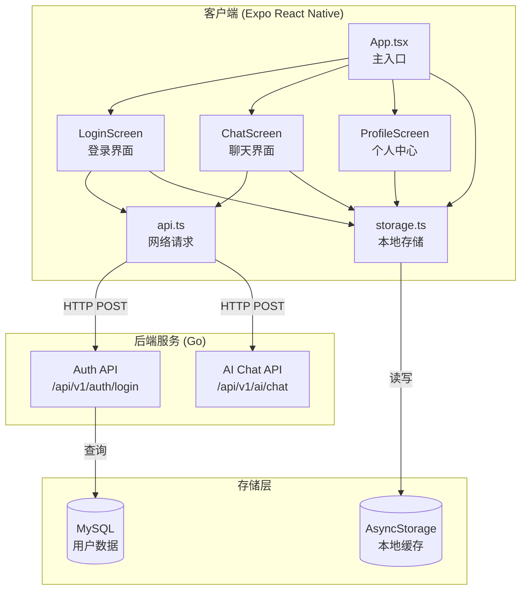
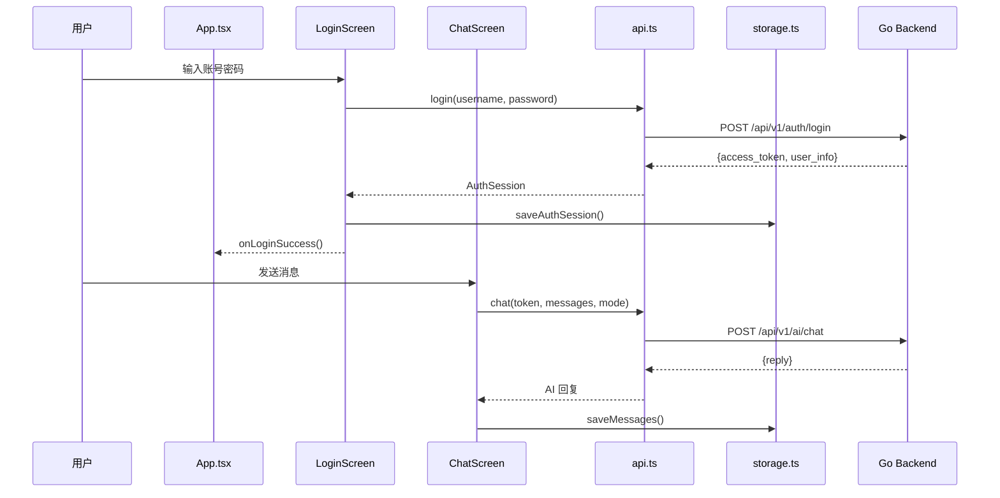

# classPlatform Mini App 产品报告

## 一、产品功能介绍

### 1.1 产品概述

**classPlatform** 是一款基于 React Native (Expo) 开发的跨平台 AI 智能辅导 Mini App。该应用专注于为学生提供个性化的电磁学课程学习辅导，支持 iOS 和 Android 双平台运行。

### 1.2 核心功能

| 功能模块 | 描述 |
|---------|------|
| 🔐 **用户登录** | 账户认证系统，支持会话持久化 |
| 💬 **AI 智能聊天** | 三种对话模式：Tutor（导师）、Solve（解题）、Sim（模拟） |
| 👤 **个人中心** | 查看账户信息、管理本地缓存、退出登录 |
| 💾 **本地存储** | 聊天记录本地缓存，支持离线查看 |

### 1.3 功能详情

#### 1.3.1 用户登录
- 支持用户名/密码登录
- 登录状态本地持久化（AsyncStorage）
- 自动恢复上次会话

#### 1.3.2 AI 智能聊天
- **Tutor 模式**：AI 作为导师，引导式教学
- **Solve 模式**：直接解答问题
- **Sim 模式**：模拟实验解释

#### 1.3.3 个人中心
- 显示用户信息（用户名、角色、Token 状态）
- 查看本地缓存消息数量
- 清除聊天记录
- 安全退出登录

---

## 二、程序概要设计

### 2.1 模块设计

```
mini-app-expo/
├── App.tsx                 # 主入口，路由控制
├── src/
│   ├── api.ts              # 网络请求封装
│   ├── config.ts           # 配置常量
│   ├── storage.ts          # 本地存储管理
│   ├── types.ts            # TypeScript 类型定义
│   ├── components/
│   │   └── MessageBubble.tsx   # 消息气泡组件
│   └── screens/
│       ├── LoginScreen.tsx     # 登录页面
│       ├── ChatScreen.tsx      # 聊天页面
│       └── ProfileScreen.tsx   # 个人中心页面
```

### 2.2 核心模块说明

| 模块 | 职责 |
|------|------|
| **App.tsx** | 应用入口，管理全局状态（会话、消息），底部 Tab 导航 |
| **api.ts** | 封装 HTTP 请求，处理超时、取消、错误重试 |
| **storage.ts** | AsyncStorage 封装，管理会话和消息持久化 |
| **ChatScreen.tsx** | 聊天界面，FlatList 渲染消息，支持三种 AI 模式 |
| **LoginScreen.tsx** | 登录界面，表单验证，登录状态管理 |
| **ProfileScreen.tsx** | 个人中心，账户信息展示，缓存管理 |

---

## 三、软件架构图

### 3.1 整体架构



### 3.2 数据流架构



---

## 四、技术亮点及其实现原理

### 4.1 网络请求优化

#### 请求超时与取消机制

```typescript
// api.ts - 请求封装核心逻辑
async function request<T>(path: string, options: RequestInit = {}): Promise<T> {
  const controller = new AbortController();
  const timeoutId = setTimeout(() => controller.abort(), NETWORK_TIMEOUT_MS);
  
  // 支持外部取消信号
  if (externalSignal?.aborted) {
    controller.abort();
  }
  
  try {
    const response = await fetch(buildUrl(path), {
      ...rest,
      signal: controller.signal,
    });
    // ...
  } finally {
    clearTimeout(timeoutId);
  }
}
```

**亮点**：
- 统一 15 秒超时控制
- 支持外部 AbortController 取消请求
- 组件卸载时自动取消未完成请求

### 4.2 本地存储持久化

#### AsyncStorage 封装

```typescript
// storage.ts - 消息存储
export async function saveMessages(messages: ChatMessage[]): Promise<void> {
  const trimmed = messages.slice(-MAX_HISTORY); // 限制最多 50 条
  await AsyncStorage.setItem(STORAGE_KEYS.messages, JSON.stringify(trimmed));
}
```

**亮点**：
- 消息数量限制（MAX_HISTORY = 50），防止存储膨胀
- 会话与消息分离存储，便于独立管理
- 应用启动时自动恢复历史数据

### 4.3 性能优化

#### FlatList 虚拟化渲染

```typescript
// ChatScreen.tsx
<FlatList
  ref={listRef}
  data={messages}
  keyExtractor={(item) => item.id}
  renderItem={({ item }) => <MessageBubble message={item} />}
  showsVerticalScrollIndicator={false}
/>
```

**性能保障**：
- 使用 FlatList 替代 ScrollView，仅渲染可见区域
- 唯一 key 标识避免不必要重渲染
- 消息更新时自动滚动到底部

#### 竞态条件处理

```typescript
// ChatScreen.tsx - 防止竞态
const requestIdRef = useRef(0);
const mountedRef = useRef(true);

const handleSend = async () => {
  const requestId = requestIdRef.current + 1;
  requestIdRef.current = requestId;
  
  // 发送请求...
  
  if (!mountedRef.current || requestId !== requestIdRef.current) {
    return; // 忽略过期响应
  }
  // 更新状态...
};
```

**亮点**：
- requestId 追踪确保只处理最新请求的响应
- mountedRef 防止组件卸载后更新状态
- 组件卸载时自动取消进行中的请求

### 4.4 用户体验优化

| 优化点 | 实现方式 |
|--------|----------|
| 键盘适配 | KeyboardAvoidingView 自动调整布局 |
| 加载状态 | ActivityIndicator + "AI is thinking..." 提示 |
| 错误处理 | 友好的错误提示横幅 |
| 平滑交互 | 按压反馈（opacity 变化） |

---

## 五、技术栈总结

| 类别 | 技术选型 |
|------|----------|
| **框架** | React Native (Expo 54) |
| **语言** | TypeScript |
| **状态管理** | React Hooks (useState, useEffect, useRef) |
| **网络请求** | Fetch API + AbortController |
| **本地存储** | @react-native-async-storage/async-storage |
| **UI 组件** | React Native 原生组件 (FlatList, Pressable, etc.) |
| **后端** | Go + Gin + MySQL |

---

## 六、作业要求对照

| 要求项 | 实现情况 | 说明 |
|--------|----------|------|
| ✅ 功能要求 | 已满足 | AI 智能聊天功能，三种对话模式 |
| ✅ 技术要求 (网络) | 已满足 | HTTP API 调用（登录、聊天） |
| ✅ 技术要求 (存储) | 已满足 | AsyncStorage 本地持久化 |
| ✅ 性能要求 | 已满足 | FlatList 虚拟化、请求取消、内存管理 |

---

*文档生成时间：2026-01-18*
